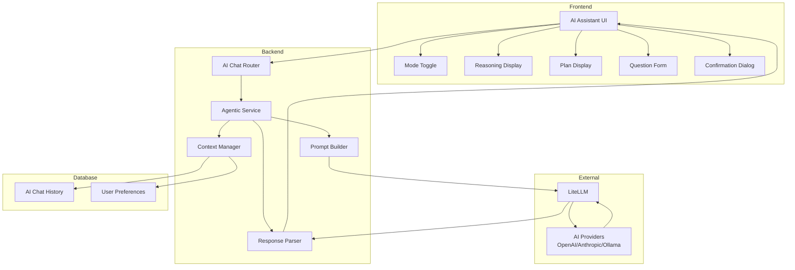
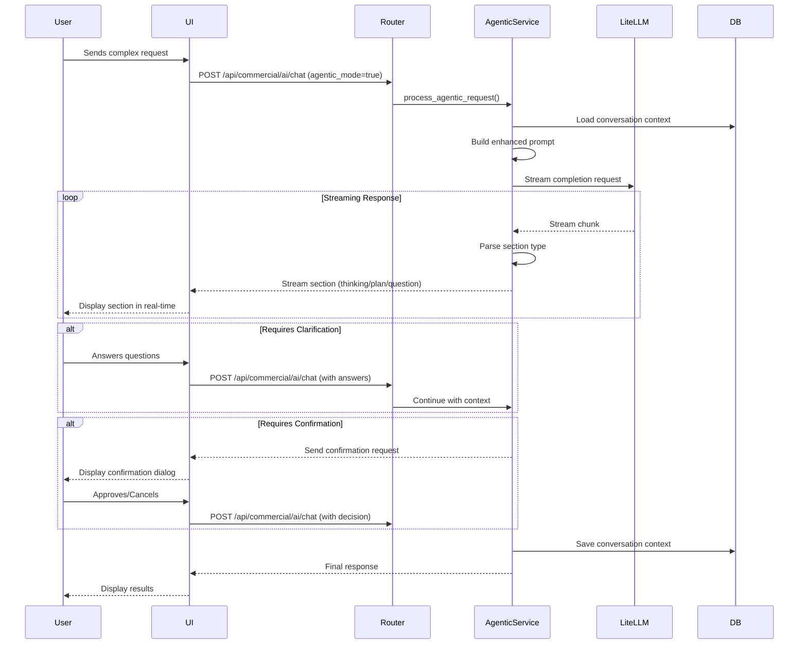

# Design Document: Agentic AI Assistant

## Overview

The Agentic AI Assistant enhances the existing AI chat functionality with advanced reasoning, planning, and interactive capabilities. The system enables the AI to think through complex questions, break them down into actionable steps, ask clarifying questions, and request user confirmation before taking significant actions. The design maintains backward compatibility with the existing "simple mode" while introducing a new "agentic mode" that provides a more intelligent and interactive experience.

The architecture extends the current LiteLLM-based AI system (supporting OpenAI, Anthropic, Ollama, and other providers) with structured response formats, conversation context management, and enhanced prompting strategies. The frontend introduces new UI components for displaying reasoning, plans, questions, and confirmation requests, while the backend adds support for structured responses and streaming of different response sections.

## Architecture

### High-Level Architecture



### Component Interaction Flow



## Components and Interfaces

### Backend Components

#### 1. Agentic Service (`api/commercial/ai/services/agentic_service.py`)

The core service that orchestrates agentic interactions.

```python
class AgenticService:
    """
    Service for handling agentic AI interactions with reasoning,
    planning, and confirmation workflows.
    """
    
    def __init__(self, db: Session, ai_config: AIConfig):
        self.db = db
        self.ai_config = ai_config
        self.prompt_builder = PromptBuilder()
        self.response_parser = ResponseParser()
        self.context_manager = ContextManager(db)
    
    async def process_request(
        self,
        message: str,
        user_id: int,
        conversation_id: Optional[str] = None,
        mode: str = "agentic"
    ) -> AsyncGenerator[Dict[str, Any], None]:
        """
        Process an agentic request and stream structured responses.
        
        Args:
            message: User's message
            user_id: Current user ID
            conversation_id: Optional conversation ID for context
            mode: "agentic" or "simple"
        
        Yields:
            Structured response sections as they are generated
        """
        pass
    
    async def handle_clarification_response(
        self,
        answers: Dict[str, str],
        conversation_id: str,
        user_id: int
    ) -> AsyncGenerator[Dict[str, Any], None]:
        """
        Process user's answers to clarifying questions and continue.
        """
        pass
    
    async def handle_confirmation_response(
        self,
        approved: bool,
        conversation_id: str,
        user_id: int
    ) -> AsyncGenerator[Dict[str, Any], None]:
        """
        Process user's confirmation decision and execute or abort.
        """
        pass
```

#### 2. Prompt Builder (`api/commercial/ai/services/prompt_builder.py`)

Constructs enhanced prompts for agentic mode.

```python
class PromptBuilder:
    """
    Builds structured prompts for agentic AI interactions.
    """
    
    def build_agentic_prompt(
        self,
        user_message: str,
        conversation_context: List[Dict[str, Any]],
        system_context: Dict[str, Any]
    ) -> str:
        """
        Build an enhanced prompt that encourages reasoning and planning.
        
        The prompt instructs the AI to:
        1. Show its thinking process
        2. Break down complex tasks into steps
        3. Ask clarifying questions when needed
        4. Request confirmation for significant actions
        
        Returns:
            Formatted prompt string
        """
        pass
    
    def build_clarification_prompt(
        self,
        original_request: str,
        questions: List[str],
        answers: Dict[str, str]
    ) -> str:
        """
        Build a prompt that incorporates user's answers to clarifying questions.
        """
        pass
    
    def build_execution_prompt(
        self,
        plan: List[str],
        user_approved: bool
    ) -> str:
        """
        Build a prompt for executing an approved plan.
        """
        pass
```

#### 3. Response Parser (`api/commercial/ai/services/response_parser.py`)

Parses streaming AI responses into structured sections.

```python
class ResponseSection(BaseModel):
    """Represents a section of an AI response."""
    type: str  # "thinking", "plan", "question", "confirmation", "answer"
    content: str
    metadata: Optional[Dict[str, Any]] = None

class ResponseParser:
    """
    Parses streaming AI responses into structured sections.
    """
    
    def parse_stream(
        self,
        stream: AsyncGenerator[str, None]
    ) -> AsyncGenerator[ResponseSection, None]:
        """
        Parse streaming response and yield structured sections.
        
        Detects section markers in the stream:
        - "Let me think..." or "Thinking:" -> thinking section
        - "Here's my plan:" or "Steps:" -> plan section
        - "I have some questions:" -> question section
        - "Before I proceed..." -> confirmation section
        
        Yields:
            ResponseSection objects as they are identified
        """
        pass
    
    def extract_plan_steps(self, plan_text: str) -> List[str]:
        """Extract numbered steps from plan text."""
        pass
    
    def extract_questions(self, question_text: str) -> List[str]:
        """Extract individual questions from question text."""
        pass
```

#### 4. Context Manager (`api/commercial/ai/services/context_manager.py`)

Manages conversation context and user preferences.

```python
class ConversationContext(BaseModel):
    """Represents the context of an ongoing conversation."""
    conversation_id: str
    user_id: int
    messages: List[Dict[str, Any]]
    user_preferences: Dict[str, Any]
    pending_clarifications: Optional[List[str]] = None
    pending_confirmation: Optional[Dict[str, Any]] = None
    created_at: datetime
    updated_at: datetime

class ContextManager:
    """
    Manages conversation context and persistence.
    """
    
    def __init__(self, db: Session):
        self.db = db
    
    async def load_context(
        self,
        conversation_id: str,
        user_id: int
    ) -> Optional[ConversationContext]:
        """Load conversation context from database."""
        pass
    
    async def save_context(
        self,
        context: ConversationContext
    ) -> None:
        """Save conversation context to database."""
        pass
    
    async def add_message(
        self,
        conversation_id: str,
        role: str,
        content: str,
        metadata: Optional[Dict[str, Any]] = None
    ) -> None:
        """Add a message to the conversation context."""
        pass
    
    async def get_user_preferences(
        self,
        user_id: int
    ) -> Dict[str, Any]:
        """Get user's AI assistant preferences."""
        pass
    
    async def save_user_preference(
        self,
        user_id: int,
        key: str,
        value: Any
    ) -> None:
        """Save a user preference."""
        pass
```

#### 5. Enhanced Router Endpoint (`api/commercial/ai/router.py`)

Extended chat endpoint supporting agentic mode.

```python
class AgenticChatRequest(BaseModel):
    """Request model for agentic chat."""
    message: str
    config_id: int = 0
    mode: str = "simple"  # "simple" or "agentic"
    conversation_id: Optional[str] = None
    clarification_answers: Optional[Dict[str, str]] = None
    confirmation_approved: Optional[bool] = None

@router.post("/chat/agentic")
@require_feature("ai_chat")
async def agentic_chat(
    request: AgenticChatRequest,
    db: Session = Depends(get_db),
    current_user: MasterUser = Depends(get_current_user)
):
    """
    Enhanced chat endpoint with agentic capabilities.
    
    Supports:
    - Simple mode (backward compatible)
    - Agentic mode with reasoning and planning
    - Streaming responses
    - Conversation context
    - Clarification workflows
    - Confirmation workflows
    """
    pass
```

### Frontend Components

#### 1. Enhanced AI Assistant Component (`ui/src/components/AIAssistant.tsx`)

Main component with mode toggle and enhanced message display.

```typescript
interface AgenticMessage extends Message {
  sections?: ResponseSection[];
  requiresClarification?: boolean;
  requiresConfirmation?: boolean;
  conversationId?: string;
}

interface ResponseSection {
  type: 'thinking' | 'plan' | 'question' | 'confirmation' | 'answer';
  content: string;
  metadata?: Record<string, any>;
}

const AIAssistant: React.FC = () => {
  const [mode, setMode] = useState<'simple' | 'agentic'>('simple');
  const [messages, setMessages] = useState<AgenticMessage[]>([]);
  const [conversationId, setConversationId] = useState<string | null>(null);
  const [isStreaming, setIsStreaming] = useState(false);
  
  // Load user's preferred mode from localStorage
  useEffect(() => {
    const savedMode = localStorage.getItem('ai_assistant_mode');
    if (savedMode === 'agentic' || savedMode === 'simple') {
      setMode(savedMode);
    }
  }, []);
  
  // Save mode preference
  const handleModeToggle = (newMode: 'simple' | 'agentic') => {
    setMode(newMode);
    localStorage.setItem('ai_assistant_mode', newMode);
  };
  
  // Handle streaming response
  const handleStreamingResponse = async (message: string) => {
    // Implementation for streaming response handling
  };
  
  return (
    <div className="ai-assistant-container">
      <ModeToggle mode={mode} onToggle={handleModeToggle} />
      <MessageList messages={messages} />
      <MessageInput onSend={handleStreamingResponse} disabled={isStreaming} />
    </div>
  );
};
```

#### 2. Mode Toggle Component (`ui/src/components/ai/ModeToggle.tsx`)

Toggle between simple and agentic modes.

```typescript
interface ModeToggleProps {
  mode: 'simple' | 'agentic';
  onToggle: (mode: 'simple' | 'agentic') => void;
}

const ModeToggle: React.FC<ModeToggleProps> = ({ mode, onToggle }) => {
  return (
    <div className="mode-toggle">
      <button
        className={mode === 'simple' ? 'active' : ''}
        onClick={() => onToggle('simple')}
      >
        Simple Mode
      </button>
      <button
        className={mode === 'agentic' ? 'active' : ''}
        onClick={() => onToggle('agentic')}
      >
        Agentic Mode
      </button>
    </div>
  );
};
```

#### 3. Reasoning Display Component (`ui/src/components/ai/ReasoningDisplay.tsx`)

Displays the AI's thinking process.

```typescript
interface ReasoningDisplayProps {
  content: string;
  isStreaming?: boolean;
}

const ReasoningDisplay: React.FC<ReasoningDisplayProps> = ({ 
  content, 
  isStreaming 
}) => {
  return (
    <div className="reasoning-display">
      <div className="reasoning-header">
        <Brain className="icon" />
        <span>Thinking...</span>
        {isStreaming && <Loader className="spinner" />}
      </div>
      <div className="reasoning-content">
        <MarkdownRenderer content={content} />
      </div>
    </div>
  );
};
```

#### 4. Plan Display Component (`ui/src/components/ai/PlanDisplay.tsx`)

Displays the step-by-step plan.

```typescript
interface PlanDisplayProps {
  steps: string[];
  isStreaming?: boolean;
}

const PlanDisplay: React.FC<PlanDisplayProps> = ({ steps, isStreaming }) => {
  return (
    <div className="plan-display">
      <div className="plan-header">
        <ListOrdered className="icon" />
        <span>Plan</span>
      </div>
      <ol className="plan-steps">
        {steps.map((step, index) => (
          <li key={index} className="plan-step">
            <span className="step-number">{index + 1}</span>
            <span className="step-content">{step}</span>
          </li>
        ))}
        {isStreaming && <Loader className="spinner" />}
      </ol>
    </div>
  );
};
```

#### 5. Question Form Component (`ui/src/components/ai/QuestionForm.tsx`)

Displays clarifying questions and collects answers.

```typescript
interface QuestionFormProps {
  questions: string[];
  conversationId: string;
  onSubmit: (answers: Record<string, string>) => void;
}

const QuestionForm: React.FC<QuestionFormProps> = ({ 
  questions, 
  conversationId,
  onSubmit 
}) => {
  const [answers, setAnswers] = useState<Record<string, string>>({});
  
  const handleSubmit = () => {
    onSubmit(answers);
  };
  
  return (
    <div className="question-form">
      <div className="question-header">
        <HelpCircle className="icon" />
        <span>I have some questions:</span>
      </div>
      <div className="questions">
        {questions.map((question, index) => (
          <div key={index} className="question-item">
            <label>{question}</label>
            <Input
              value={answers[index] || ''}
              onChange={(e) => setAnswers({...answers, [index]: e.target.value})}
              placeholder="Your answer..."
            />
          </div>
        ))}
      </div>
      <Button onClick={handleSubmit}>Submit Answers</Button>
    </div>
  );
};
```

#### 6. Confirmation Dialog Component (`ui/src/components/ai/ConfirmationDialog.tsx`)

Displays confirmation request with approve/cancel options.

```typescript
interface ConfirmationDialogProps {
  plan: string[];
  summary: string;
  conversationId: string;
  onConfirm: (approved: boolean) => void;
}

const ConfirmationDialog: React.FC<ConfirmationDialogProps> = ({ 
  plan,
  summary,
  conversationId,
  onConfirm 
}) => {
  return (
    <div className="confirmation-dialog">
      <div className="confirmation-header">
        <AlertTriangle className="icon" />
        <span>Confirmation Required</span>
      </div>
      <div className="confirmation-content">
        <p className="summary">{summary}</p>
        <div className="plan-preview">
          <h4>What I'll do:</h4>
          <ol>
            {plan.map((step, index) => (
              <li key={index}>{step}</li>
            ))}
          </ol>
        </div>
      </div>
      <div className="confirmation-actions">
        <Button variant="outline" onClick={() => onConfirm(false)}>
          Cancel
        </Button>
        <Button onClick={() => onConfirm(true)}>
          Approve
        </Button>
      </div>
    </div>
  );
};
```

## Data Models

### Database Schema Extensions

#### AI Chat History Extension

Extend the existing `AIChatHistory` table to support agentic conversations:

```python
class AIChatHistory(Base):
    __tablename__ = "ai_chat_history"
    
    # Existing fields
    id = Column(Integer, primary_key=True, index=True)
    user_id = Column(Integer, ForeignKey("master_users.id"), nullable=False)
    message = Column(Text, nullable=False)
    response = Column(Text, nullable=False)
    sender = Column(String(10), nullable=False)
    timestamp = Column(DateTime(timezone=True), server_default=func.now())
    
    # New fields for agentic mode
    conversation_id = Column(String(36), index=True, nullable=True)
    mode = Column(String(20), default="simple")  # "simple" or "agentic"
    sections = Column(JSON, nullable=True)  # Structured response sections
    metadata = Column(JSON, nullable=True)  # Additional metadata
```

#### User Preferences Table

New table for storing user AI preferences:

```python
class AIUserPreference(Base):
    __tablename__ = "ai_user_preferences"
    
    id = Column(Integer, primary_key=True, index=True)
    user_id = Column(Integer, ForeignKey("master_users.id"), nullable=False, unique=True)
    preferred_mode = Column(String(20), default="simple")
    auto_confirm_safe_actions = Column(Boolean, default=False)
    show_reasoning = Column(Boolean, default=True)
    preferences = Column(JSON, nullable=True)  # Additional preferences
    created_at = Column(DateTime(timezone=True), server_default=func.now())
    updated_at = Column(DateTime(timezone=True), onupdate=func.now())
```

### Response Format

Structured response format for agentic mode:

```typescript
interface AgenticResponse {
  success: boolean;
  data: {
    conversation_id: string;
    sections: ResponseSection[];
    requires_clarification: boolean;
    requires_confirmation: boolean;
    provider: string;
    model: string;
    source: string;
  };
}

interface ResponseSection {
  type: 'thinking' | 'plan' | 'question' | 'confirmation' | 'answer';
  content: string;
  metadata?: {
    steps?: string[];
    questions?: string[];
    plan_summary?: string;
    affected_records?: number;
  };
}
```

## Correctness Properties

*A property is a characteristic or behavior that should hold true across all valid executions of a system—essentially, a formal statement about what the system should do. Properties serve as the bridge between human-readable specifications and machine-verifiable correctness guarantees.*


### Property 1: Reasoning Display for Complex Requests
*For any* complex request in agentic mode, the AI response should contain a reasoning section that appears before the final answer section.
**Validates: Requirements 1.1**

### Property 2: Streaming Response Delivery
*For any* agentic mode response, the content should be delivered in chunks (streamed) rather than all at once, allowing real-time display.
**Validates: Requirements 1.2, 9.3**

### Property 3: Markdown Rendering Support
*For any* reasoning or answer content containing markdown syntax, the rendered output should properly convert markdown to formatted HTML elements.
**Validates: Requirements 1.4**

### Property 4: Multi-Step Plan Generation
*For any* multi-step task in agentic mode, the AI response should contain a plan section with numbered, discrete action steps.
**Validates: Requirements 2.1**

### Property 5: Entity References in Plans
*For any* generated plan, each step that affects data should reference specific entities (by ID, name, or count) that will be affected.
**Validates: Requirements 2.3**

### Property 6: User Interaction Indicators
*For any* generated plan, steps requiring user input or confirmation should be marked with metadata indicating the interaction type.
**Validates: Requirements 2.4**

### Property 7: Plan Refinement with Context Preservation
*For any* plan refinement request, the updated plan should incorporate the user's feedback while maintaining all previous conversation context.
**Validates: Requirements 2.5, 5.1, 5.2**

### Property 8: Clarifying Questions for Incomplete Requests
*For any* request that is ambiguous or missing required information, the AI response should contain a question section before proceeding with any actions.
**Validates: Requirements 3.1, 3.2**

### Property 9: Structured Question Format
*For any* clarifying questions section, the questions should be presented as a structured list (array) that can be individually answered.
**Validates: Requirements 3.3**

### Property 10: Answer Integration into Context
*For any* clarifying questions answered by the user, the answers should appear in the conversation context and be referenced in subsequent responses.
**Validates: Requirements 3.4**

### Property 11: Confirmation for Significant Actions
*For any* request involving bulk modifications, deletions, or operations affecting multiple records, the AI response should contain a confirmation section with a summary of the planned changes.
**Validates: Requirements 4.1, 4.2, 4.3**

### Property 12: Cancellation Preserves State
*For any* confirmation request, if the user cancels, the system state should remain unchanged (no records modified, deleted, or created).
**Validates: Requirements 4.5**

### Property 13: Approval Executes Actions
*For any* confirmation request, if the user approves, the planned actions should be executed and a result summary should be returned.
**Validates: Requirements 4.6**

### Property 14: Preference Memory
*For any* user preference expressed during a conversation, subsequent responses in that conversation should reflect the stated preference.
**Validates: Requirements 5.3**

### Property 15: Change Highlighting in Refinements
*For any* refined plan, the response should include metadata or markers indicating which steps changed from the previous version.
**Validates: Requirements 5.4**

### Property 16: Multiple Refinement Rounds
*For any* conversation, the system should allow multiple plan refinement cycles without executing actions until explicit approval is given.
**Validates: Requirements 5.5**

### Property 17: Simple Mode Excludes Agentic Features
*For any* request in simple mode, the response should not contain reasoning, planning, or confirmation sections.
**Validates: Requirements 6.2**

### Property 18: Agentic Mode Includes Enhanced Features
*For any* appropriate request in agentic mode, the response should contain at least one of: reasoning section, plan section, question section, or confirmation section.
**Validates: Requirements 6.3**

### Property 19: Mode Preference Persistence
*For any* user, their selected mode (simple or agentic) should be saved and automatically restored in subsequent sessions.
**Validates: Requirements 6.4**

### Property 20: Mid-Conversation Mode Switching
*For any* conversation, the user should be able to switch between simple and agentic modes without errors or loss of context.
**Validates: Requirements 6.5**

### Property 21: Structured Response Sections
*For any* agentic mode response, each section should have a distinct type field (thinking, plan, question, confirmation, or answer) and conform to the ResponseSection schema.
**Validates: Requirements 7.1, 7.2, 7.5**

### Property 22: Independent Section Streaming
*For any* multi-section response, each section should be streamed independently (one section completes before the next begins).
**Validates: Requirements 7.3**

### Property 23: Logical Section Ordering
*For any* multi-section response, sections should follow a logical order: thinking before plan, questions before answer, confirmation before execution.
**Validates: Requirements 7.4**

### Property 24: Context Persistence Across Messages
*For any* conversation, information from earlier messages should be accessible and usable in later message exchanges.
**Validates: Requirements 8.1, 8.2**

### Property 25: Comprehensive Context Storage
*For any* conversation context, it should include user preferences, clarification answers, and confirmation decisions made during the conversation.
**Validates: Requirements 8.3**

### Property 26: Context Database Persistence
*For any* conversation, the context should be persisted to the database and be retrievable for session recovery.
**Validates: Requirements 8.4**

### Property 27: New Conversation Isolation
*For any* new conversation, the initial context should be empty and not contain information from previous conversations.
**Validates: Requirements 8.5**

### Property 28: Enhanced Prompts in Agentic Mode
*For any* agentic mode request, the system prompt should include instructions for reasoning, planning, and confirmation that are not present in simple mode prompts.
**Validates: Requirements 9.2**

### Property 29: Backward Compatibility
*For any* simple mode request, the behavior and response format should match the pre-agentic implementation.
**Validates: Requirements 9.4**

### Property 30: Interaction Logging
*For any* agentic mode interaction, the request, response sections, and user decisions should be logged to the database.
**Validates: Requirements 9.5**

### Property 31: Plan List Rendering
*For any* plan section, the frontend should render it as an ordered list with collapse/expand functionality.
**Validates: Requirements 10.2**

### Property 32: Question Input Rendering
*For any* question section, the frontend should render an input field or selection option for each question.
**Validates: Requirements 10.3**

## Error Handling

### Error Scenarios and Handling Strategies

#### 1. AI Provider Failures

**Scenario**: LiteLLM fails to connect to the AI provider or the provider returns an error.

**Handling**:
- Catch provider exceptions in the AgenticService
- Return a user-friendly error message
- Log the error with full context for debugging
- Maintain conversation context so the user can retry
- Fall back to simple mode if agentic mode fails repeatedly

```python
try:
    response = await completion(**kwargs)
except Exception as e:
    logger.error(f"AI provider error: {e}", exc_info=True)
    return {
        "success": False,
        "error": "The AI service is temporarily unavailable. Please try again.",
        "can_retry": True
    }
```

#### 2. Streaming Interruptions

**Scenario**: Network interruption or timeout during response streaming.

**Handling**:
- Implement timeout handling in the streaming parser
- Save partial responses to allow continuation
- Provide a "Continue" button in the UI for interrupted streams
- Mark incomplete sections with a status indicator

```python
async def parse_stream_with_timeout(stream, timeout=30):
    try:
        async with asyncio.timeout(timeout):
            async for chunk in stream:
                yield chunk
    except asyncio.TimeoutError:
        yield {"type": "error", "content": "Stream timeout", "can_continue": True}
```

#### 3. Invalid Response Format

**Scenario**: AI returns a response that doesn't match the expected structure.

**Handling**:
- Implement robust parsing with fallbacks
- If structured parsing fails, treat as plain text
- Log parsing failures for prompt improvement
- Display the raw response to the user with a warning

```python
def parse_response_safe(response_text: str) -> List[ResponseSection]:
    try:
        return parse_structured_response(response_text)
    except ParseError as e:
        logger.warning(f"Failed to parse structured response: {e}")
        return [ResponseSection(type="answer", content=response_text)]
```

#### 4. Context Retrieval Failures

**Scenario**: Database error when loading conversation context.

**Handling**:
- Catch database exceptions
- Start with empty context if retrieval fails
- Notify user that previous context is unavailable
- Log the error for investigation

```python
async def load_context_safe(conversation_id: str, user_id: int):
    try:
        return await context_manager.load_context(conversation_id, user_id)
    except DatabaseError as e:
        logger.error(f"Context retrieval failed: {e}", exc_info=True)
        return ConversationContext.empty(user_id)
```

#### 5. Confirmation Timeout

**Scenario**: User doesn't respond to a confirmation request within a reasonable time.

**Handling**:
- Implement a timeout (e.g., 5 minutes) for pending confirmations
- Mark timed-out confirmations as expired
- Allow user to restart the request if needed
- Clean up expired confirmations periodically

```python
class PendingConfirmation:
    created_at: datetime
    expires_at: datetime
    
    def is_expired(self) -> bool:
        return datetime.now(timezone.utc) > self.expires_at
```

#### 6. Mode Switching During Active Operation

**Scenario**: User switches from agentic to simple mode while a multi-step operation is in progress.

**Handling**:
- Warn user that switching modes will cancel the current operation
- Require explicit confirmation before mode switch
- Clean up any pending confirmations or clarifications
- Save the conversation state before switching

```typescript
const handleModeSwitch = (newMode: string) => {
  if (hasPendingOperation) {
    showConfirmDialog(
      "Switching modes will cancel the current operation. Continue?",
      () => {
        cancelPendingOperation();
        setMode(newMode);
      }
    );
  } else {
    setMode(newMode);
  }
};
```

#### 7. Concurrent Modification

**Scenario**: User sends a new message while a previous response is still streaming.

**Handling**:
- Disable message input while streaming is in progress
- Show a loading indicator
- Queue new messages if user attempts to send during streaming
- Allow cancellation of current stream to send new message

```typescript
const [isStreaming, setIsStreaming] = useState(false);

const handleSendMessage = async (message: string) => {
  if (isStreaming) {
    showWarning("Please wait for the current response to complete");
    return;
  }
  
  setIsStreaming(true);
  try {
    await sendMessageWithStreaming(message);
  } finally {
    setIsStreaming(false);
  }
};
```

## Testing Strategy

### Dual Testing Approach

The testing strategy employs both unit tests and property-based tests to ensure comprehensive coverage:

- **Unit tests**: Verify specific examples, edge cases, error conditions, and integration points
- **Property-based tests**: Verify universal properties across all inputs through randomization

### Unit Testing

Unit tests focus on:

1. **Specific Examples**
   - Example: Simple mode request returns direct response without reasoning
   - Example: Agentic mode request for "categorize expenses" triggers clarifying questions
   - Example: Confirmation dialog displays approve and cancel buttons

2. **Edge Cases**
   - Empty message handling
   - Very long messages (>10,000 characters)
   - Special characters in messages
   - Rapid mode switching
   - Network timeout scenarios

3. **Error Conditions**
   - AI provider unavailable
   - Invalid API configuration
   - Database connection failures
   - Malformed response parsing
   - Context retrieval errors

4. **Integration Points**
   - Frontend-backend communication
   - Database persistence
   - LiteLLM integration
   - Streaming response handling

### Property-Based Testing

Property-based tests verify universal properties using randomized inputs. Each test should run a minimum of 100 iterations.

**Testing Library**: Use `hypothesis` for Python backend tests and `fast-check` for TypeScript frontend tests.

**Test Configuration**:
```python
# Python example
from hypothesis import given, settings
import hypothesis.strategies as st

@settings(max_examples=100)
@given(st.text(min_size=10, max_size=500))
def test_property_1_reasoning_display(complex_request):
    """
    Feature: agentic-ai-assistant, Property 1: Reasoning Display for Complex Requests
    For any complex request in agentic mode, the AI response should contain 
    a reasoning section that appears before the final answer section.
    """
    response = send_agentic_request(complex_request)
    sections = response['data']['sections']
    
    # Find reasoning and answer sections
    reasoning_idx = next((i for i, s in enumerate(sections) if s['type'] == 'thinking'), None)
    answer_idx = next((i for i, s in enumerate(sections) if s['type'] == 'answer'), None)
    
    # If both exist, reasoning should come before answer
    if reasoning_idx is not None and answer_idx is not None:
        assert reasoning_idx < answer_idx
```

```typescript
// TypeScript example
import fc from 'fast-check';

describe('Property 21: Structured Response Sections', () => {
  it('should have distinct type fields conforming to ResponseSection schema', () => {
    /**
     * Feature: agentic-ai-assistant, Property 21: Structured Response Sections
     * For any agentic mode response, each section should have a distinct type field
     * and conform to the ResponseSection schema.
     */
    fc.assert(
      fc.property(
        fc.string({ minLength: 10, maxLength: 200 }),
        async (message) => {
          const response = await sendAgenticRequest(message);
          const sections = response.data.sections;
          
          sections.forEach(section => {
            // Each section must have a type field
            expect(section).toHaveProperty('type');
            
            // Type must be one of the valid values
            expect(['thinking', 'plan', 'question', 'confirmation', 'answer'])
              .toContain(section.type);
            
            // Each section must have content
            expect(section).toHaveProperty('content');
            expect(typeof section.content).toBe('string');
          });
        }
      ),
      { numRuns: 100 }
    );
  });
});
```

### Test Coverage Requirements

- **Backend**: Minimum 80% code coverage for agentic service components
- **Frontend**: Minimum 75% code coverage for agentic UI components
- **Property Tests**: All 32 correctness properties must have corresponding property-based tests
- **Integration Tests**: End-to-end tests for complete workflows (reasoning → planning → confirmation → execution)

### Test Data Generation

For property-based tests, generate:

1. **Request Variations**
   - Simple requests (single action)
   - Complex requests (multiple steps)
   - Ambiguous requests (missing information)
   - Bulk operation requests (affecting multiple records)

2. **Conversation Contexts**
   - Empty context (new conversation)
   - Context with preferences
   - Context with pending clarifications
   - Context with pending confirmations

3. **User Responses**
   - Clarification answers (complete and partial)
   - Confirmation decisions (approve and cancel)
   - Plan refinement feedback

### Continuous Testing

- Run unit tests on every commit
- Run property tests nightly (due to longer execution time)
- Run integration tests before deployment
- Monitor test failures and flakiness
- Update tests when requirements change

## Implementation Notes

### Prompt Engineering

The quality of agentic interactions heavily depends on prompt engineering. Key prompt strategies:

1. **System Prompt Structure**
```
You are an intelligent AI assistant with reasoning capabilities.

When responding to user requests:
1. First, show your thinking process in a "Thinking:" section
2. If the task has multiple steps, create a "Plan:" section with numbered steps
3. If information is missing or ambiguous, ask clarifying questions in a "Questions:" section
4. If the action is significant (bulk changes, deletions), request confirmation in a "Confirmation:" section
5. Finally, provide your answer or execute the approved plan

Format your response with clear section markers.
```

2. **Context Injection**
```
Previous conversation:
{conversation_history}

User preferences:
{user_preferences}

Current request: {user_message}
```

3. **Clarification Prompt**
```
The user has answered your questions:
{questions_and_answers}

Now proceed with the original request: {original_request}
```

### Performance Considerations

1. **Streaming Optimization**
   - Use server-sent events (SSE) for efficient streaming
   - Implement backpressure handling
   - Buffer small chunks to reduce overhead

2. **Context Management**
   - Limit conversation history to last 10 messages
   - Summarize older context to reduce token usage
   - Cache frequently accessed contexts

3. **Database Optimization**
   - Index conversation_id for fast lookups
   - Use JSON columns efficiently
   - Implement context cleanup for old conversations

### Security Considerations

1. **Input Validation**
   - Sanitize user messages before processing
   - Validate conversation IDs to prevent unauthorized access
   - Limit message length to prevent abuse

2. **Authorization**
   - Verify user owns the conversation before loading context
   - Check permissions before executing actions
   - Log all significant operations for audit

3. **Rate Limiting**
   - Implement per-user rate limits for agentic requests
   - Higher limits for agentic mode (more expensive)
   - Graceful degradation when limits are reached

### Migration Strategy

1. **Phase 1: Backend Implementation**
   - Implement agentic service and supporting components
   - Add database migrations for new tables
   - Extend existing chat endpoint with agentic support
   - Maintain full backward compatibility

2. **Phase 2: Frontend Implementation**
   - Implement new UI components
   - Add mode toggle
   - Update message display to handle sections
   - Test with backend in simple mode

3. **Phase 3: Integration**
   - Connect frontend to agentic backend
   - Test end-to-end workflows
   - Gather user feedback
   - Iterate on prompts and UI

4. **Phase 4: Rollout**
   - Enable for beta users first
   - Monitor performance and errors
   - Gradually roll out to all users
   - Collect usage analytics

### Monitoring and Observability

1. **Metrics to Track**
   - Agentic mode usage percentage
   - Average response time by mode
   - Clarification request frequency
   - Confirmation approval rate
   - Error rates by error type
   - Token usage by mode

2. **Logging**
   - Log all agentic interactions with full context
   - Log prompt construction for debugging
   - Log parsing failures with raw responses
   - Log user decisions (approve/cancel)

3. **Alerts**
   - Alert on high error rates
   - Alert on streaming timeouts
   - Alert on context retrieval failures
   - Alert on unusual token usage

## Future Enhancements

1. **Multi-Agent Collaboration**
   - Multiple AI agents working together on complex tasks
   - Specialized agents for different domains (finance, data analysis, etc.)

2. **Learning from Feedback**
   - Track which plans users approve vs. reject
   - Use feedback to improve future suggestions
   - Personalize reasoning style based on user preferences

3. **Visual Plan Execution**
   - Show progress bars for multi-step plans
   - Display real-time status of each step
   - Allow pausing and resuming execution

4. **Advanced Context Management**
   - Semantic search over conversation history
   - Automatic context summarization
   - Cross-conversation learning

5. **Proactive Assistance**
   - AI suggests actions based on user patterns
   - Scheduled tasks and reminders
   - Anomaly detection and alerts
