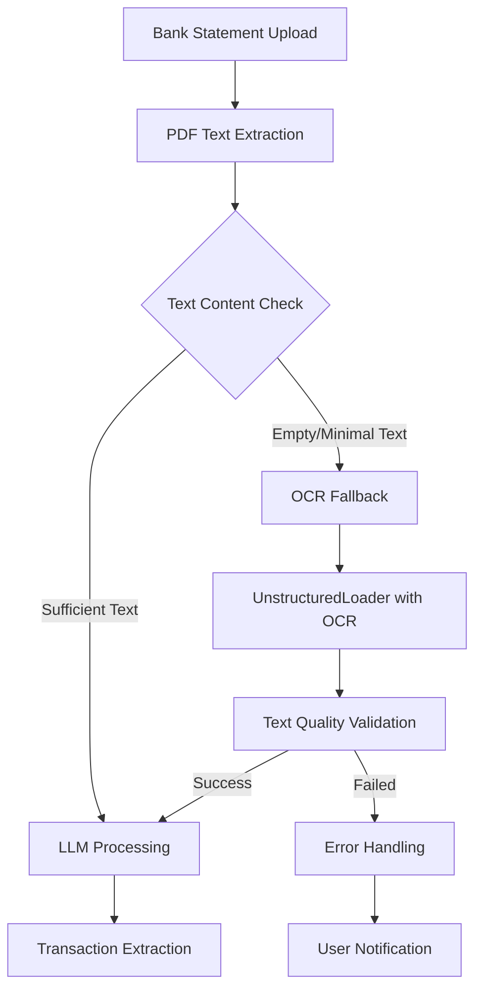

# Bank Statement OCR Fallback Design

## Overview

This design implements OCR fallback functionality for bank statement processing by enhancing the existing `statement_service.py` to automatically detect when PDF text extraction fails and seamlessly fall back to OCR-based text extraction. The solution leverages LangChain's `UnstructuredLoader` with Tesseract OCR to handle scanned or image-based PDFs while maintaining backward compatibility and performance for text-based PDFs.

## Architecture

### High-Level Flow



### Component Integration

The OCR fallback integrates with existing components:

- **Statement Service**: Enhanced with OCR fallback logic
- **OCR Service**: Reused for AI usage tracking and configuration
- **UniversalBankTransactionExtractor**: Modified to handle OCR-extracted text
- **Kafka Workers**: Updated to handle OCR processing timeouts
- **AI Configuration**: Extended to support OCR-specific settings

## Components and Interfaces

### Enhanced PDF Text Extraction

```python
class EnhancedPDFTextExtractor:
    def __init__(self, ai_config: Optional[Dict] = None):
        self.ai_config = ai_config
        self.pdf_loaders = self._initialize_pdf_loaders()
        self.ocr_loader = self._initialize_ocr_loader()
        
    def extract_text(self, pdf_path: str) -> Tuple[str, str]:
        """
        Extract text from PDF with OCR fallback.
        Returns: (extracted_text, extraction_method)
        """
        # Try PDF loaders first
        text = self._extract_with_pdf_loaders(pdf_path)
        
        if self._is_text_sufficient(text):
            return text, "pdf_loader"
        
        # Fallback to OCR
        logger.info(f"PDF extraction yielded insufficient text, falling back to OCR for {pdf_path}")
        ocr_text = self._extract_with_ocr(pdf_path)
        return ocr_text, "ocr"
    
    def _is_text_sufficient(self, text: str) -> bool:
        """Check if extracted text meets minimum quality thresholds."""
        if not text or len(text.strip()) < 50:
            return False
        
        # Additional quality checks
        word_count = len(text.split())
        if word_count < 10:
            return False
            
        # Check for common bank statement indicators
        bank_indicators = ['date', 'amount', 'balance', 'transaction', 'debit', 'credit']
        found_indicators = sum(1 for indicator in bank_indicators if indicator.lower() in text.lower())
        
        return found_indicators >= 2
```

### OCR Integration Layer

```python
class BankStatementOCRProcessor:
    def __init__(self, ai_config: Optional[Dict] = None):
        self.ai_config = ai_config
        self.ocr_timeout = int(os.getenv("BANK_OCR_TIMEOUT", "300"))  # 5 minutes
        
    def _initialize_ocr_loader(self):
        """Initialize unstructured with OCR capabilities."""
        try:
            from unstructured.partition.pdf import partition_pdf
            from unstructured.partition.auto import partition
            
            # Check for Unstructured API configuration
            api_key = os.getenv("UNSTRUCTURED_API_KEY")
            if api_key:
                logger.info("Using Unstructured API for OCR processing")
                return lambda path: UnstructuredLoader(
                    path,
                    strategy="hi_res",
                    partition_via_api=True,
                    api_key=api_key
                )
            else:
                logger.info("Using local Tesseract for OCR processing")
                return lambda path: UnstructuredLoader(
                    path,
                    strategy="hi_res",
                    mode="single"
                )
        except ImportError:
            logger.warning("UnstructuredLoader not available, OCR fallback disabled")
            return None
    
    def extract_with_ocr(self, pdf_path: str) -> str:
        """Extract text using OCR with timeout handling."""
        if not self.ocr_loader:
            raise OCRUnavailableError("OCR loader not initialized")
        
        try:
            with timeout(self.ocr_timeout):
                loader = self.ocr_loader(pdf_path)
                documents = loader.load()
                
                # Combine all document content
                text = "\n".join(doc.page_content for doc in documents)
                
                logger.info(f"OCR extracted {len(text)} characters from {pdf_path}")
                return text
                
        except TimeoutError:
            raise OCRTimeoutError(f"OCR processing timed out after {self.ocr_timeout} seconds")
        except Exception as e:
            raise OCRProcessingError(f"OCR processing failed: {str(e)}")
```

### Modified Bank Transaction Extractor

```python
class UniversalBankTransactionExtractor:
    def __init__(self, ai_config: Dict[str, Any], **kwargs):
        # Existing initialization
        self.text_extractor = EnhancedPDFTextExtractor(ai_config)
        
    def process_pdf(self, pdf_path: str) -> List[Dict[str, Any]]:
        """Process PDF with OCR fallback support."""
        try:
            # Extract text with fallback
            text, extraction_method = self.text_extractor.extract_text(pdf_path)
            
            # Track extraction method for analytics
            self._track_extraction_method(extraction_method, pdf_path)
            
            # Process with LLM (existing logic)
            transactions = self._process_with_llm(text)
            
            logger.info(f"Extracted {len(transactions)} transactions using {extraction_method}")
            return transactions
            
        except (OCRUnavailableError, OCRTimeoutError, OCRProcessingError) as e:
            logger.error(f"OCR fallback failed for {pdf_path}: {e}")
            # Fall back to existing error handling
            raise BankLLMUnavailableError(f"Both PDF and OCR extraction failed: {e}")
```

## Data Models

### Enhanced Processing Metadata

```python
@dataclass
class BankStatementProcessingResult:
    transactions: List[Dict[str, Any]]
    extraction_method: str  # "pdf_loader" or "ocr"
    processing_time: float
    text_length: int
    confidence_score: Optional[float] = None
    ocr_metadata: Optional[Dict] = None
```

### Configuration Extensions

```python
class OCRConfig:
    enabled: bool = True
    timeout_seconds: int = 300
    min_text_threshold: int = 50
    min_word_threshold: int = 10
    use_unstructured_api: bool = False
    api_key: Optional[str] = None
    tesseract_config: Optional[Dict] = None
```

## Error Handling

### Exception Hierarchy

```python
class OCRError(Exception):
    """Base class for OCR-related errors."""
    pass

class OCRUnavailableError(OCRError):
    """Raised when OCR functionality is not available."""
    pass

class OCRTimeoutError(OCRError):
    """Raised when OCR processing exceeds timeout."""
    pass

class OCRProcessingError(OCRError):
    """Raised when OCR processing fails."""
    pass
```

### Error Recovery Strategy

1. **PDF Extraction Failure**: Automatically trigger OCR fallback
2. **OCR Unavailable**: Log warning and proceed with existing error handling
3. **OCR Timeout**: Provide retry option with user notification
4. **OCR Processing Error**: Fall back to manual processing suggestion

## Testing Strategy

### Unit Tests

```python
class TestOCRFallback:
    def test_pdf_extraction_success_skips_ocr(self):
        """Test that successful PDF extraction skips OCR."""
        
    def test_empty_pdf_triggers_ocr_fallback(self):
        """Test that empty PDF extraction triggers OCR."""
        
    def test_ocr_unavailable_graceful_degradation(self):
        """Test graceful handling when OCR is unavailable."""
        
    def test_ocr_timeout_handling(self):
        """Test timeout handling for long OCR operations."""
        
    def test_extraction_method_tracking(self):
        """Test that extraction methods are properly tracked."""
```

### Integration Tests

```python
class TestBankStatementOCRIntegration:
    def test_end_to_end_pdf_processing(self):
        """Test complete processing flow with text-based PDF."""
        
    def test_end_to_end_scanned_processing(self):
        """Test complete processing flow with scanned PDF."""
        
    def test_kafka_worker_ocr_handling(self):
        """Test Kafka worker handling of OCR operations."""
        
    def test_ai_usage_tracking_with_ocr(self):
        """Test AI usage tracking includes OCR operations."""
```

### Performance Tests

- Benchmark PDF loader vs OCR processing times
- Test memory usage with large scanned documents
- Validate timeout handling under load
- Measure accuracy differences between extraction methods

## Configuration

### Environment Variables

```bash
# OCR Configuration
BANK_OCR_ENABLED=true
BANK_OCR_TIMEOUT=300
BANK_OCR_MIN_TEXT_THRESHOLD=50
BANK_OCR_MIN_WORD_THRESHOLD=10

# Unstructured API (optional)
UNSTRUCTURED_API_KEY=your_api_key_here
UNSTRUCTURED_API_URL=https://api.unstructured.io

# Tesseract Configuration (local)
TESSERACT_CMD=/usr/bin/tesseract
TESSERACT_CONFIG=--oem 3 --psm 6
```

### Dependencies

```python
# requirements.txt additions
unstructured[pdf]==0.10.30
langchain-unstructured==0.1.0
tesseract==0.1.3  # Python wrapper
pytesseract==0.3.10
```

## Monitoring and Analytics

### Metrics to Track

- Extraction method usage (PDF vs OCR)
- Processing time by method
- Success/failure rates
- Document characteristics that trigger OCR
- OCR confidence scores
- User satisfaction with OCR results

### Logging Enhancements

```python
logger.info(f"Bank statement processing: method={extraction_method} "
           f"time={processing_time:.2f}s text_length={text_length} "
           f"transactions={len(transactions)}")
```

### Dashboard Integration

- Add OCR metrics to existing monitoring dashboards
- Alert on high OCR failure rates
- Track processing time trends
- Monitor OCR service availability

## Migration Strategy

### Phase 1: Core Implementation
- Implement OCR fallback in statement_service.py
- Add configuration and error handling
- Create unit tests

### Phase 2: Integration
- Update Kafka workers for OCR timeout handling
- Integrate with AI usage tracking
- Add monitoring and logging

### Phase 3: Optimization
- Performance tuning based on usage patterns
- Advanced OCR configuration options
- User feedback integration

### Rollback Plan

The implementation maintains full backward compatibility. If issues arise:
1. Disable OCR fallback via environment variable
2. System reverts to existing PDF-only processing
3. No data migration required
4. No API changes needed