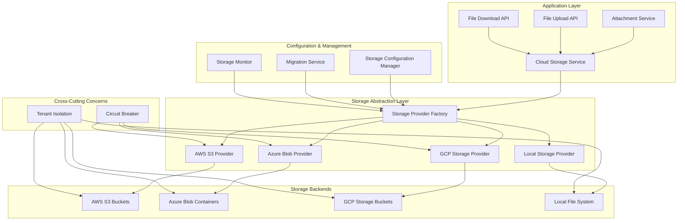

# Cloud File Storage Migration Design

## Overview

This design document outlines the migration of the current disk-based file attachment storage system to cloud storage providers (AWS S3, Azure Blob Storage, Google Cloud Storage). The solution provides a unified storage abstraction layer that supports multiple cloud providers while maintaining backward compatibility with local storage as a fallback option.

The design leverages existing patterns from the encryption system's key vault integrations and follows the established multi-tenant architecture. It introduces a pluggable storage provider system with automatic failover capabilities and comprehensive migration tools.

## Architecture



## Components and Interfaces

### 1. Storage Provider Interface

```python
from abc import ABC, abstractmethod
from typing import Optional, Dict, Any, List
from dataclasses import dataclass
from enum import Enum

class StorageProvider(Enum):
    AWS_S3 = "aws_s3"
    AZURE_BLOB = "azure_blob"
    GCP_STORAGE = "gcp_storage"
    LOCAL = "local"

@dataclass
class StorageResult:
    success: bool
    file_url: Optional[str] = None
    file_key: Optional[str] = None
    file_size: Optional[int] = None
    content_type: Optional[str] = None
    error_message: Optional[str] = None
    metadata: Optional[Dict[str, Any]] = None

@dataclass
class StorageConfig:
    provider: StorageProvider
    enabled: bool = True
    is_primary: bool = False
    config: Dict[str, Any] = None
    
class CloudStorageProvider(ABC):
    """Abstract base class for cloud storage providers"""
    
    @abstractmethod
    async def upload_file(
        self, 
        file_content: bytes, 
        file_key: str, 
        content_type: str,
        metadata: Optional[Dict[str, Any]] = None
    ) -> StorageResult:
        """Upload file to storage provider"""
        pass
    
    @abstractmethod
    async def download_file(self, file_key: str) -> StorageResult:
        """Download file from storage provider"""
        pass
    
    @abstractmethod
    async def delete_file(self, file_key: str) -> bool:
        """Delete file from storage provider"""
        pass
    
    @abstractmethod
    async def get_file_url(
        self, 
        file_key: str, 
        expiry_seconds: int = 3600
    ) -> Optional[str]:
        """Generate temporary access URL"""
        pass
    
    @abstractmethod
    async def list_files(
        self, 
        prefix: str, 
        limit: int = 100
    ) -> List[Dict[str, Any]]:
        """List files with given prefix"""
        pass
    
    @abstractmethod
    async def health_check(self) -> Dict[str, Any]:
        """Check provider health status"""
        pass
```

### 2. Cloud Storage Service

```python
class CloudStorageService:
    """
    Main service for cloud storage operations with provider abstraction
    and automatic fallback capabilities.
    """
    
    def __init__(self, config_manager: StorageConfigurationManager):
        self.config_manager = config_manager
        self.providers: Dict[StorageProvider, CloudStorageProvider] = {}
        self.circuit_breakers: Dict[StorageProvider, CloudProviderCircuitBreaker] = {}
        self._init_providers()
        self._init_circuit_breakers()
    
    async def store_file(
        self,
        file_content: bytes,
        tenant_id: str,
        item_id: int,
        attachment_type: str,
        original_filename: str,
        user_id: int
    ) -> StorageResult:
        """
        Store file using configured provider with automatic fallback
        """
        file_key = self._generate_file_key(
            tenant_id, item_id, attachment_type, original_filename
        )
        
        # Try primary provider first
        primary_provider = self._get_primary_provider()
        if primary_provider:
            try:
                result = await self._store_with_provider(
                    primary_provider, file_content, file_key, original_filename
                )
                if result.success:
                    await self._log_storage_operation(
                        "upload", file_key, primary_provider.value, True, user_id
                    )
                    return result
            except Exception as e:
                logger.warning(f"Primary provider {primary_provider.value} failed: {e}")
        
        # Fallback to local storage
        local_provider = self.providers.get(StorageProvider.LOCAL)
        if local_provider:
            result = await self._store_with_provider(
                local_provider, file_content, file_key, original_filename
            )
            await self._log_storage_operation(
                "upload", file_key, "local_fallback", result.success, user_id
            )
            return result
        
        return StorageResult(
            success=False, 
            error_message="No available storage providers"
        )
    
    async def retrieve_file(
        self, 
        file_key: str, 
        user_id: int,
        generate_url: bool = True
    ) -> StorageResult:
        """
        Retrieve file from any available provider
        """
        # Try to find file in cloud providers first
        for provider_type in [StorageProvider.AWS_S3, StorageProvider.AZURE_BLOB, StorageProvider.GCP_STORAGE]:
            provider = self.providers.get(provider_type)
            if provider and self._is_provider_healthy(provider_type):
                try:
                    if generate_url:
                        url = await provider.get_file_url(file_key)
                        if url:
                            return StorageResult(success=True, file_url=url)
                    else:
                        result = await provider.download_file(file_key)
                        if result.success:
                            return result
                except Exception as e:
                    logger.warning(f"Provider {provider_type.value} failed to retrieve {file_key}: {e}")
        
        # Fallback to local storage
        local_provider = self.providers.get(StorageProvider.LOCAL)
        if local_provider:
            try:
                return await local_provider.download_file(file_key)
            except Exception as e:
                logger.error(f"Local storage failed to retrieve {file_key}: {e}")
        
        return StorageResult(
            success=False, 
            error_message=f"File not found: {file_key}"
        )
```

### 3. AWS S3 Provider Implementation

```python
class AWSS3Provider(CloudStorageProvider):
    """AWS S3 storage provider implementation"""
    
    def __init__(self, config: Dict[str, Any]):
        self.bucket_name = config['bucket_name']
        self.region = config.get('region', 'us-east-1')
        self.access_key_id = config.get('access_key_id')
        self.secret_access_key = config.get('secret_access_key')
        
        # Initialize S3 client with connection pooling
        self.session = boto3.Session(
            aws_access_key_id=self.access_key_id,
            aws_secret_access_key=self.secret_access_key,
            region_name=self.region
        )
        
        self.s3_client = self.session.client(
            's3',
            config=boto3Config(
                region_name=self.region,
                max_pool_connections=20,
                retries={'max_attempts': 3, 'mode': 'adaptive'}
            )
        )
    
    async def upload_file(
        self, 
        file_content: bytes, 
        file_key: str, 
        content_type: str,
        metadata: Optional[Dict[str, Any]] = None
    ) -> StorageResult:
        """Upload file to S3 bucket"""
        try:
            extra_args = {
                'ContentType': content_type,
                'ServerSideEncryption': 'AES256'
            }
            
            if metadata:
                extra_args['Metadata'] = {
                    k: str(v) for k, v in metadata.items()
                }
            
            # Upload file
            self.s3_client.put_object(
                Bucket=self.bucket_name,
                Key=file_key,
                Body=file_content,
                **extra_args
            )
            
            return StorageResult(
                success=True,
                file_key=file_key,
                file_size=len(file_content),
                content_type=content_type
            )
            
        except ClientError as e:
            logger.error(f"S3 upload failed for {file_key}: {e}")
            return StorageResult(
                success=False,
                error_message=f"S3 upload failed: {str(e)}"
            )
    
    async def get_file_url(
        self, 
        file_key: str, 
        expiry_seconds: int = 3600
    ) -> Optional[str]:
        """Generate presigned URL for S3 object"""
        try:
            url = self.s3_client.generate_presigned_url(
                'get_object',
                Params={'Bucket': self.bucket_name, 'Key': file_key},
                ExpiresIn=expiry_seconds
            )
            return url
        except Exception as e:
            logger.error(f"Failed to generate S3 presigned URL for {file_key}: {e}")
            return None
```

### 4. Storage Configuration Manager

```python
@dataclass
class CloudStorageConfig:
    """Configuration for cloud storage providers"""
    
    # Provider selection
    PRIMARY_PROVIDER: str = field(default_factory=lambda: 
        os.getenv("CLOUD_STORAGE_PRIMARY_PROVIDER", "local"))
    
    FALLBACK_ENABLED: bool = field(default_factory=lambda:
        os.getenv("CLOUD_STORAGE_FALLBACK_ENABLED", "true").lower() == "true")
    
    # AWS S3 Configuration
    AWS_S3_ENABLED: bool = field(default_factory=lambda:
        os.getenv("AWS_S3_ENABLED", "false").lower() == "true")
    
    AWS_S3_BUCKET_NAME: Optional[str] = field(default_factory=lambda:
        os.getenv("AWS_S3_BUCKET_NAME"))
    
    AWS_S3_REGION: str = field(default_factory=lambda:
        os.getenv("AWS_S3_REGION", "us-east-1"))
    
    AWS_S3_ACCESS_KEY_ID: Optional[str] = field(default_factory=lambda:
        os.getenv("AWS_S3_ACCESS_KEY_ID"))
    
    AWS_S3_SECRET_ACCESS_KEY: Optional[str] = field(default_factory=lambda:
        os.getenv("AWS_S3_SECRET_ACCESS_KEY"))
    
    # Azure Blob Storage Configuration
    AZURE_BLOB_ENABLED: bool = field(default_factory=lambda:
        os.getenv("AZURE_BLOB_ENABLED", "false").lower() == "true")
    
    AZURE_STORAGE_ACCOUNT_NAME: Optional[str] = field(default_factory=lambda:
        os.getenv("AZURE_STORAGE_ACCOUNT_NAME"))
    
    AZURE_STORAGE_ACCOUNT_KEY: Optional[str] = field(default_factory=lambda:
        os.getenv("AZURE_STORAGE_ACCOUNT_KEY"))
    
    AZURE_CONTAINER_NAME: Optional[str] = field(default_factory=lambda:
        os.getenv("AZURE_CONTAINER_NAME"))
    
    # Google Cloud Storage Configuration
    GCP_STORAGE_ENABLED: bool = field(default_factory=lambda:
        os.getenv("GCP_STORAGE_ENABLED", "false").lower() == "true")
    
    GCP_BUCKET_NAME: Optional[str] = field(default_factory=lambda:
        os.getenv("GCP_BUCKET_NAME"))
    
    GCP_PROJECT_ID: Optional[str] = field(default_factory=lambda:
        os.getenv("GCP_PROJECT_ID"))
    
    GCP_CREDENTIALS_PATH: Optional[str] = field(default_factory=lambda:
        os.getenv("GCP_CREDENTIALS_PATH"))

class StorageConfigurationManager:
    """Manages cloud storage provider configurations"""
    
    def __init__(self):
        self.config = CloudStorageConfig()
        self.validate_configuration()
    
    def get_provider_configs(self) -> Dict[StorageProvider, Dict[str, Any]]:
        """Get configuration for all enabled providers"""
        configs = {}
        
        # Always include local storage as fallback
        configs[StorageProvider.LOCAL] = {
            'base_path': config.UPLOAD_PATH,
            'max_file_size': config.MAX_UPLOAD_SIZE
        }
        
        if self.config.AWS_S3_ENABLED and self.config.AWS_S3_BUCKET_NAME:
            configs[StorageProvider.AWS_S3] = {
                'bucket_name': self.config.AWS_S3_BUCKET_NAME,
                'region': self.config.AWS_S3_REGION,
                'access_key_id': self.config.AWS_S3_ACCESS_KEY_ID,
                'secret_access_key': self.config.AWS_S3_SECRET_ACCESS_KEY
            }
        
        if self.config.AZURE_BLOB_ENABLED and self.config.AZURE_STORAGE_ACCOUNT_NAME:
            configs[StorageProvider.AZURE_BLOB] = {
                'account_name': self.config.AZURE_STORAGE_ACCOUNT_NAME,
                'account_key': self.config.AZURE_STORAGE_ACCOUNT_KEY,
                'container_name': self.config.AZURE_CONTAINER_NAME
            }
        
        if self.config.GCP_STORAGE_ENABLED and self.config.GCP_BUCKET_NAME:
            configs[StorageProvider.GCP_STORAGE] = {
                'bucket_name': self.config.GCP_BUCKET_NAME,
                'project_id': self.config.GCP_PROJECT_ID,
                'credentials_path': self.config.GCP_CREDENTIALS_PATH
            }
        
        return configs
```

### 5. Migration Service

```python
class AttachmentMigrationService:
    """Service for migrating existing attachments to cloud storage"""
    
    def __init__(self, storage_service: CloudStorageService, db: Session):
        self.storage_service = storage_service
        self.db = db
        self.migration_stats = {
            'total_files': 0,
            'migrated_files': 0,
            'failed_files': 0,
            'skipped_files': 0
        }
    
    async def migrate_tenant_attachments(
        self, 
        tenant_id: str,
        dry_run: bool = False
    ) -> Dict[str, Any]:
        """Migrate all attachments for a specific tenant"""
        
        tenant_path = Path(config.UPLOAD_PATH) / f"tenant_{tenant_id}"
        if not tenant_path.exists():
            return {'error': f'No attachments found for tenant {tenant_id}'}
        
        migration_results = []
        
        # Scan all attachment files
        for attachment_type in ['images', 'documents', 'invoices', 'expenses']:
            type_path = tenant_path / attachment_type
            if not type_path.exists():
                continue
            
            for file_path in type_path.rglob('*'):
                if file_path.is_file():
                    result = await self._migrate_single_file(
                        file_path, tenant_id, attachment_type, dry_run
                    )
                    migration_results.append(result)
        
        return {
            'tenant_id': tenant_id,
            'stats': self.migration_stats,
            'results': migration_results
        }
    
    async def _migrate_single_file(
        self,
        file_path: Path,
        tenant_id: str,
        attachment_type: str,
        dry_run: bool
    ) -> Dict[str, Any]:
        """Migrate a single file to cloud storage"""
        
        try:
            # Read file content
            with open(file_path, 'rb') as f:
                file_content = f.read()
            
            # Generate cloud storage key
            relative_path = file_path.relative_to(Path(config.UPLOAD_PATH))
            file_key = str(relative_path).replace('\\', '/')
            
            # Check if file already exists in cloud
            existing_result = await self.storage_service.retrieve_file(
                file_key, user_id=0, generate_url=True
            )
            
            if existing_result.success:
                self.migration_stats['skipped_files'] += 1
                return {
                    'file_path': str(file_path),
                    'status': 'skipped',
                    'reason': 'Already exists in cloud storage'
                }
            
            if not dry_run:
                # Upload to cloud storage
                content_type, _ = mimetypes.guess_type(str(file_path))
                result = await self.storage_service.store_file(
                    file_content=file_content,
                    tenant_id=tenant_id,
                    item_id=0,  # Migration context
                    attachment_type=attachment_type,
                    original_filename=file_path.name,
                    user_id=0  # System migration
                )
                
                if result.success:
                    self.migration_stats['migrated_files'] += 1
                    return {
                        'file_path': str(file_path),
                        'file_key': file_key,
                        'status': 'migrated',
                        'cloud_url': result.file_url
                    }
                else:
                    self.migration_stats['failed_files'] += 1
                    return {
                        'file_path': str(file_path),
                        'status': 'failed',
                        'error': result.error_message
                    }
            else:
                return {
                    'file_path': str(file_path),
                    'file_key': file_key,
                    'status': 'would_migrate',
                    'size': len(file_content)
                }
                
        except Exception as e:
            self.migration_stats['failed_files'] += 1
            return {
                'file_path': str(file_path),
                'status': 'error',
                'error': str(e)
            }
```

## Data Models

### Storage Configuration Model

```python
class CloudStorageConfiguration(Base):
    """Database model for cloud storage configuration"""
    __tablename__ = "cloud_storage_configurations"
    
    id = Column(Integer, primary_key=True, index=True)
    tenant_id = Column(Integer, nullable=True, index=True)  # None for global config
    provider = Column(String(50), nullable=False)
    is_enabled = Column(Boolean, default=True)
    is_primary = Column(Boolean, default=False)
    configuration = Column(JSON, nullable=False)  # Encrypted configuration
    created_at = Column(DateTime(timezone=True), server_default=func.now())
    updated_at = Column(DateTime(timezone=True), onupdate=func.now())
    
    __table_args__ = (
        UniqueConstraint('tenant_id', 'provider', name='unique_tenant_provider'),
    )

class StorageOperationLog(Base):
    """Log of storage operations for audit and monitoring"""
    __tablename__ = "storage_operation_logs"
    
    id = Column(Integer, primary_key=True, index=True)
    tenant_id = Column(String(50), nullable=False, index=True)
    operation_type = Column(String(20), nullable=False)  # upload, download, delete
    file_key = Column(String(500), nullable=False)
    provider = Column(String(50), nullable=False)
    success = Column(Boolean, nullable=False)
    file_size = Column(BigInteger, nullable=True)
    duration_ms = Column(Integer, nullable=True)
    error_message = Column(Text, nullable=True)
    user_id = Column(Integer, nullable=True)
    ip_address = Column(String(45), nullable=True)
    created_at = Column(DateTime(timezone=True), server_default=func.now())
    
    __table_args__ = (
        Index('idx_storage_logs_tenant_created', 'tenant_id', 'created_at'),
        Index('idx_storage_logs_operation_created', 'operation_type', 'created_at'),
    )
```

## Error Handling

### Circuit Breaker Implementation

```python
class CloudStorageCircuitBreaker(CloudProviderCircuitBreaker):
    """Circuit breaker specifically for cloud storage operations"""
    
    def __init__(self, provider_name: str):
        super().__init__(
            provider_name=provider_name,
            operation_name="storage_operations",
            failure_threshold=5,  # Open after 5 failures
            recovery_timeout=60.0,  # Wait 1 minute before retry
            success_threshold=3  # Need 3 successes to close
        )
    
    def should_fallback_to_local(self) -> bool:
        """Determine if should fallback to local storage"""
        return self.state == CircuitBreakerState.OPEN
```

### Error Recovery Strategies

1. **Automatic Retry**: Exponential backoff for transient failures
2. **Circuit Breaker**: Prevent cascading failures to cloud providers
3. **Local Fallback**: Automatic fallback to local storage when cloud is unavailable
4. **Graceful Degradation**: Continue operations with reduced functionality
5. **Background Sync**: Sync local files to cloud when connectivity is restored

## Testing Strategy

### Unit Tests

1. **Provider Tests**: Test each cloud storage provider implementation
2. **Service Tests**: Test storage service logic and fallback mechanisms
3. **Configuration Tests**: Validate configuration management and validation
4. **Migration Tests**: Test file migration logic and error handling

### Integration Tests

1. **Multi-Provider Tests**: Test switching between providers
2. **Fallback Tests**: Test automatic fallback to local storage
3. **Migration Integration**: End-to-end migration testing
4. **Performance Tests**: Test upload/download performance across providers

### Test Data Strategy

1. **Mock Providers**: Use mocked cloud providers for unit tests
2. **Test Buckets**: Use dedicated test buckets/containers for integration tests
3. **Sample Files**: Various file types and sizes for comprehensive testing
4. **Tenant Isolation**: Verify tenant isolation across all providers

## Security Considerations

### Data Protection

1. **Encryption at Rest**: All cloud providers configured with server-side encryption
2. **Encryption in Transit**: HTTPS/TLS for all cloud communications
3. **Access Control**: IAM roles and policies for least-privilege access
4. **Tenant Isolation**: Strict separation of tenant data using prefixes/containers

### Authentication & Authorization

1. **Service Accounts**: Use service accounts with minimal required permissions
2. **Credential Management**: Encrypt and securely store cloud provider credentials
3. **Access Logging**: Comprehensive logging of all storage operations
4. **Audit Trail**: Maintain audit trail for compliance requirements

## Performance Optimization

### Caching Strategy

1. **URL Caching**: Cache presigned URLs to reduce API calls
2. **Metadata Caching**: Cache file metadata for faster lookups
3. **Connection Pooling**: Reuse connections to cloud providers
4. **Async Operations**: Use async/await for non-blocking I/O

### Cost Optimization

1. **Storage Classes**: Use appropriate storage classes based on access patterns
2. **Lifecycle Policies**: Automatic transition to cheaper storage tiers
3. **Compression**: Compress files before upload where appropriate
4. **Deduplication**: Avoid storing duplicate files

## Monitoring and Alerting

### Metrics Collection

1. **Operation Metrics**: Success rates, latency, throughput
2. **Storage Metrics**: Usage by tenant, file type, provider
3. **Cost Metrics**: Storage costs by provider and tenant
4. **Error Metrics**: Error rates and types by provider

### Alert Conditions

1. **High Error Rates**: Alert when error rate exceeds threshold
2. **Storage Quota**: Alert when approaching storage limits
3. **Cost Thresholds**: Alert when costs exceed budgets
4. **Provider Outages**: Alert when providers become unavailable

## Migration Plan

### Phase 1: Infrastructure Setup
- Deploy cloud storage configuration
- Set up cloud provider accounts and permissions
- Configure monitoring and alerting

### Phase 2: Parallel Operation
- Deploy storage abstraction layer
- Configure fallback to local storage
- Test with new uploads only

### Phase 3: Migration Execution
- Run migration service for existing files
- Verify file integrity and accessibility
- Monitor performance and error rates

### Phase 4: Cleanup and Optimization
- Remove local files after successful migration
- Optimize storage classes and lifecycle policies
- Fine-tune performance and cost settings