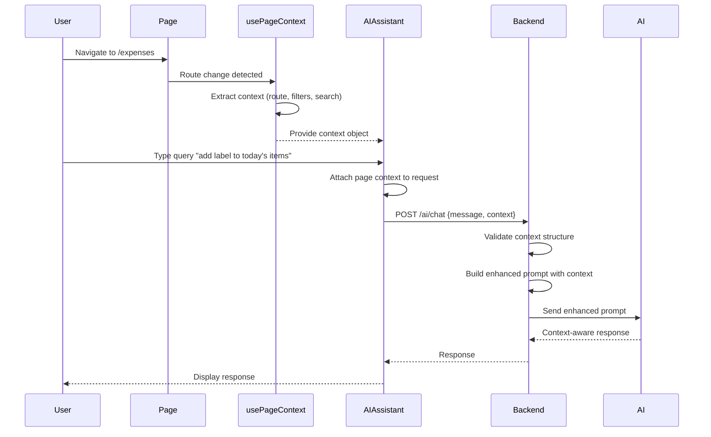

# Design Document: Context-Aware AI Assistant

## Overview

The Context-Aware AI Assistant feature enhances the existing AI chat system by automatically detecting and transmitting the user's current page context with every query. This enables more natural, conversational interactions where users don't need to explicitly specify what they're referring to.

The implementation involves:
1. A React hook to detect and track the current page context
2. Extension of the existing ChatRequest schema to include context information
3. Backend modifications to incorporate context into AI prompts
4. UI enhancements to display the current context to users

## Architecture

### High-Level Architecture

```
┌─────────────────────────────────────────────────────────────┐
│                      Frontend (React)                        │
│                                                              │
│  ┌────────────────┐      ┌──────────────────────────────┐  │
│  │  Page Context  │─────▶│   AIAssistant Component      │  │
│  │  Hook          │      │   - Displays context         │  │
│  │  (usePageCtx)  │      │   - Sends context with query │  │
│  └────────────────┘      └──────────────────────────────┘  │
│         │                            │                       │
│         │ Detects route              │ POST /ai/chat        │
│         │ & filters                  │ + context payload    │
│         ▼                            ▼                       │
│  ┌────────────────────────────────────────────────────┐    │
│  │  React Router (useLocation, useSearchParams)       │    │
│  └────────────────────────────────────────────────────┘    │
└─────────────────────────────────────────────────────────────┘
                              │
                              │ HTTPS
                              ▼
┌─────────────────────────────────────────────────────────────┐
│                    Backend (FastAPI)                         │
│                                                              │
│  ┌──────────────────────────────────────────────────────┐  │
│  │  /ai/chat Endpoint                                    │  │
│  │  - Receives ChatRequest with optional context        │  │
│  │  - Validates context structure                       │  │
│  │  - Builds enhanced AI prompt with context            │  │
│  └──────────────────────────────────────────────────────┘  │
│                              │                               │
│                              ▼                               │
│  ┌──────────────────────────────────────────────────────┐  │
│  │  AI Service (LiteLLM / OpenAI / Anthropic)           │  │
│  │  - Processes enhanced prompt                         │  │
│  │  - Returns context-aware response                    │  │
│  └──────────────────────────────────────────────────────┘  │
└─────────────────────────────────────────────────────────────┘
```

### Component Interaction Flow



## Components and Interfaces

### Frontend Components

#### 1. usePageContext Hook

A custom React hook that detects and provides the current page context.

**Location:** `ui/src/hooks/usePageContext.ts`

**Interface:**
```typescript
interface PageContext {
  route: string;              // Current route path (e.g., "/expenses")
  pageName: string;           // Human-readable page name (e.g., "Expenses")
  pageType: string;           // Page category (e.g., "expenses", "invoices", "investments")
  filters?: Record<string, any>;  // Active filters on the page
  searchQuery?: string;       // Active search query
  selectedIds?: number[];     // Selected item IDs (if applicable)
  metadata?: Record<string, any>; // Additional page-specific metadata
}

function usePageContext(): PageContext;
```

**Implementation Strategy:**
- Use `useLocation()` from react-router-dom to get current route
- Use `useSearchParams()` to extract query parameters
- Map routes to page names and types using a configuration object
- Return memoized context object that updates only when route or params change

**Route Mapping Configuration:**
```typescript
const PAGE_CONFIG: Record<string, { name: string; type: string }> = {
  '/expenses': { name: 'Expenses', type: 'expenses' },
  '/expenses/new': { name: 'New Expense', type: 'expenses' },
  '/expenses/edit/:id': { name: 'Edit Expense', type: 'expenses' },
  '/expenses/import': { name: 'Import Expenses', type: 'expenses' },
  '/invoices': { name: 'Invoices', type: 'invoices' },
  '/invoices/new': { name: 'New Invoice', type: 'invoices' },
  '/invoices/edit/:id': { name: 'Edit Invoice', type: 'invoices' },
  '/investments': { name: 'Investment Dashboard', type: 'investments' },
  '/investments/portfolio/:id': { name: 'Portfolio Detail', type: 'investments' },
  '/investments/portfolio/:id/performance': { name: 'Portfolio Performance', type: 'investments' },
  // ... additional routes
};
```

#### 2. AIAssistant Component Modifications

**Location:** `ui/src/components/AIAssistant.tsx`

**Changes Required:**
1. Import and use `usePageContext` hook
2. Display current context in the chat UI
3. Include context in all chat API requests
4. Handle context changes during active chat sessions

**Context Display UI:**
```typescript
// Add to AIAssistant component
const ContextBadge = ({ context }: { context: PageContext }) => (
  <div className="flex items-center gap-2 px-3 py-1.5 bg-primary/10 rounded-lg text-xs">
    <MapPin className="w-3 h-3" />
    <span className="font-medium">{context.pageName}</span>
    {context.searchQuery && (
      <Badge variant="secondary" className="text-[10px]">
        Search: {context.searchQuery}
      </Badge>
    )}
    {context.filters && Object.keys(context.filters).length > 0 && (
      <Badge variant="secondary" className="text-[10px]">
        {Object.keys(context.filters).length} filters
      </Badge>
    )}
  </div>
);
```

**Modified Chat Request:**
```typescript
// Update the chat request to include context
const response = await api.post('/ai/chat', {
  message: textToSend,
  config_id: defaultAIConfig?.id || 0,
  context: pageContext  // Add context to request
}) as any;
```

### Backend Components

#### 1. Extended ChatRequest Schema

**Location:** `api/commercial/ai/router.py`

**Current Schema:**
```python
class ChatRequest(BaseModel):
    message: str
    config_id: int = 0
```

**Extended Schema:**
```python
class PageContext(BaseModel):
    """Page context information from the frontend"""
    route: str
    page_name: str
    page_type: str
    filters: Optional[Dict[str, Any]] = None
    search_query: Optional[str] = None
    selected_ids: Optional[List[int]] = None
    metadata: Optional[Dict[str, Any]] = None

class ChatRequest(BaseModel):
    message: str
    config_id: int = 0
    context: Optional[PageContext] = None  # New optional field
```

#### 2. Context-Enhanced Prompt Builder

**Location:** `api/commercial/ai/router.py` (new function)

**Function:**
```python
def build_context_enhanced_prompt(
    user_message: str,
    context: Optional[PageContext] = None,
    base_prompt: str = ""
) -> str:
    """
    Build an AI prompt that includes page context information.
    
    Args:
        user_message: The user's query
        context: Optional page context from frontend
        base_prompt: Base system prompt for the AI
        
    Returns:
        Enhanced prompt string with context information
    """
    if not context:
        return f"{base_prompt}\n\nUser: {user_message}"
    
    context_section = f"""
Current Page Context:
- Page: {context.page_name} ({context.route})
- Page Type: {context.page_type}
"""
    
    if context.search_query:
        context_section += f"- Active Search: '{context.search_query}'\n"
    
    if context.filters:
        filter_desc = ", ".join([f"{k}={v}" for k, v in context.filters.items()])
        context_section += f"- Active Filters: {filter_desc}\n"
    
    if context.selected_ids:
        context_section += f"- Selected Items: {len(context.selected_ids)} items\n"
    
    context_section += """
When the user refers to items, data, or actions without specifying the type,
assume they are referring to the current page type. For example:
- On the Expenses page, "items" means expenses
- On the Invoices page, "items" means invoices
- On Investment pages, "items" means portfolios or holdings
"""
    
    return f"{base_prompt}\n\n{context_section}\n\nUser: {user_message}"
```

#### 3. Modified ai_chat Endpoint

**Location:** `api/commercial/ai/router.py`

**Changes:**
```python
@router.post("/chat")
@require_feature("ai_chat")
async def ai_chat(
    request: ChatRequest,
    db: Session = Depends(get_db),
    current_user: MasterUser = Depends(get_current_user)
):
    """
    Chat with AI assistant using specified configuration.
    Now supports optional page context for context-aware responses.
    """
    logger.info(f"AI Chat endpoint called with message: '{request.message}' by user: {current_user.email}")
    
    # Log context if provided
    if request.context:
        logger.info(f"Page context: {request.context.page_name} ({request.context.route})")
    
    # ... existing config loading logic ...
    
    # Build the prompt with context
    base_system_prompt = "You are an AI assistant for an invoice and expense management application."
    enhanced_prompt = build_context_enhanced_prompt(
        user_message=request.message,
        context=request.context,
        base_prompt=base_system_prompt
    )
    
    # ... rest of existing logic using enhanced_prompt ...
```

## Data Models

### PageContext Data Model

```typescript
// Frontend TypeScript
interface PageContext {
  route: string;              // "/expenses", "/invoices", etc.
  pageName: string;           // "Expenses", "Invoices", etc.
  pageType: string;           // "expenses", "invoices", "investments"
  filters?: {
    category?: string;        // For expenses
    status?: string;          // For invoices
    type?: string;            // For investments
    label?: string;           // Common across pages
    dateRange?: {
      start: string;
      end: string;
    };
    [key: string]: any;       // Allow additional filters
  };
  searchQuery?: string;       // Active search text
  selectedIds?: number[];     // IDs of selected items
  metadata?: {
    portfolioId?: number;     // For investment detail pages
    totalItems?: number;      // Total items on page
    page?: number;            // Current pagination page
    [key: string]: any;       // Allow additional metadata
  };
}
```

```python
# Backend Python (Pydantic)
class PageContext(BaseModel):
    """Page context information from the frontend"""
    route: str = Field(..., description="Current route path")
    page_name: str = Field(..., description="Human-readable page name")
    page_type: str = Field(..., description="Page category (expenses, invoices, investments)")
    filters: Optional[Dict[str, Any]] = Field(None, description="Active filters")
    search_query: Optional[str] = Field(None, description="Active search query")
    selected_ids: Optional[List[int]] = Field(None, description="Selected item IDs")
    metadata: Optional[Dict[str, Any]] = Field(None, description="Additional page metadata")
    
    class Config:
        schema_extra = {
            "example": {
                "route": "/expenses",
                "page_name": "Expenses",
                "page_type": "expenses",
                "filters": {"category": "travel", "label": "urgent"},
                "search_query": "hotel",
                "selected_ids": [1, 2, 3],
                "metadata": {"totalItems": 150, "page": 1}
            }
        }
```

### Example Context Payloads

**Expenses Page with Filters:**
```json
{
  "route": "/expenses",
  "pageName": "Expenses",
  "pageType": "expenses",
  "filters": {
    "category": "travel",
    "label": "urgent",
    "unlinkedOnly": false
  },
  "searchQuery": "hotel",
  "metadata": {
    "totalItems": 45,
    "page": 1
  }
}
```

**Investment Portfolio Detail:**
```json
{
  "route": "/investments/portfolio/5",
  "pageName": "Portfolio Detail",
  "pageType": "investments",
  "metadata": {
    "portfolioId": 5,
    "portfolioName": "Retirement Fund",
    "portfolioType": "retirement"
  }
}
```

**Invoices Page with Selection:**
```json
{
  "route": "/invoices",
  "pageName": "Invoices",
  "pageType": "invoices",
  "filters": {
    "status": "unpaid"
  },
  "selectedIds": [12, 15, 18],
  "metadata": {
    "totalItems": 3
  }
}
```

## Correctness Properties

*A property is a characteristic or behavior that should hold true across all valid executions of a system—essentially, a formal statement about what the system should do. Properties serve as the bridge between human-readable specifications and machine-verifiable correctness guarantees.*

### Property 1: Context Detection Consistency

*For any* page navigation event, the usePageContext hook should return a PageContext object with valid route, pageName, and pageType fields that accurately reflect the current page.

**Validates: Requirements 1.1, 1.2, 1.3, 1.4**

### Property 2: Context Transmission Completeness

*For any* AI chat request sent from the frontend, if a PageContext exists, it should be included in the request payload and arrive at the backend without data loss.

**Validates: Requirements 2.1, 2.2**

### Property 3: Backward Compatibility Preservation

*For any* AI chat request without a context field, the backend should process it successfully using the existing logic without errors.

**Validates: Requirements 2.4, 7.1, 7.2, 7.3, 7.4, 7.5**

### Property 4: Context-Aware Prompt Enhancement

*For any* AI chat request with valid PageContext, the backend should generate an enhanced prompt that includes the page name, page type, and any active filters or search queries.

**Validates: Requirements 3.1, 3.2**

### Property 5: Page-Specific Interpretation

*For any* user query containing generic terms like "items", "these", or "current data" on a specific page type, the AI prompt should include context that maps these terms to the appropriate page-specific entities (expenses, invoices, or investments).

**Validates: Requirements 3.3, 3.4, 3.5**

### Property 6: Filter Context Inclusion

*For any* page with active filters, the PageContext should include all filter values, and the backend prompt should describe these filters to the AI.

**Validates: Requirements 5.1, 5.2, 5.4**

### Property 7: Selection Context Inclusion

*For any* page with selected items, the PageContext should include the selectedIds array, and the backend prompt should inform the AI about the selection.

**Validates: Requirements 5.3**

### Property 8: Context Update on Navigation

*For any* route change event while the AI chat is open, the usePageContext hook should update the context to reflect the new page.

**Validates: Requirements 6.2, 6.3, 6.4**

### Property 9: Context Display Accuracy

*For any* PageContext provided to the AIAssistant component, the displayed context badge should show the correct page name and summarize active filters/search.

**Validates: Requirements 8.1, 8.2, 8.3, 8.4, 8.5**

### Property 10: Error Resilience

*For any* malformed or invalid PageContext, the backend should log the error, discard the invalid context, and process the query without context rather than failing.

**Validates: Requirements 9.1, 9.2, 9.3, 9.4, 9.5**

### Property 11: Performance Efficiency

*For any* page navigation, context detection should complete in under 50ms, and context transmission should add no more than 100ms to the total request time.

**Validates: Requirements 10.1, 10.2, 10.3, 10.4**

## Error Handling

### Frontend Error Handling

1. **Context Detection Failure**
   - If route parsing fails, return a minimal context with route="unknown"
   - Log warning but don't block chat functionality
   - Send query without context

2. **Context Serialization Error**
   - Catch JSON serialization errors
   - Send query without context
   - Log error for debugging

3. **Network Errors**
   - Standard retry logic applies (existing behavior)
   - Context is included in retries if available

### Backend Error Handling

1. **Context Validation Failure**
   - Use Pydantic validation to catch malformed context
   - Log validation error with details
   - Process query without context
   - Return successful response (don't fail the request)

2. **Context Processing Error**
   - Wrap context processing in try-except
   - Fall back to base prompt if context processing fails
   - Log error with stack trace
   - Continue with query processing

3. **AI Service Error**
   - Existing error handling applies
   - Context doesn't affect error recovery logic

### Error Logging

```python
# Backend logging strategy
logger.warning(f"Invalid context received: {validation_error}")
logger.error(f"Context processing failed: {error}", exc_info=True)
logger.info(f"Processing query without context due to error")
```

```typescript
// Frontend logging strategy
console.warn('Failed to detect page context:', error);
console.error('Context serialization failed:', error);
```

## Testing Strategy

### Unit Tests

**Frontend Unit Tests:**
1. Test `usePageContext` hook with different routes
2. Test context extraction from search params
3. Test context display component rendering
4. Test AIAssistant component with and without context
5. Test context serialization

**Backend Unit Tests:**
1. Test `PageContext` Pydantic model validation
2. Test `build_context_enhanced_prompt` function with various contexts
3. Test `ai_chat` endpoint with context
4. Test `ai_chat` endpoint without context (backward compatibility)
5. Test error handling for malformed context

### Property-Based Tests

Each property test should run a minimum of 100 iterations with randomized inputs.

**Property Test 1: Context Detection Consistency**
```typescript
// Feature: context-aware-ai-assistant, Property 1: Context Detection Consistency
// Generate random routes and verify context is always valid
test('property: context detection returns valid context for any route', () => {
  fc.assert(
    fc.property(
      fc.oneof(
        fc.constant('/expenses'),
        fc.constant('/invoices'),
        fc.constant('/investments'),
        fc.record({
          pathname: fc.constantFrom('/expenses', '/invoices', '/investments'),
          search: fc.string()
        })
      ),
      (routeInput) => {
        const context = extractContextFromRoute(routeInput);
        expect(context).toHaveProperty('route');
        expect(context).toHaveProperty('pageName');
        expect(context).toHaveProperty('pageType');
        expect(typeof context.route).toBe('string');
        expect(typeof context.pageName).toBe('string');
        expect(typeof context.pageType).toBe('string');
      }
    ),
    { numRuns: 100 }
  );
});
```

**Property Test 2: Context Transmission Completeness**
```typescript
// Feature: context-aware-ai-assistant, Property 2: Context Transmission Completeness
// Generate random contexts and verify they survive serialization
test('property: context survives JSON serialization round-trip', () => {
  fc.assert(
    fc.property(
      fc.record({
        route: fc.constantFrom('/expenses', '/invoices', '/investments'),
        pageName: fc.string(),
        pageType: fc.constantFrom('expenses', 'invoices', 'investments'),
        filters: fc.option(fc.dictionary(fc.string(), fc.anything())),
        searchQuery: fc.option(fc.string()),
        selectedIds: fc.option(fc.array(fc.integer()))
      }),
      (context) => {
        const serialized = JSON.stringify(context);
        const deserialized = JSON.parse(serialized);
        expect(deserialized).toEqual(context);
      }
    ),
    { numRuns: 100 }
  );
});
```

**Property Test 3: Backward Compatibility Preservation**
```python
# Feature: context-aware-ai-assistant, Property 3: Backward Compatibility Preservation
# Test that requests without context still work
@given(st.text(min_size=1), st.integers(min_value=0))
def test_chat_without_context_works(message: str, config_id: int):
    """Property: Chat requests without context should process successfully"""
    request = ChatRequest(message=message, config_id=config_id)
    # Should not raise an exception
    assert request.context is None
    # Should be valid
    assert request.message == message
```

**Property Test 4: Context-Aware Prompt Enhancement**
```python
# Feature: context-aware-ai-assistant, Property 4: Context-Aware Prompt Enhancement
# Test that valid contexts always enhance the prompt
@given(
    st.text(min_size=1),
    st.builds(
        PageContext,
        route=st.sampled_from(['/expenses', '/invoices', '/investments']),
        page_name=st.text(min_size=1),
        page_type=st.sampled_from(['expenses', 'invoices', 'investments'])
    )
)
def test_context_enhances_prompt(message: str, context: PageContext):
    """Property: Valid context should always enhance the prompt"""
    base_prompt = "You are an AI assistant."
    enhanced = build_context_enhanced_prompt(message, context, base_prompt)
    
    # Enhanced prompt should contain base prompt
    assert base_prompt in enhanced
    # Enhanced prompt should contain user message
    assert message in enhanced
    # Enhanced prompt should contain context information
    assert context.page_name in enhanced
    assert context.page_type in enhanced
    # Enhanced prompt should be longer than base + message
    assert len(enhanced) > len(base_prompt) + len(message)
```

**Property Test 5: Error Resilience**
```python
# Feature: context-aware-ai-assistant, Property 10: Error Resilience
# Test that malformed contexts don't crash the system
@given(st.dictionaries(st.text(), st.text()))
def test_malformed_context_handled_gracefully(malformed_dict: dict):
    """Property: Malformed context should not crash the endpoint"""
    try:
        # Try to create PageContext from random dict
        context = PageContext(**malformed_dict)
    except ValidationError:
        # This is expected for invalid data
        # The important thing is we catch it and don't crash
        pass
    
    # The endpoint should handle this gracefully
    # (This would be tested in integration tests)
```

### Integration Tests

1. **End-to-End Context Flow**
   - Navigate to Expenses page
   - Open AI chat
   - Send query
   - Verify context is included in request
   - Verify response is context-aware

2. **Context Update on Navigation**
   - Open AI chat on Expenses page
   - Navigate to Invoices page
   - Verify context updates
   - Send query
   - Verify new context is used

3. **Filter Context Integration**
   - Apply filters on Expenses page
   - Open AI chat
   - Verify filters are in context
   - Send query about "filtered items"
   - Verify AI understands the filter context

4. **Backward Compatibility**
   - Send chat request without context (simulate old client)
   - Verify request succeeds
   - Verify response is generated

### Test Configuration

- **Unit tests:** Run on every commit
- **Property tests:** Minimum 100 iterations per property
- **Integration tests:** Run on pull requests
- **Test frameworks:**
  - Frontend: Jest + React Testing Library + fast-check
  - Backend: pytest + Hypothesis
