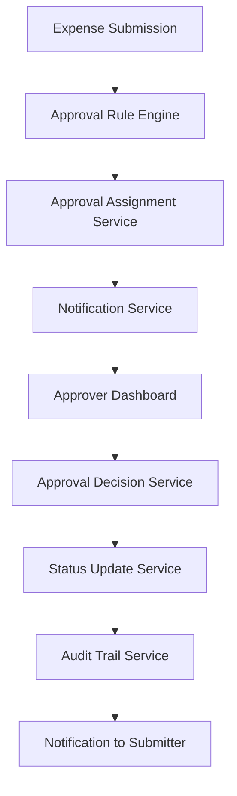
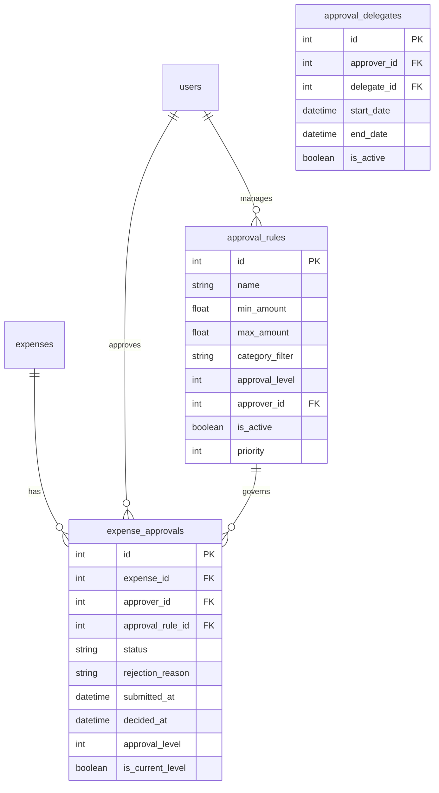

# Design Document

## Overview

The expense approval workflow feature will extend the existing expense management system to support configurable approval processes. The design leverages the current expense model's status field and builds upon the existing RBAC system, notification service, and audit logging capabilities. The solution will be implemented as a modular service that integrates seamlessly with the current FastAPI architecture.

## Architecture

### High-Level Architecture



### Database Schema Extensions

The design will extend the existing database schema with new tables while maintaining backward compatibility:



## Components and Interfaces

### 1. Approval Rule Engine

**Purpose:** Determines which approval rules apply to a given expense and assigns appropriate approvers.

**Key Methods:**
- `evaluate_expense(expense: Expense) -> List[ApprovalRule]`
- `get_required_approval_levels(expense: Expense) -> List[int]`
- `assign_approvers(expense: Expense, rules: List[ApprovalRule]) -> List[User]`

**Business Logic:**
- Evaluates expense amount against configured thresholds
- Matches expense categories against rule filters
- Supports multi-level approval workflows
- Handles fallback approvers when no specific rules match

### 2. Approval Service

**Purpose:** Core service managing the approval workflow lifecycle.

**Key Methods:**
- `submit_for_approval(expense_id: int, submitter_id: int) -> ExpenseApproval`
- `approve_expense(approval_id: int, approver_id: int, notes: str) -> bool`
- `reject_expense(approval_id: int, approver_id: int, reason: str) -> bool`
- `get_pending_approvals(approver_id: int) -> List[ExpenseApproval]`
- `delegate_approval(approver_id: int, delegate_id: int, start_date: date, end_date: date) -> bool`

### 3. Approval Router

**Purpose:** FastAPI router providing REST endpoints for approval operations.

**Endpoints:**
- `POST /expenses/{expense_id}/submit-approval` - Submit expense for approval
- `GET /approvals/pending` - Get pending approvals for current user
- `POST /approvals/{approval_id}/approve` - Approve an expense
- `POST /approvals/{approval_id}/reject` - Reject an expense
- `GET /approvals/history/{expense_id}` - Get approval history for expense
- `POST /approval-rules` - Create/update approval rules (admin only)
- `GET /approval-rules` - List approval rules
- `POST /approvals/delegate` - Set up approval delegation

### 4. Notification Integration

**Purpose:** Extends existing notification service for approval-related events.

**New Notification Types:**
- `expense_submitted_for_approval` - Notify approver of new submission
- `expense_approved` - Notify submitter of approval
- `expense_rejected` - Notify submitter of rejection
- `approval_reminder` - Remind approver of pending items
- `approval_escalation` - Notify when approval is overdue

### 5. Dashboard Components

**Purpose:** UI components for managing approvals and viewing status.

**Components:**
- `ApprovalDashboard` - Overview of pending approvals
- `ExpenseApprovalStatus` - Status indicator for expense list
- `ApprovalHistoryView` - Detailed approval timeline
- `ApprovalRulesManager` - Admin interface for rule configuration
- `ApprovalDelegationManager` - Interface for setting up delegates

## Data Models

### ExpenseApproval Model

```python
class ExpenseApproval(Base):
    __tablename__ = "expense_approvals"
    
    id = Column(Integer, primary_key=True, index=True)
    expense_id = Column(Integer, ForeignKey("expenses.id"), nullable=False)
    approver_id = Column(Integer, ForeignKey("users.id"), nullable=False)
    approval_rule_id = Column(Integer, ForeignKey("approval_rules.id"), nullable=True)
    status = Column(String, nullable=False, default="pending")  # pending, approved, rejected
    rejection_reason = Column(Text, nullable=True)
    notes = Column(Text, nullable=True)
    submitted_at = Column(DateTime(timezone=True), nullable=False)
    decided_at = Column(DateTime(timezone=True), nullable=True)
    approval_level = Column(Integer, nullable=False, default=1)
    is_current_level = Column(Boolean, nullable=False, default=True)
    
    # Relationships
    expense = relationship("Expense")
    approver = relationship("User")
    approval_rule = relationship("ApprovalRule")
```

### ApprovalRule Model

```python
class ApprovalRule(Base):
    __tablename__ = "approval_rules"
    
    id = Column(Integer, primary_key=True, index=True)
    name = Column(String, nullable=False)
    min_amount = Column(Float, nullable=True)
    max_amount = Column(Float, nullable=True)
    category_filter = Column(String, nullable=True)  # JSON array of categories
    currency = Column(String, default="USD", nullable=False)
    approval_level = Column(Integer, nullable=False, default=1)
    approver_id = Column(Integer, ForeignKey("users.id"), nullable=False)
    is_active = Column(Boolean, default=True, nullable=False)
    priority = Column(Integer, default=0, nullable=False)
    auto_approve_below = Column(Float, nullable=True)  # Auto-approve below this amount
    
    # Relationships
    approver = relationship("User")
```

### Enhanced Expense Status Values

The existing expense status field will be extended to support approval workflow:
- `draft` - Expense created but not submitted
- `pending_approval` - Submitted for approval
- `approved` - Approved and ready for reimbursement
- `rejected` - Rejected by approver
- `resubmitted` - Resubmitted after rejection
- `recorded` - Legacy status for expenses not requiring approval
- `reimbursed` - Existing status for completed reimbursements

## Error Handling

### Approval-Specific Exceptions

```python
class ApprovalException(Exception):
    """Base exception for approval-related errors"""
    pass

class InsufficientApprovalPermissions(ApprovalException):
    """Raised when user lacks approval permissions"""
    pass

class ExpenseAlreadyApproved(ApprovalException):
    """Raised when trying to modify already approved expense"""
    pass

class NoApprovalRuleFound(ApprovalException):
    """Raised when no approval rule matches expense criteria"""
    pass

class ApprovalLevelMismatch(ApprovalException):
    """Raised when approval level doesn't match expected level"""
    pass
```

### Error Handling Strategy

1. **Validation Errors:** Return 400 Bad Request with detailed error messages
2. **Permission Errors:** Return 403 Forbidden with appropriate error codes
3. **Not Found Errors:** Return 404 Not Found for non-existent approvals/expenses
4. **Business Logic Errors:** Return 422 Unprocessable Entity with business rule violations
5. **System Errors:** Log detailed errors and return 500 Internal Server Error with generic message

## Testing Strategy

### Unit Tests

1. **Approval Rule Engine Tests**
   - Test rule evaluation logic with various expense scenarios
   - Test multi-level approval assignment
   - Test fallback approver assignment

2. **Approval Service Tests**
   - Test approval workflow state transitions
   - Test delegation functionality
   - Test notification triggering

3. **Permission Tests**
   - Test RBAC integration for approval permissions
   - Test approval level restrictions
   - Test delegation permission checks

### Integration Tests

1. **End-to-End Approval Workflow**
   - Submit expense → Assign approver → Approve → Update status
   - Submit expense → Assign approver → Reject → Resubmit workflow
   - Multi-level approval workflow testing

2. **Notification Integration**
   - Test approval notification delivery
   - Test reminder notification scheduling
   - Test escalation notification triggers

3. **Database Integration**
   - Test approval history persistence
   - Test audit trail generation
   - Test concurrent approval handling

### API Tests

1. **Approval Endpoints**
   - Test all approval REST endpoints
   - Test authentication and authorization
   - Test input validation and error responses

2. **Performance Tests**
   - Test approval rule evaluation performance
   - Test bulk approval operations
   - Test notification system under load

### UI Tests

1. **Approval Dashboard**
   - Test pending approval display
   - Test approval action buttons
   - Test filtering and sorting functionality

2. **Expense Status Display**
   - Test approval status indicators
   - Test approval history timeline
   - Test responsive design on mobile devices

## Security Considerations

### Access Control

1. **Approval Permissions:** Only designated approvers can approve expenses within their configured limits
2. **Expense Modification:** Prevent modification of expenses once submitted for approval
3. **Approval History:** Maintain immutable audit trail of all approval decisions
4. **Delegation Security:** Ensure delegation permissions are properly validated and time-bounded

### Data Protection

1. **Sensitive Information:** Protect expense details and approval reasons from unauthorized access
2. **Audit Logging:** Log all approval actions with user identification and timestamps
3. **Input Validation:** Validate all approval-related inputs to prevent injection attacks
4. **Rate Limiting:** Implement rate limiting on approval endpoints to prevent abuse

## Performance Optimization

### Database Optimization

1. **Indexing Strategy:**
   - Index on expense_id, approver_id, and status for fast approval queries
   - Composite index on (expense_id, approval_level) for multi-level approvals
   - Index on submitted_at for time-based queries

2. **Query Optimization:**
   - Use eager loading for approval relationships
   - Implement pagination for large approval lists
   - Cache frequently accessed approval rules

### Notification Optimization

1. **Batch Processing:** Group notifications to reduce email sending overhead
2. **Queue Management:** Use background tasks for non-critical notifications
3. **Template Caching:** Cache email templates to improve rendering performance

## Migration Strategy

### Database Migration

1. **Phase 1:** Create new approval tables without affecting existing expenses
2. **Phase 2:** Add approval workflow endpoints alongside existing expense endpoints
3. **Phase 3:** Migrate existing expense statuses to new approval-aware statuses
4. **Phase 4:** Enable approval workflow for new expenses while maintaining backward compatibility

### Feature Rollout

1. **Admin Configuration:** Allow administrators to configure approval rules before enabling workflow
2. **Gradual Enablement:** Enable approval workflow per user group or expense category
3. **Fallback Support:** Maintain existing expense workflow as fallback option
4. **User Training:** Provide in-app guidance for new approval features