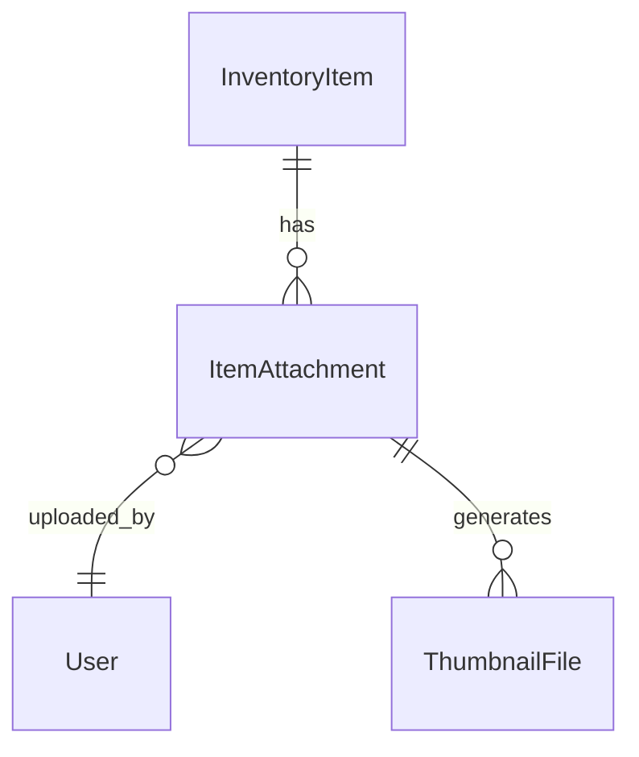

# Design Document

## Overview

The inventory attachments feature extends the existing inventory management system by adding comprehensive file upload, storage, and management capabilities for inventory items. The design leverages the established multi-tenant architecture and follows existing file handling patterns while introducing new models and services specifically for attachment management.

The system supports both images (for product photos) and documents (for manuals, certificates, specifications) with secure storage, efficient retrieval, and seamless integration with the existing inventory workflows. The design prioritizes security, performance, and user experience while maintaining consistency with the existing codebase patterns.

## Architecture

### High-Level Architecture

The inventory attachments system extends the existing layered architecture:

```
┌─────────────────────────────────────────────────────────────┐
│                    UI Layer (React/TypeScript)              │
│  ┌─────────────────┐ ┌─────────────────┐ ┌─────────────────┐│
│  │   Attachment    │ │   Image Gallery │ │   File Upload   ││
│  │   Manager       │ │   Component     │ │   Component     ││
│  └─────────────────┘ └─────────────────┘ └─────────────────┘│
├─────────────────────────────────────────────────────────────┤
│                    API Layer (FastAPI)                      │
│  ┌─────────────────┐ ┌─────────────────┐ ┌─────────────────┐│
│  │   Inventory     │ │   Attachment    │ │   File Serving  ││
│  │   Router        │ │   Router        │ │   Router        ││
│  └─────────────────┘ └─────────────────┘ └─────────────────┘│
├─────────────────────────────────────────────────────────────┤
│                   Service Layer                             │
│  ┌─────────────────┐ ┌─────────────────┐ ┌─────────────────┐│
│  │   Attachment    │ │   File Storage  │ │   Image         ││
│  │   Service       │ │   Service       │ │   Processing    ││
│  └─────────────────┘ └─────────────────┘ └─────────────────┘│
├─────────────────────────────────────────────────────────────┤
│                    Data Layer (SQLAlchemy)                  │
│  ┌─────────────────┐ ┌─────────────────┐ ┌─────────────────┐│
│  │ InventoryItem   │ │ ItemAttachment  │ │ AttachmentMeta  ││
│  │     Model       │ │     Model       │ │     Model       ││
│  └─────────────────┘ └─────────────────┘ └─────────────────┘│
├─────────────────────────────────────────────────────────────┤
│              File System (Tenant-Scoped Storage)            │
│  ┌─────────────────┐ ┌─────────────────┐ ┌─────────────────┐│
│  │   Original      │ │   Thumbnails    │ │   Compressed    ││
│  │   Files         │ │   (Images)      │ │   Versions      ││
│  └─────────────────┘ └─────────────────┘ └─────────────────┘│
└─────────────────────────────────────────────────────────────┘
```

### Integration Points

The attachment system integrates with existing components:

1. **Inventory Management**: Direct attachment to inventory items
2. **Invoice Generation**: Include product images in PDF invoices
3. **Mobile App**: Camera capture and upload functionality
4. **Search System**: Include attachment metadata in search results
5. **Backup/Export**: Include attachments in data exports

## Components and Interfaces

### Core Models

#### ItemAttachment Model
```python
class ItemAttachment(Base):
    __tablename__ = "item_attachments"
    
    id = Column(Integer, primary_key=True, index=True)
    item_id = Column(Integer, ForeignKey("inventory_items.id", ondelete="CASCADE"), nullable=False)
    
    # File information
    filename = Column(String, nullable=False)  # Original filename
    stored_filename = Column(String, nullable=False)  # Secure stored filename
    file_path = Column(String, nullable=False)  # Relative path from attachments root
    file_size = Column(Integer, nullable=False)  # Size in bytes
    content_type = Column(String, nullable=False)  # MIME type
    file_hash = Column(String, nullable=False, index=True)  # SHA-256 hash for deduplication
    
    # Attachment metadata
    attachment_type = Column(String, nullable=False)  # image, document
    document_type = Column(String, nullable=True)  # manual, certificate, warranty, specification
    description = Column(Text, nullable=True)  # User-provided description
    alt_text = Column(String, nullable=True)  # Accessibility text for images
    
    # Display and ordering
    is_primary = Column(Boolean, default=False, nullable=False)  # Primary image for item
    display_order = Column(Integer, default=0, nullable=False)  # Order for display
    
    # Image-specific metadata (null for documents)
    image_width = Column(Integer, nullable=True)
    image_height = Column(Integer, nullable=True)
    has_thumbnail = Column(Boolean, default=False, nullable=False)
    thumbnail_path = Column(String, nullable=True)
    
    # Security and audit
    uploaded_by = Column(Integer, ForeignKey("users.id"), nullable=False)
    upload_ip = Column(String, nullable=True)  # IP address for audit
    is_active = Column(Boolean, default=True, nullable=False)
    
    # Timestamps
    created_at = Column(DateTime(timezone=True), default=lambda: datetime.now(timezone.utc))
    updated_at = Column(DateTime(timezone=True), default=lambda: datetime.now(timezone.utc), onupdate=lambda: datetime.now(timezone.utc))
    
    # Relationships
    item = relationship("InventoryItem", back_populates="attachments")
    uploader = relationship("User")
    
    # Indexes for performance
    __table_args__ = (
        Index('idx_item_attachments_item_id', 'item_id'),
        Index('idx_item_attachments_type', 'attachment_type'),
        Index('idx_item_attachments_primary', 'item_id', 'is_primary'),
        Index('idx_item_attachments_order', 'item_id', 'display_order'),
    )
```

#### Enhanced InventoryItem Model
```python
# Add to existing InventoryItem model
attachments = relationship("ItemAttachment", back_populates="item", cascade="all, delete-orphan")

# Add computed properties
@property
def primary_image(self) -> Optional["ItemAttachment"]:
    """Get the primary image attachment"""
    return next((att for att in self.attachments if att.is_primary and att.attachment_type == "image"), None)

@property
def attachment_count(self) -> int:
    """Get total count of active attachments"""
    return len([att for att in self.attachments if att.is_active])

@property
def image_count(self) -> int:
    """Get count of image attachments"""
    return len([att for att in self.attachments if att.attachment_type == "image" and att.is_active])

@property
def document_count(self) -> int:
    """Get count of document attachments"""
    return len([att for att in self.attachments if att.attachment_type == "document" and att.is_active])
```

### Service Layer Components

#### AttachmentService
Primary service for attachment management operations.

```python
class AttachmentService:
    def __init__(self, db: Session):
        self.db = db
        self.file_service = FileStorageService()
        self.image_service = ImageProcessingService()
    
    async def upload_attachment(
        self, 
        item_id: int, 
        file: UploadFile, 
        attachment_type: str,
        document_type: Optional[str] = None,
        description: Optional[str] = None,
        user_id: int = None
    ) -> ItemAttachment:
        """Upload and process a new attachment"""
        
    async def delete_attachment(self, attachment_id: int, user_id: int) -> bool:
        """Delete an attachment and its files"""
        
    async def update_attachment_metadata(
        self, 
        attachment_id: int, 
        metadata: AttachmentUpdateData
    ) -> ItemAttachment:
        """Update attachment metadata (description, order, etc.)"""
        
    async def set_primary_image(self, item_id: int, attachment_id: int) -> ItemAttachment:
        """Set an image as the primary image for an item"""
        
    async def reorder_attachments(self, item_id: int, attachment_orders: List[AttachmentOrder]) -> List[ItemAttachment]:
        """Update display order for multiple attachments"""
        
    async def get_item_attachments(
        self, 
        item_id: int, 
        attachment_type: Optional[str] = None
    ) -> List[ItemAttachment]:
        """Get all attachments for an item, optionally filtered by type"""
        
    async def duplicate_check(self, file_hash: str, item_id: int) -> Optional[ItemAttachment]:
        """Check if file already exists for this item"""
```

#### FileStorageService
Handles secure file storage and retrieval.

```python
class FileStorageService:
    def __init__(self):
        self.base_path = Path(settings.UPLOAD_PATH)
        self.max_file_size = settings.MAX_UPLOAD_SIZE
    
    async def store_file(
        self, 
        file: UploadFile, 
        tenant_id: str, 
        item_id: int,
        attachment_type: str
    ) -> FileStorageResult:
        """Store file securely with proper naming and organization"""
        
    async def delete_file(self, file_path: str) -> bool:
        """Delete file from storage"""
        
    async def get_file_info(self, file_path: str) -> FileInfo:
        """Get file metadata and verify existence"""
        
    def generate_secure_filename(self, original_filename: str, item_id: int) -> str:
        """Generate secure filename with UUID and sanitization"""
        
    def validate_file_type(self, file: UploadFile, allowed_types: List[str]) -> bool:
        """Validate file type against allowed types"""
        
    def calculate_file_hash(self, file_content: bytes) -> str:
        """Calculate SHA-256 hash for deduplication"""
        
    def get_storage_path(self, tenant_id: str, attachment_type: str) -> Path:
        """Get organized storage path: attachments/tenant_X/inventory/images|documents"""
```

#### ImageProcessingService
Handles image-specific operations like thumbnail generation.

```python
class ImageProcessingService:
    def __init__(self):
        self.thumbnail_sizes = [(150, 150), (300, 300)]  # Small and medium thumbnails
        self.max_image_size = (2048, 2048)  # Max dimensions for originals
    
    async def process_image(self, file_path: Path, attachment: ItemAttachment) -> ImageProcessingResult:
        """Process uploaded image: validate, resize, generate thumbnails"""
        
    async def generate_thumbnails(self, source_path: Path, attachment_id: int) -> List[ThumbnailInfo]:
        """Generate multiple thumbnail sizes"""
        
    async def get_image_dimensions(self, file_path: Path) -> Tuple[int, int]:
        """Get image width and height"""
        
    async def optimize_image(self, file_path: Path, max_size: Tuple[int, int]) -> bool:
        """Optimize image size and quality for web display"""
        
    def is_valid_image(self, file_content: bytes) -> bool:
        """Validate image file integrity"""
```

### API Layer Components

#### Attachment Router
RESTful API endpoints for attachment management:

```python
router = APIRouter(prefix="/api/inventory/{item_id}/attachments", tags=["inventory-attachments"])

# Upload and management
@router.post("/", response_model=AttachmentResponse)
async def upload_attachment(
    item_id: int,
    file: UploadFile = File(...),
    attachment_type: str = Form(...),
    document_type: Optional[str] = Form(None),
    description: Optional[str] = Form(None)
)

@router.get("/", response_model=List[AttachmentResponse])
async def get_attachments(item_id: int, type_filter: Optional[str] = None)

@router.put("/{attachment_id}", response_model=AttachmentResponse)
async def update_attachment(item_id: int, attachment_id: int, update_data: AttachmentUpdate)

@router.delete("/{attachment_id}")
async def delete_attachment(item_id: int, attachment_id: int)

# Image-specific operations
@router.post("/{attachment_id}/set-primary")
async def set_primary_image(item_id: int, attachment_id: int)

@router.post("/reorder")
async def reorder_attachments(item_id: int, orders: List[AttachmentOrder])

# File serving
@router.get("/{attachment_id}/download")
async def download_attachment(item_id: int, attachment_id: int)

@router.get("/{attachment_id}/thumbnail/{size}")
async def get_thumbnail(item_id: int, attachment_id: int, size: str)
```

#### File Serving Router
Secure file serving with proper authentication:

```python
router = APIRouter(prefix="/api/files", tags=["file-serving"])

@router.get("/inventory/{tenant_id}/{file_path:path}")
async def serve_inventory_file(
    tenant_id: str,
    file_path: str,
    current_user: MasterUser = Depends(get_current_user)
):
    """Serve inventory attachment files with security checks"""
    
@router.get("/thumbnails/{tenant_id}/{file_path:path}")
async def serve_thumbnail(
    tenant_id: str,
    file_path: str,
    current_user: MasterUser = Depends(get_current_user)
):
    """Serve thumbnail images with caching headers"""
```

## Data Models

### Database Schema Design

The attachment system adds one new table to the existing per-tenant database:

1. **item_attachments**: Core attachment information and metadata

### File System Organization

```
attachments/
├── tenant_1/
│   └── inventory/
│       ├── images/
│       │   ├── originals/
│       │   │   └── item_123_uuid_product.jpg
│       │   └── thumbnails/
│       │       ├── 150x150/
│       │       │   └── item_123_uuid_product.jpg
│       │       └── 300x300/
│       │           └── item_123_uuid_product.jpg
│       └── documents/
│           └── item_123_uuid_manual.pdf
└── tenant_2/
    └── inventory/
        └── ...
```

### Data Relationships



### Data Validation Rules

1. **File Type Validation**: Strict MIME type checking with content verification
2. **File Size Limits**: Configurable per tenant (default 10MB images, 25MB documents)
3. **Primary Image Constraint**: Only one primary image per inventory item
4. **Filename Sanitization**: Remove unsafe characters and path traversal attempts
5. **Hash Uniqueness**: Prevent duplicate files per item using SHA-256 hash

## Error Handling

### Error Categories

1. **Upload Errors**: File too large, invalid type, corrupted file
2. **Storage Errors**: Disk space, permission issues, file system errors
3. **Processing Errors**: Image processing failures, thumbnail generation
4. **Security Errors**: Malware detection, unauthorized access attempts
5. **Business Logic Errors**: Primary image conflicts, invalid metadata

### Error Response Format

```python
class AttachmentException(BaseException):
    def __init__(self, message: str, error_code: str, details: Dict[str, Any] = None):
        self.message = message
        self.error_code = error_code
        self.details = details or {}

# Specific error types
class FileTooLargeException(AttachmentException):
    pass

class InvalidFileTypeException(AttachmentException):
    pass

class StorageException(AttachmentException):
    pass

class ImageProcessingException(AttachmentException):
    pass
```

### Error Recovery Strategies

1. **Upload Failures**: Clean up partial files, provide retry mechanism
2. **Processing Failures**: Store original, retry processing in background
3. **Storage Failures**: Fallback storage locations, queue for retry
4. **Thumbnail Generation**: Graceful degradation, regenerate on demand

## Security Considerations

### File Security

1. **Content Validation**: MIME type verification with magic number checking
2. **Malware Scanning**: Integration with antivirus scanning (configurable)
3. **File Sanitization**: Remove EXIF data from images, sanitize document metadata
4. **Secure Storage**: Files stored outside web root with secure naming
5. **Access Control**: Authentication required for all file access

### Upload Security

1. **Rate Limiting**: Prevent abuse with upload rate limits per user
2. **Size Validation**: Strict file size limits with early termination
3. **Type Restrictions**: Whitelist approach for allowed file types
4. **Path Traversal Prevention**: Sanitize all file paths and names
5. **Virus Scanning**: Optional integration with ClamAV or similar

### Data Protection

1. **Tenant Isolation**: Files organized by tenant with access controls
2. **User Permissions**: Role-based access to attachment features
3. **Audit Logging**: Track all upload, download, and deletion activities
4. **Data Encryption**: Optional encryption at rest for sensitive files

## Performance Optimization

### File Handling Performance

1. **Streaming Uploads**: Handle large files with streaming to avoid memory issues
2. **Thumbnail Caching**: Generate thumbnails once, serve with proper cache headers
3. **Lazy Loading**: Load attachment metadata only when needed
4. **Compression**: Automatic image optimization for web display
5. **CDN Integration**: Optional CDN support for file serving

### Database Performance

1. **Indexing Strategy**: Indexes on item_id, attachment_type, and is_primary
2. **Query Optimization**: Efficient joins with inventory items
3. **Pagination**: Large attachment lists paginated
4. **Eager Loading**: Load attachments with inventory items when needed

### Storage Optimization

1. **Deduplication**: Use file hashes to prevent duplicate storage
2. **Cleanup Jobs**: Background jobs to remove orphaned files
3. **Storage Monitoring**: Track storage usage per tenant
4. **Archival Strategy**: Move old unused files to cheaper storage

## Testing Strategy

### Unit Testing

1. **Service Tests**: File upload, processing, and management logic
2. **Model Tests**: Database relationships and constraints
3. **Validation Tests**: File type, size, and security validations
4. **Error Handling**: Exception scenarios and recovery

### Integration Testing

1. **API Tests**: Complete upload and download workflows
2. **File System Tests**: Storage and retrieval operations
3. **Image Processing**: Thumbnail generation and optimization
4. **Security Tests**: Access control and validation

### End-to-End Testing

1. **User Workflows**: Complete attachment management scenarios
2. **Mobile Integration**: Camera capture and upload flows
3. **Invoice Integration**: Image inclusion in generated invoices
4. **Performance Tests**: Large file uploads and concurrent access

### Test Data Strategy

```python
@pytest.fixture
def sample_image_file():
    """Create a test image file"""
    return create_test_image(width=800, height=600, format="JPEG")

@pytest.fixture
def sample_pdf_file():
    """Create a test PDF document"""
    return create_test_pdf(content="Test document content")

@pytest.fixture
def attachment_test_data():
    """Test data for attachment operations"""
    return {
        "item_id": 1,
        "attachment_type": "image",
        "description": "Product photo",
        "is_primary": True
    }
```

## Mobile Integration

### Camera Capture

1. **Native Camera**: Direct camera access for photo capture
2. **Image Editing**: Basic crop, rotate, and filter capabilities
3. **Batch Upload**: Multiple photo selection and upload
4. **Offline Queue**: Store uploads when offline, sync when connected
5. **Progress Tracking**: Real-time upload progress indication

### Mobile Optimization

1. **Image Compression**: Automatic compression for mobile uploads
2. **Thumbnail Generation**: Client-side thumbnail preview
3. **Background Upload**: Continue uploads when app is backgrounded
4. **Error Handling**: Robust error handling for network issues

## Future Enhancements

### Phase 2 Features

1. **Bulk Operations**: Bulk upload, delete, and metadata updates
2. **Image Editing**: Advanced editing capabilities (filters, annotations)
3. **Video Support**: Support for product demonstration videos
4. **OCR Integration**: Extract text from document attachments
5. **AI Tagging**: Automatic image tagging and categorization

### Advanced Features

1. **Version Control**: Track attachment versions and changes
2. **Collaborative Editing**: Multiple users editing attachment metadata
3. **Advanced Search**: Full-text search within document attachments
4. **Integration APIs**: Third-party integrations for file sources
5. **Analytics**: Attachment usage and performance analytics

## Migration Strategy

### Database Migration

```python
# Alembic migration for item_attachments table
def upgrade():
    op.create_table(
        'item_attachments',
        sa.Column('id', sa.Integer(), nullable=False),
        sa.Column('item_id', sa.Integer(), nullable=False),
        sa.Column('filename', sa.String(), nullable=False),
        # ... additional columns
        sa.ForeignKeyConstraint(['item_id'], ['inventory_items.id'], ondelete='CASCADE'),
        sa.PrimaryKeyConstraint('id')
    )
    
    # Create indexes
    op.create_index('idx_item_attachments_item_id', 'item_attachments', ['item_id'])
    # ... additional indexes
```

### File System Setup

1. **Directory Creation**: Ensure proper directory structure exists
2. **Permission Setup**: Set appropriate file system permissions
3. **Storage Validation**: Verify storage capacity and accessibility
4. **Backup Integration**: Include attachments in backup procedures

### Feature Rollout

1. **Feature Flags**: Gradual rollout with feature toggles
2. **User Training**: Documentation and tutorials for new features
3. **Performance Monitoring**: Monitor system performance during rollout
4. **Feedback Collection**: Gather user feedback for improvements