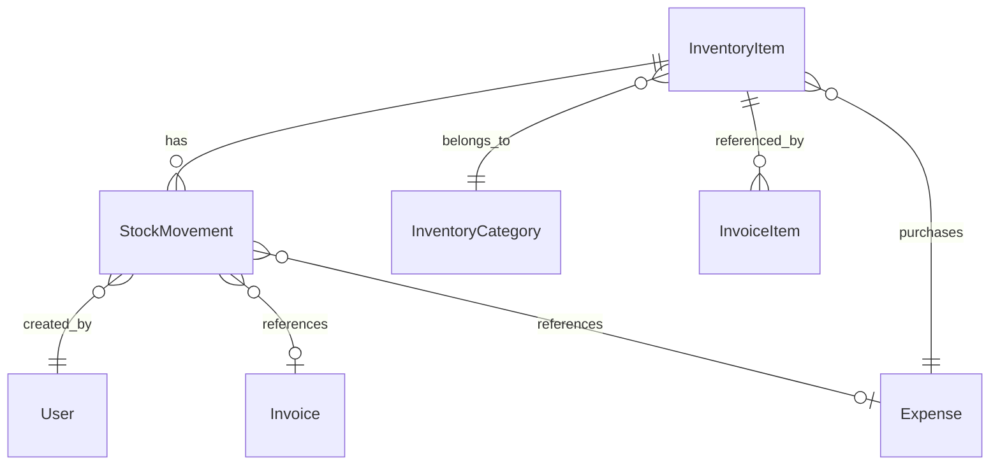

# Design Document

## Overview

The inventory management feature extends the existing personal invoicing and expense application with comprehensive product catalog and stock tracking capabilities. The design follows the established multi-tenant architecture pattern, integrating seamlessly with existing invoicing and expense workflows while maintaining data consistency and referential integrity.

The system supports both product-based businesses (with stock tracking) and service-based businesses (materials and supplies tracking), providing flexibility for different business models while keeping the interface simple and intuitive.

## Architecture

### High-Level Architecture

The inventory management system follows the existing layered architecture:

```
┌─────────────────────────────────────────────────────────────┐
│                    UI Layer (React/TypeScript)              │
├─────────────────────────────────────────────────────────────┤
│                    API Layer (FastAPI)                      │
│  ┌─────────────────┐ ┌─────────────────┐ ┌─────────────────┐│
│  │   Inventory     │ │    Invoice      │ │    Expense      ││
│  │    Router       │ │    Router       │ │    Router       ││
│  └─────────────────┘ └─────────────────┘ └─────────────────┘│
├─────────────────────────────────────────────────────────────┤
│                   Service Layer                             │
│  ┌─────────────────┐ ┌─────────────────┐ ┌─────────────────┐│
│  │   Inventory     │ │  Stock Movement │ │   Integration   ││
│  │   Service       │ │    Service      │ │    Service      ││
│  └─────────────────┘ └─────────────────┘ └─────────────────┘│
├─────────────────────────────────────────────────────────────┤
│                    Data Layer (SQLAlchemy)                  │
│  ┌─────────────────┐ ┌─────────────────┐ ┌─────────────────┐│
│  │  InventoryItem  │ │ StockMovement   │ │  ItemCategory   ││
│  │     Model       │ │     Model       │ │     Model       ││
│  └─────────────────┘ └─────────────────┘ └─────────────────┘│
├─────────────────────────────────────────────────────────────┤
│              Database (Per-Tenant SQLite/PostgreSQL)        │
└─────────────────────────────────────────────────────────────┘
```

### Integration Points

The inventory system integrates with existing components at multiple levels:

1. **Invoice Integration**: Direct selection of inventory items when creating invoice line items
2. **Expense Integration**: Recording inventory purchases and automatic stock adjustments
3. **Reporting Integration**: Inventory data included in financial reports and analytics
4. **User Management**: Leverages existing user authentication and tenant isolation

## Components and Interfaces

### Core Models

#### InventoryItem Model
```python
class InventoryItem(Base):
    __tablename__ = "inventory_items"
    
    id = Column(Integer, primary_key=True, index=True)
    name = Column(String, nullable=False, index=True)
    description = Column(Text, nullable=True)
    sku = Column(String, nullable=True, unique=True, index=True)
    category_id = Column(Integer, ForeignKey("inventory_categories.id"), nullable=True)
    
    # Pricing
    unit_price = Column(Float, nullable=False)
    cost_price = Column(Float, nullable=True)  # For profit calculations
    currency = Column(String, default="USD", nullable=False)
    
    # Stock tracking (optional)
    track_stock = Column(Boolean, default=False, nullable=False)
    current_stock = Column(Float, default=0.0, nullable=False)
    minimum_stock = Column(Float, default=0.0, nullable=False)
    unit_of_measure = Column(String, default="each", nullable=False)
    
    # Item type and status
    item_type = Column(String, default="product", nullable=False)  # product, material, service
    is_active = Column(Boolean, default=True, nullable=False)
    
    # Audit fields
    created_at = Column(DateTime(timezone=True), default=lambda: datetime.now(timezone.utc))
    updated_at = Column(DateTime(timezone=True), default=lambda: datetime.now(timezone.utc), onupdate=lambda: datetime.now(timezone.utc))
    
    # Relationships
    category = relationship("InventoryCategory", back_populates="items")
    stock_movements = relationship("StockMovement", back_populates="item", cascade="all, delete-orphan")
    invoice_items = relationship("InvoiceItem", back_populates="inventory_item")
```

#### InventoryCategory Model
```python
class InventoryCategory(Base):
    __tablename__ = "inventory_categories"
    
    id = Column(Integer, primary_key=True, index=True)
    name = Column(String, nullable=False, unique=True, index=True)
    description = Column(Text, nullable=True)
    color = Column(String, nullable=True)  # For UI display
    is_active = Column(Boolean, default=True, nullable=False)
    
    created_at = Column(DateTime(timezone=True), default=lambda: datetime.now(timezone.utc))
    updated_at = Column(DateTime(timezone=True), default=lambda: datetime.now(timezone.utc), onupdate=lambda: datetime.now(timezone.utc))
    
    # Relationships
    items = relationship("InventoryItem", back_populates="category")
```

#### StockMovement Model
```python
class StockMovement(Base):
    __tablename__ = "stock_movements"
    
    id = Column(Integer, primary_key=True, index=True)
    item_id = Column(Integer, ForeignKey("inventory_items.id", ondelete="CASCADE"), nullable=False)
    
    # Movement details
    movement_type = Column(String, nullable=False)  # purchase, sale, adjustment, usage
    quantity = Column(Float, nullable=False)  # Positive for increases, negative for decreases
    unit_cost = Column(Float, nullable=True)  # Cost per unit for purchases
    
    # Reference information
    reference_type = Column(String, nullable=True)  # invoice, expense, manual
    reference_id = Column(Integer, nullable=True)  # ID of the related record
    notes = Column(Text, nullable=True)
    
    # User and timestamp
    user_id = Column(Integer, ForeignKey("users.id"), nullable=False)
    movement_date = Column(DateTime(timezone=True), default=lambda: datetime.now(timezone.utc))
    
    created_at = Column(DateTime(timezone=True), default=lambda: datetime.now(timezone.utc))
    
    # Relationships
    item = relationship("InventoryItem", back_populates="stock_movements")
    user = relationship("User")
```

### Enhanced Existing Models

#### InvoiceItem Model Enhancement
```python
# Add to existing InvoiceItem model
inventory_item_id = Column(Integer, ForeignKey("inventory_items.id"), nullable=True)
unit_of_measure = Column(String, nullable=True)

# Add relationship
inventory_item = relationship("InventoryItem", back_populates="invoice_items")
```

#### Expense Model Enhancement
```python
# Add to existing Expense model
is_inventory_purchase = Column(Boolean, default=False, nullable=False)
inventory_items = Column(JSON, nullable=True)  # Store purchased items and quantities
```

### Service Layer Components

#### InventoryService
Primary service for inventory item CRUD operations, validation, and business logic.

```python
class InventoryService:
    def __init__(self, db: Session):
        self.db = db
        self.stock_service = StockMovementService(db)
    
    async def create_item(self, item_data: InventoryItemCreate) -> InventoryItem
    async def update_item(self, item_id: int, item_data: InventoryItemUpdate) -> InventoryItem
    async def delete_item(self, item_id: int) -> bool
    async def get_item(self, item_id: int) -> InventoryItem
    async def list_items(self, filters: InventoryFilters) -> List[InventoryItem]
    async def search_items(self, query: str) -> List[InventoryItem]
    async def get_low_stock_items(self) -> List[InventoryItem]
```

#### StockMovementService
Handles all stock-related operations and maintains movement history.

```python
class StockMovementService:
    def __init__(self, db: Session):
        self.db = db
    
    async def record_movement(self, movement_data: StockMovementCreate) -> StockMovement
    async def adjust_stock(self, item_id: int, quantity: float, reason: str) -> StockMovement
    async def process_invoice_sale(self, invoice_items: List[InvoiceItem]) -> List[StockMovement]
    async def process_expense_purchase(self, expense: Expense) -> List[StockMovement]
    async def get_movement_history(self, item_id: int, date_range: DateRange) -> List[StockMovement]
```

#### InventoryIntegrationService
Manages integration with invoicing and expense systems.

```python
class InventoryIntegrationService:
    def __init__(self, db: Session):
        self.db = db
        self.inventory_service = InventoryService(db)
        self.stock_service = StockMovementService(db)
    
    async def populate_invoice_item(self, inventory_item_id: int) -> InvoiceItemData
    async def validate_stock_availability(self, invoice_items: List[InvoiceItem]) -> ValidationResult
    async def process_invoice_completion(self, invoice: Invoice) -> None
    async def process_expense_inventory_purchase(self, expense: Expense) -> None
    async def reverse_invoice_stock_impact(self, invoice: Invoice) -> None
```

### API Layer Components

#### Inventory Router
RESTful API endpoints following existing patterns:

```python
router = APIRouter(prefix="/api/inventory", tags=["inventory"])

# CRUD operations
@router.post("/items", response_model=InventoryItemResponse)
@router.get("/items", response_model=List[InventoryItemResponse])
@router.get("/items/{item_id}", response_model=InventoryItemResponse)
@router.put("/items/{item_id}", response_model=InventoryItemResponse)
@router.delete("/items/{item_id}")

# Stock operations
@router.post("/items/{item_id}/stock/adjust")
@router.get("/items/{item_id}/stock/movements")
@router.get("/stock/low-stock")

# Categories
@router.post("/categories", response_model=CategoryResponse)
@router.get("/categories", response_model=List[CategoryResponse])

# Integration endpoints
@router.get("/items/search")
@router.get("/items/{item_id}/availability")
```

## Data Models

### Database Schema Design

The inventory system adds three new tables to the existing per-tenant database structure:

1. **inventory_items**: Core inventory item information
2. **inventory_categories**: Item categorization
3. **stock_movements**: Historical record of all stock changes

### Data Relationships



### Data Validation Rules

1. **Unique Constraints**: SKU must be unique per tenant when provided
2. **Stock Validation**: Current stock cannot go negative for tracked items
3. **Price Validation**: Unit price must be positive
4. **Category Validation**: Category must exist and be active
5. **Movement Validation**: Stock movements must have valid reference types and IDs

## Error Handling

### Error Categories

1. **Validation Errors**: Invalid data format, missing required fields
2. **Business Logic Errors**: Insufficient stock, inactive items
3. **Integration Errors**: Failed invoice/expense updates
4. **System Errors**: Database connection issues, service unavailability

### Error Response Format

Following existing error handling patterns:

```python
class InventoryException(BaseException):
    def __init__(self, message: str, error_code: str, details: Dict[str, Any] = None):
        self.message = message
        self.error_code = error_code
        self.details = details or {}

# Specific error types
class InsufficientStockException(InventoryException):
    pass

class ItemNotFoundException(InventoryException):
    pass

class DuplicateSKUException(InventoryException):
    pass
```

### Error Recovery Strategies

1. **Stock Adjustments**: Automatic rollback on failed transactions
2. **Integration Failures**: Queue for retry with exponential backoff
3. **Validation Failures**: Detailed field-level error messages
4. **System Failures**: Graceful degradation with cached data

## Testing Strategy

### Unit Testing

1. **Model Tests**: Validation, relationships, constraints
2. **Service Tests**: Business logic, error handling, integration points
3. **API Tests**: Endpoint functionality, authentication, authorization

### Integration Testing

1. **Database Integration**: Multi-table operations, transactions
2. **Service Integration**: Cross-service communication
3. **External Integration**: Invoice and expense system integration

### End-to-End Testing

1. **User Workflows**: Complete inventory management scenarios
2. **Integration Workflows**: Invoice creation with inventory items
3. **Stock Management**: Purchase-to-sale inventory lifecycle

### Test Data Strategy

```python
# Test fixtures for consistent testing
@pytest.fixture
def sample_inventory_item():
    return InventoryItemCreate(
        name="Test Product",
        description="A test product",
        sku="TEST-001",
        unit_price=29.99,
        track_stock=True,
        current_stock=100.0,
        minimum_stock=10.0
    )

@pytest.fixture
def sample_category():
    return CategoryCreate(
        name="Test Category",
        description="A test category"
    )
```

### Performance Testing

1. **Load Testing**: High-volume inventory operations
2. **Stress Testing**: Concurrent stock movements
3. **Database Performance**: Query optimization validation

## Security Considerations

### Data Access Control

1. **Tenant Isolation**: Inventory data isolated per tenant database
2. **User Permissions**: Role-based access to inventory features
3. **API Authentication**: JWT token validation for all endpoints

### Data Validation

1. **Input Sanitization**: All user inputs validated and sanitized
2. **SQL Injection Prevention**: Parameterized queries only
3. **Business Rule Enforcement**: Server-side validation of all business rules

### Audit Trail

1. **Stock Movement Logging**: All stock changes recorded with user and timestamp
2. **Item Change History**: Track modifications to inventory items
3. **Integration Audit**: Log all invoice/expense integration activities

## Performance Optimization

### Database Optimization

1. **Indexing Strategy**: Indexes on frequently queried fields (name, sku, category_id)
2. **Query Optimization**: Efficient joins and filtering
3. **Connection Pooling**: Reuse database connections

### Caching Strategy

1. **Item Caching**: Cache frequently accessed inventory items
2. **Category Caching**: Cache category lists for dropdowns
3. **Stock Level Caching**: Cache current stock levels with TTL

### API Performance

1. **Pagination**: Large result sets paginated
2. **Field Selection**: Allow clients to specify required fields
3. **Bulk Operations**: Support bulk create/update operations

## Migration Strategy

### Database Migration

1. **Schema Creation**: Alembic migrations for new tables
2. **Data Migration**: Scripts for importing existing product data
3. **Index Creation**: Performance indexes added post-migration

### Feature Rollout

1. **Feature Flags**: Gradual rollout with feature toggles
2. **User Training**: Documentation and tutorials
3. **Monitoring**: Performance and error monitoring during rollout

## Future Enhancements

### Phase 2 Features

1. **Barcode Support**: Barcode scanning for inventory items
2. **Multi-location**: Support for multiple warehouse locations
3. **Supplier Management**: Track suppliers and purchase orders
4. **Automated Reordering**: Automatic purchase suggestions

### Advanced Features

1. **Inventory Valuation**: FIFO, LIFO, weighted average costing
2. **Lot Tracking**: Track inventory by lot or batch numbers
3. **Expiration Management**: Track expiration dates for perishable items
4. **Advanced Analytics**: Inventory turnover, profitability analysis