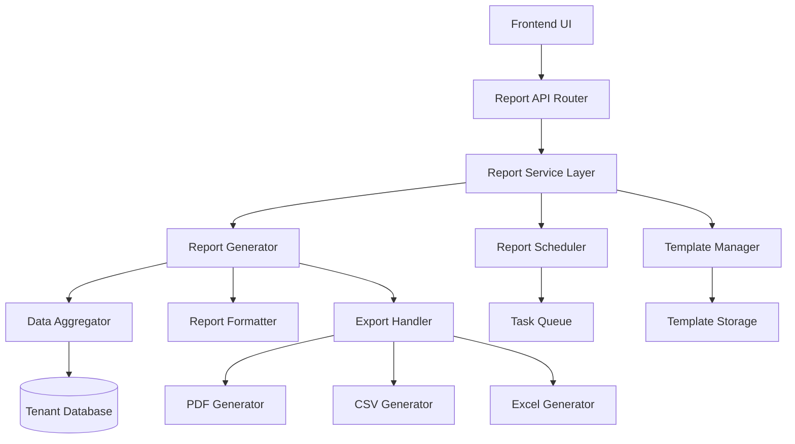
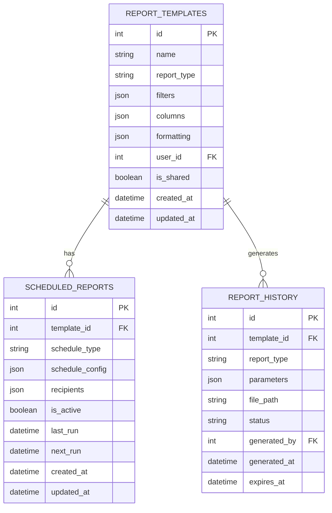

# Design Document - Reporting Module

## Overview

The reporting module will be implemented as a comprehensive system that provides flexible, customizable reports across all major data entities in the invoice management system. The module will follow the existing FastAPI architecture pattern and integrate seamlessly with the current multi-tenant database structure.

The system will support real-time report generation, scheduled automated reports, customizable templates, and multiple export formats. All reports will respect tenant isolation and user permissions, ensuring data security and appropriate access control.

## Architecture

### High-Level Architecture



### Database Architecture

The reporting module will utilize the existing multi-tenant database structure with additional tables for report management:



## Components and Interfaces

### 1. Report API Router (`api/routers/reports.py`)

**Endpoints:**
- `GET /reports/types` - List available report types
- `POST /reports/generate` - Generate report with filters
- `GET /reports/templates` - List user's report templates
- `POST /reports/templates` - Create/update report template
- `DELETE /reports/templates/{id}` - Delete report template
- `GET /reports/scheduled` - List scheduled reports
- `POST /reports/scheduled` - Create scheduled report
- `PUT /reports/scheduled/{id}` - Update scheduled report
- `DELETE /reports/scheduled/{id}` - Delete scheduled report
- `GET /reports/history` - List report generation history
- `GET /reports/download/{id}` - Download generated report
- `POST /reports/preview` - Preview report with current filters

### 2. Report Service Layer (`api/services/report_service.py`)

**Core Classes:**

```python
class ReportService:
    def generate_report(self, report_type: str, filters: dict, format: str) -> ReportResult
    def get_available_report_types(self) -> List[ReportType]
    def validate_filters(self, report_type: str, filters: dict) -> bool
    def schedule_report(self, template_id: int, schedule: ScheduleConfig) -> ScheduledReport
    def get_report_history(self, user_id: int, limit: int) -> List[ReportHistory]

class ReportGenerator:
    def generate_client_report(self, filters: ClientReportFilters) -> ReportData
    def generate_invoice_report(self, filters: InvoiceReportFilters) -> ReportData
    def generate_payment_report(self, filters: PaymentReportFilters) -> ReportData
    def generate_expense_report(self, filters: ExpenseReportFilters) -> ReportData
    def generate_statement_report(self, filters: StatementReportFilters) -> ReportData
```

### 3. Data Aggregation Layer (`api/services/report_data_aggregator.py`)

**Responsibilities:**
- Query optimization for large datasets
- Data filtering and sorting
- Cross-entity data joining
- Calculation of derived metrics
- Tenant-aware data access

**Key Methods:**
```python
class ReportDataAggregator:
    def aggregate_client_data(self, client_ids: List[int], date_range: DateRange) -> ClientData
    def aggregate_invoice_metrics(self, filters: InvoiceFilters) -> InvoiceMetrics
    def aggregate_payment_flows(self, filters: PaymentFilters) -> PaymentFlows
    def aggregate_expense_categories(self, filters: ExpenseFilters) -> ExpenseBreakdown
    def aggregate_statement_transactions(self, filters: StatementFilters) -> TransactionData
```

### 4. Export Handler (`api/services/report_exporter.py`)

**Supported Formats:**
- PDF with professional formatting and branding
- CSV for data analysis
- Excel with multiple sheets and formatting
- JSON for API consumption

**Export Classes:**
```python
class PDFExporter:
    def export_report(self, report_data: ReportData, template: ReportTemplate) -> bytes

class CSVExporter:
    def export_report(self, report_data: ReportData) -> str

class ExcelExporter:
    def export_report(self, report_data: ReportData, template: ReportTemplate) -> bytes
```

### 5. Report Scheduler (`api/services/report_scheduler.py`)

**Features:**
- Cron-based scheduling
- Email delivery integration
- Failure handling and retry logic
- Schedule management

```python
class ReportScheduler:
    def schedule_report(self, config: ScheduleConfig) -> str
    def cancel_scheduled_report(self, schedule_id: str) -> bool
    def execute_scheduled_report(self, schedule_id: str) -> ReportResult
    def get_next_run_time(self, schedule_id: str) -> datetime
```

## Data Models

### Report Filter Models

```python
class BaseReportFilters(BaseModel):
    date_from: Optional[datetime] = None
    date_to: Optional[datetime] = None
    client_ids: Optional[List[int]] = None
    currency: Optional[str] = None

class InvoiceReportFilters(BaseReportFilters):
    status: Optional[List[str]] = None
    amount_min: Optional[float] = None
    amount_max: Optional[float] = None
    include_items: bool = False

class PaymentReportFilters(BaseReportFilters):
    payment_methods: Optional[List[str]] = None
    include_unmatched: bool = False

class ExpenseReportFilters(BaseReportFilters):
    categories: Optional[List[str]] = None
    labels: Optional[List[str]] = None
    include_attachments: bool = False

class StatementReportFilters(BaseReportFilters):
    account_ids: Optional[List[int]] = None
    transaction_types: Optional[List[str]] = None
    include_reconciliation: bool = False
```

### Report Output Models

```python
class ReportData(BaseModel):
    report_type: str
    generated_at: datetime
    filters: dict
    summary: ReportSummary
    data: List[dict]
    metadata: ReportMetadata

class ReportSummary(BaseModel):
    total_records: int
    total_amount: float
    currency: str
    date_range: DateRange
    key_metrics: dict

class ReportTemplate(BaseModel):
    id: Optional[int] = None
    name: str
    report_type: str
    filters: dict
    columns: List[str]
    formatting: dict
    is_shared: bool = False
```

## Error Handling

### Error Categories

1. **Validation Errors**
   - Invalid date ranges
   - Unsupported report types
   - Missing required filters

2. **Data Access Errors**
   - Insufficient permissions
   - Tenant isolation violations
   - Database connection issues

3. **Generation Errors**
   - Large dataset timeouts
   - Export format failures
   - Template processing errors

4. **Scheduling Errors**
   - Invalid cron expressions
   - Email delivery failures
   - Storage capacity issues

### Error Response Format

```python
class ReportError(BaseModel):
    error_code: str
    message: str
    details: Optional[dict] = None
    suggestions: Optional[List[str]] = None
```

### Error Codes

```python
# Report Generation Errors
REPORT_INVALID_TYPE = "REPORT_001"
REPORT_INVALID_FILTERS = "REPORT_002"
REPORT_DATA_TOO_LARGE = "REPORT_003"
REPORT_GENERATION_FAILED = "REPORT_004"

# Template Errors
TEMPLATE_NOT_FOUND = "TEMPLATE_001"
TEMPLATE_INVALID_FORMAT = "TEMPLATE_002"
TEMPLATE_ACCESS_DENIED = "TEMPLATE_003"

# Schedule Errors
SCHEDULE_INVALID_CRON = "SCHEDULE_001"
SCHEDULE_EMAIL_FAILED = "SCHEDULE_002"
SCHEDULE_EXECUTION_FAILED = "SCHEDULE_003"
```

## Testing Strategy

### Unit Tests

1. **Service Layer Tests**
   - Report generation logic
   - Data aggregation accuracy
   - Filter validation
   - Export format correctness

2. **API Endpoint Tests**
   - Request/response validation
   - Authentication and authorization
   - Error handling
   - Performance benchmarks

3. **Database Tests**
   - Query optimization
   - Tenant isolation
   - Data integrity
   - Migration compatibility

### Integration Tests

1. **End-to-End Report Generation**
   - Complete report workflows
   - Multi-format exports
   - Large dataset handling
   - Cross-entity data consistency

2. **Scheduling System Tests**
   - Automated report execution
   - Email delivery integration
   - Failure recovery
   - Schedule management

3. **Performance Tests**
   - Large dataset reports
   - Concurrent report generation
   - Memory usage optimization
   - Database query performance

### Test Data Strategy

- Use existing test fixtures from current test suite
- Create comprehensive test datasets covering edge cases
- Mock external dependencies (email service, file storage)
- Implement data factories for consistent test data generation

## Security Considerations

### Access Control

1. **Role-Based Permissions**
   - Admin: Full access to all reports and templates
   - User: Access to own reports and shared templates
   - Viewer: Read-only access to designated reports

2. **Data Filtering**
   - Automatic tenant isolation
   - Client-level access restrictions
   - Sensitive data redaction options

3. **Report Sharing**
   - Template sharing controls
   - Report history access restrictions
   - Scheduled report recipient validation

### Data Protection

1. **Export Security**
   - Temporary file cleanup
   - Secure file storage
   - Access token validation for downloads

2. **Audit Logging**
   - Report generation tracking
   - Template access logging
   - Export activity monitoring

3. **Rate Limiting**
   - Report generation frequency limits
   - Large dataset request throttling
   - Scheduled report execution limits

## Performance Optimization

### Database Optimization

1. **Query Optimization**
   - Indexed columns for common filters
   - Optimized joins across entities
   - Query result caching
   - Pagination for large datasets

2. **Data Aggregation**
   - Pre-calculated summary tables
   - Incremental data processing
   - Background data preparation
   - Materialized views for complex reports

### Caching Strategy

1. **Report Caching**
   - Cache frequently requested reports
   - Invalidation on data changes
   - User-specific cache keys
   - Configurable cache TTL

2. **Template Caching**
   - Cache compiled templates
   - Version-based invalidation
   - Shared template optimization

### Scalability Considerations

1. **Asynchronous Processing**
   - Background report generation
   - Queue-based scheduling
   - Progress tracking
   - Result notification

2. **Resource Management**
   - Memory usage monitoring
   - Concurrent request limiting
   - Temporary file cleanup
   - Database connection pooling