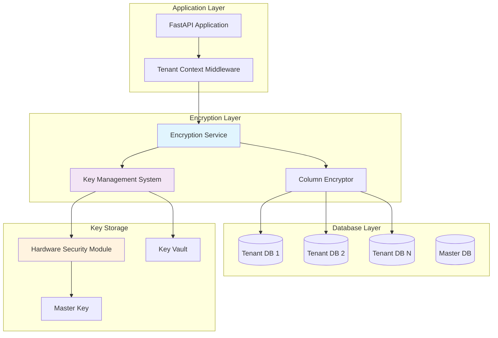

# Tenant Database Encryption Design

## Overview

This design document outlines the implementation of comprehensive encryption for tenant database contents in the multi-tenant {APP_NAME}. The solution provides transparent data-at-rest encryption using AES-256-GCM encryption with secure key management, while maintaining system performance and existing API compatibility.

## Architecture

### High-Level Architecture



### Component Architecture

The encryption system consists of four main components:

1. **Encryption Service**: Handles transparent encryption/decryption operations
2. **Key Management System**: Manages encryption keys and key rotation
3. **Column Encryptor**: SQLAlchemy integration for automatic field encryption
4. **Key Vault Integration**: Secure storage for encryption keys

## Components and Interfaces

### 1. Encryption Service

**Location**: `api/services/encryption_service.py`

```python
class EncryptionService:
    def encrypt_data(self, data: str, tenant_id: int) -> str
    def decrypt_data(self, encrypted_data: str, tenant_id: int) -> str
    def encrypt_json(self, data: dict, tenant_id: int) -> str
    def decrypt_json(self, encrypted_data: str, tenant_id: int) -> dict
    def get_tenant_key(self, tenant_id: int) -> bytes
    def rotate_tenant_key(self, tenant_id: int) -> bool
```

**Key Features**:
- AES-256-GCM encryption algorithm
- PostgreSQL-specific optimizations
- Tenant-specific encryption keys
- JSON data encryption support
- Automatic key derivation
- Performance optimization with key caching

### 2. Key Management System

**Location**: `api/services/key_management_service.py`

```python
class KeyManagementService:
    def generate_tenant_key(self, tenant_id: int) -> str
    def store_tenant_key(self, tenant_id: int, key: str) -> bool
    def retrieve_tenant_key(self, tenant_id: int) -> str
    def rotate_key(self, tenant_id: int) -> bool
    def backup_keys(self) -> bool
    def audit_key_access(self, tenant_id: int, operation: str) -> None
```

**Key Features**:
- Master key encryption for tenant keys
- Key rotation without data loss
- Audit logging for all key operations
- Integration with external key vaults (AWS KMS, Azure Key Vault, HashiCorp Vault)
- Key escrow for compliance

### 3. Column Encryptor

**Location**: `api/utils/column_encryptor.py`

```python
class EncryptedColumn(TypeDecorator):
    def process_bind_param(self, value, dialect)
    def process_result_value(self, value, dialect)

class EncryptedJSON(TypeDecorator):
    def process_bind_param(self, value, dialect)
    def process_result_value(self, value, dialect)
```

**Key Features**:
- SQLAlchemy custom column types for PostgreSQL
- Transparent encryption/decryption
- Support for string and JSON data types
- PostgreSQL JSONB optimization
- Automatic tenant context detection
- Backward compatibility with existing queries

### 4. Configuration Management

**Location**: `api/config/encryption_config.py`

```python
class EncryptionConfig:
    ENCRYPTION_ALGORITHM: str = "AES-256-GCM"
    KEY_DERIVATION_ITERATIONS: int = 100000
    KEY_VAULT_PROVIDER: str = "local"  # local, aws_kms, azure_kv, hashicorp_vault
    MASTER_KEY_ID: str
    ENCRYPTION_ENABLED: bool = True
    KEY_ROTATION_INTERVAL_DAYS: int = 90
    DATABASE_TYPE: str = "postgresql"  # Only PostgreSQL supported
```

## Data Models

### Encrypted Fields Mapping

The following fields will be encrypted in each model:

#### User Model
- `email` (EncryptedColumn)
- `first_name` (EncryptedColumn)
- `last_name` (EncryptedColumn)
- `google_id` (EncryptedColumn)
- `azure_ad_id` (EncryptedColumn)

#### Client Model
- `name` (EncryptedColumn)
- `email` (EncryptedColumn)
- `phone` (EncryptedColumn)
- `address` (EncryptedColumn)
- `company` (EncryptedColumn)

#### Invoice Model
- `notes` (EncryptedColumn)
- `custom_fields` (EncryptedJSON)
- `attachment_filename` (EncryptedColumn)

#### Payment Model
- `reference_number` (EncryptedColumn)
- `notes` (EncryptedColumn)

#### Expense Model
- `vendor` (EncryptedColumn)
- `notes` (EncryptedColumn)
- `receipt_filename` (EncryptedColumn)
- `analysis_result` (EncryptedJSON)
- `inventory_items` (EncryptedJSON)
- `consumption_items` (EncryptedJSON)

#### ClientNote Model
- `note` (EncryptedColumn)

#### AIConfig Model
- `api_key` (EncryptedColumn)
- `provider_url` (EncryptedColumn)

#### AuditLog Model
- `user_email` (EncryptedColumn)
- `details` (EncryptedJSON)
- `ip_address` (EncryptedColumn)
- `user_agent` (EncryptedColumn)

### Updated Model Example

```python
from utils.column_encryptor import EncryptedColumn, EncryptedJSON

class Client(Base):
    __tablename__ = "clients"
    
    id = Column(Integer, primary_key=True, index=True)
    name = EncryptedColumn(String, index=True)
    email = EncryptedColumn(String, unique=True, nullable=False, index=True)
    phone = EncryptedColumn(String, nullable=True)
    address = EncryptedColumn(String, nullable=True)
    company = EncryptedColumn(String, nullable=True)
    balance = Column(Float, default=0.0)  # Not encrypted - needed for calculations
    # ... other fields
```

## Error Handling

### Encryption Error Types

```python
class EncryptionError(Exception):
    """Base encryption error"""
    pass

class KeyNotFoundError(EncryptionError):
    """Encryption key not found"""
    pass

class DecryptionError(EncryptionError):
    """Failed to decrypt data"""
    pass

class KeyRotationError(EncryptionError):
    """Key rotation failed"""
    pass
```

### Error Handling Strategy

1. **Graceful Degradation**: System continues to operate with unencrypted data if encryption fails during reads
2. **Retry Logic**: Automatic retry for transient encryption failures
3. **Fallback Keys**: Support for multiple key versions during rotation
4. **Error Logging**: Comprehensive logging without exposing sensitive data
5. **Monitoring Integration**: Alerts for encryption failures and key issues

## Testing Strategy

### Unit Tests

**Location**: `api/tests/test_encryption/`

1. **Encryption Service Tests**
   - Test encryption/decryption roundtrip
   - Test with different data types
   - Test key rotation scenarios
   - Test error conditions

2. **Key Management Tests**
   - Test key generation and storage
   - Test key retrieval and caching
   - Test key rotation process
   - Test audit logging

3. **Column Encryptor Tests**
   - Test SQLAlchemy integration
   - Test query performance
   - Test index compatibility
   - Test migration scenarios

### Integration Tests

1. **End-to-End Encryption Tests**
   - Test complete data flow with encryption
   - Test multi-tenant isolation
   - Test backup and restore with encryption
   - Test key rotation without downtime

2. **Performance Tests**
   - Benchmark encryption/decryption performance
   - Test database query performance impact
   - Test memory usage with encryption
   - Load testing with encrypted data

### Security Tests

1. **Penetration Testing**
   - Test key extraction attempts
   - Test data exposure in logs
   - Test memory dumps for key leakage
   - Test backup file security

2. **Compliance Tests**
   - GDPR right-to-be-forgotten testing
   - Data residency compliance testing
   - Audit trail completeness testing
   - Key escrow functionality testing

## Implementation Plan

### Phase 1: Core Infrastructure (Week 1-2)

1. **Encryption Service Implementation**
   - Create base encryption service
   - Implement AES-256-GCM encryption
   - Add tenant key management
   - Create configuration system

2. **Key Management System**
   - Implement local key storage
   - Add master key encryption
   - Create key generation utilities
   - Implement audit logging

### Phase 2: Database Integration (Week 3-4)

1. **Column Encryptor Development**
   - Create SQLAlchemy custom types
   - Implement transparent encryption
   - Add JSON encryption support
   - Test with existing queries

2. **Model Updates**
   - Update all models with encrypted columns
   - Create database migration scripts
   - Test data integrity
   - Validate query performance

### Phase 3: Advanced Features (Week 5-6)

1. **Key Rotation Implementation**
   - Background key rotation service
   - Zero-downtime rotation process
   - Data re-encryption utilities
   - Rollback capabilities

2. **External Key Vault Integration**
   - AWS KMS integration
   - Azure Key Vault integration
   - HashiCorp Vault integration
   - Configuration management

### Phase 4: Production Readiness (Week 7-8)

1. **Monitoring and Alerting**
   - Encryption performance metrics
   - Key access monitoring
   - Error rate tracking
   - Security incident detection

2. **Backup and Recovery**
   - Encrypted backup procedures
   - Key backup and recovery
   - Disaster recovery testing
   - Documentation updates

## Security Considerations

### Key Security

1. **Master Key Protection**
   - Store master key in hardware security module (HSM)
   - Use key derivation functions (PBKDF2/Argon2)
   - Implement key splitting for high-security environments
   - Regular key rotation schedule

2. **Tenant Key Isolation**
   - Separate encryption keys per tenant
   - No cross-tenant key access
   - Key access audit logging
   - Secure key transmission

### Data Protection

1. **Encryption Standards**
   - AES-256-GCM authenticated encryption
   - Cryptographically secure random number generation
   - Proper initialization vector (IV) handling
   - Side-channel attack protection

2. **Memory Security**
   - Clear sensitive data from memory
   - Use secure memory allocation where possible
   - Prevent key data in swap files
   - Memory dump protection

### Compliance Features

1. **GDPR Compliance**
   - Right-to-be-forgotten implementation
   - Data portability with decryption
   - Consent management integration
   - Data processing audit trails

2. **SOX Compliance**
   - Financial data encryption
   - Access control integration
   - Change management procedures
   - Regular security assessments

## Performance Optimization

### Caching Strategy

1. **Key Caching**
   - In-memory key cache with TTL
   - Redis-based distributed caching
   - Cache invalidation on key rotation
   - Performance monitoring

2. **PostgreSQL-Specific Optimizations**
   - Index-compatible encryption for searchable fields
   - PostgreSQL JSONB encryption optimization
   - Bulk encryption/decryption operations
   - Connection pooling optimization
   - PostgreSQL-specific query result caching

### Monitoring Metrics

1. **Performance Metrics**
   - Encryption/decryption latency
   - Database query performance impact
   - Memory usage patterns
   - CPU utilization

2. **Security Metrics**
   - Failed decryption attempts
   - Key access patterns
   - Unusual data access patterns
   - Security incident counts

## Migration Strategy

### Data Migration Process

1. **Pre-Migration**
   - Backup all tenant databases
   - Test encryption on sample data
   - Validate key management system
   - Prepare rollback procedures

2. **Migration Execution**
   - Deploy encryption infrastructure
   - Migrate data in batches
   - Validate data integrity
   - Update application configuration

3. **Post-Migration**
   - Monitor system performance
   - Validate encryption coverage
   - Test backup and recovery
   - Update documentation

### Rollback Plan

1. **Emergency Rollback**
   - Disable encryption in configuration
   - Revert to unencrypted data access
   - Maintain encrypted data for future migration
   - Document rollback reasons

2. **Gradual Rollback**
   - Decrypt data in batches
   - Validate data integrity
   - Remove encryption infrastructure
   - Clean up encryption keys

This design provides a comprehensive, secure, and performant solution for tenant database encryption while maintaining compatibility with the existing system architecture.