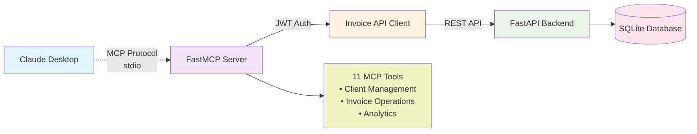

# Invoice Management Application

A modern, multi-tenant invoice management system built with FastAPI and React. This application allows businesses to manage clients, create invoices, track payments, and generate professional PDF invoices with comprehensive CRM capabilities and data management features.

## 🚀 Features

### Core Functionality
- **Multi-tenant Architecture** - Isolated data per tenant/organization
- **Client Management** - Add, edit, and manage customer information with CRM capabilities
- **Smart Invoice Creation** - Generate professional invoices with automatic numbering and intelligent status management
- **Advanced Invoice Editing** - Individual item updates with immutable paid invoice protection
- **Payment Tracking** - Record and track payments against invoices with automatic status updates
- **Dashboard Analytics** - Overview of financial metrics and statistics
- **PDF Generation** - Export invoices as professional PDF documents
- **Email Delivery** - Send invoices directly to clients via email with PDF attachments
- **Responsive Design** - Modern UI that works on desktop and mobile

### 🆕 CRM & Client Management
- **Client Notes System** - Add, edit, update, and delete client notes with timestamps
- **Note Management** - Inline editing with save/cancel functionality
- **User Attribution** - Track which user created each note
- **Complete CRM History** - Comprehensive client interaction tracking
- **Enhanced Client Profiles** - Rich client information with note history

### 💰 Currency & International Support
- **Multi-Currency Support** - Support for multiple currencies with proper formatting
- **Currency Selection** - Choose preferred currency per client and invoice
- **Dynamic Currency API** - Real-time currency support with fallback handling
- **Localized Display** - Proper currency formatting and display

### 📊 Data Management & Backup
- **Complete Data Export** - Export all business data to SQLite format
- **Data Import/Restore** - Import data from previous backups with conflict resolution
- **Smart Import Logic** - Automatic invoice number generation to avoid conflicts
- **Data Integrity** - Comprehensive validation and error handling during import/export
- **Backup Recommendations** - Built-in guidance for data safety best practices

### Invoice Management Enhancements ✨
- **Intelligent Item Management** - Individual invoice item updates without losing data
- **Immutable Paid Invoices** - Paid invoices are protected from accidental changes (except status)
- **Smart Status Controls** - Enhanced status filtering and management
- **Enhanced Data Persistence** - Invoice descriptions and details are properly saved and loaded
- **Consistent API Responses** - All endpoints return complete invoice data including items

### Authentication & Security
- **User Authentication** - Secure login/signup with JWT tokens
- **Role-based Access** - Admin, user, and viewer roles
- **Google SSO** - Optional Google OAuth integration
- **Tenant Isolation** - Complete data separation between organizations

### Technical Features
- **RESTful API** - Clean, documented API endpoints with consistent data structures
- **AI Integration (MCP)** - Model Context Protocol server for AI assistant integration
- **Email Service Integration** - Support for AWS SES, Azure Email Services, and Mailgun with proper API routing
- **Real-time Updates** - Instant UI updates with optimistic rendering
- **Search & Filtering** - Advanced filtering and search capabilities
- **Docker Support** - Containerized deployment ready
- **Database Migrations** - Automated schema management

## 🆕 Recent Major Updates & Improvements

### 🎯 CRM System Implementation
- **✅ Complete Client Notes System** - Full CRUD operations for client notes with user attribution
- **✅ Inline Note Editing** - Edit notes directly in the interface with save/cancel functionality
- **✅ Note Deletion with Confirmation** - Safe note deletion with preview confirmation dialogs
- **✅ Timestamp Tracking** - Automatic creation and update timestamps for all notes
- **✅ User Attribution** - Track which user created each note for accountability
- **✅ Enhanced Client Profiles** - Rich client detail pages with integrated note management

### 💾 Data Management & Backup System
- **✅ Complete Data Export** - Export all tenant data (clients, invoices, payments, notes, settings) to SQLite
- **✅ Data Import/Restore** - Import data from SQLite backups with intelligent conflict resolution
- **✅ Smart Invoice Number Generation** - Automatic generation of unique invoice numbers during import
- **✅ Data Integrity Protection** - Comprehensive validation and rollback on import errors
- **✅ User-Friendly Interface** - Intuitive data management UI with clear warnings and guidance
- **✅ Best Practices Integration** - Built-in recommendations for backup and restore procedures

### 💰 Currency System Enhancement
- **✅ Multi-Currency Support** - Full support for multiple currencies with proper API integration
- **✅ Client Currency Preferences** - Set and save preferred currency per client
- **✅ Dynamic Currency Loading** - Real-time currency options with fallback handling
- **✅ Currency Display Components** - Consistent currency formatting throughout the application
- **✅ API Integration Fix** - Resolved currency selector API connectivity issues

### 🔧 Bug Fixes & System Improvements
- **✅ Invoice Status Filtering** - Fixed invoice status dropdown and backend filtering
- **✅ Client Currency Updates** - Resolved issues with saving client preferred currency
- **✅ API Response Consistency** - Fixed missing fields in client and invoice API responses
- **✅ Currency Selector Integration** - Fixed "API not available" errors in currency selection
- **✅ Import Conflict Resolution** - Resolved unique constraint errors during data import
- **✅ Error Handling Enhancement** - Improved error messages and user feedback throughout

### 🎨 UI/UX Improvements
- **✅ Refactored Data Management Tab** - Complete redesign of export/import interface
- **✅ Visual Status Indicators** - Color-coded status indicators and progress feedback
- **✅ Enhanced File Selection** - Improved file upload interface with visual feedback
- **✅ Responsive Design Updates** - Better mobile and tablet experience
- **✅ Professional Layout** - Clean, modern interface with improved information hierarchy
- **✅ Interactive Elements** - Better button states, loading indicators, and user feedback

### 📈 Performance & Reliability
- **✅ Database Optimization** - Improved query performance and data handling
- **✅ Error Recovery** - Enhanced error handling with proper rollback mechanisms
- **✅ API Reliability** - More robust API responses with consistent data structures
- **✅ Session Management** - Better handling of database sessions and transactions
- **✅ Memory Management** - Improved cleanup of temporary files and resources

### Invoice Management Enhancements
- **✅ Fixed Invoice Item Persistence** - Invoice item descriptions now save correctly without reverting to default values
- **✅ Enhanced Item Update Logic** - Individual items can be updated, added, or removed without affecting other items
- **✅ Immutable Paid Invoice Protection** - Paid invoices are now read-only except for status changes to prevent accidental modifications
- **✅ Smart Status Management** - Enhanced status filtering and management capabilities

### API & Data Consistency
- **✅ Complete API Responses** - All invoice endpoints now return consistent data structures including invoice items
- **✅ Proper Item ID Handling** - Invoice items include proper IDs for reliable updates and tracking
- **✅ Enhanced Error Handling** - Eliminated "Invoice items could not be loaded properly" errors
- **✅ Centralized API Client** - All frontend requests use the centralized API client for better reliability

### User Experience Improvements
- **✅ Visual Feedback for Paid Invoices** - Clear indication when invoices are locked due to paid status
- **✅ Improved Form Validation** - Better error messages and validation for invoice creation and editing
- **✅ Enhanced Data Loading** - More reliable data loading with proper fallback handling
- **✅ Professional UI Components** - Consistent design language with ShadCN UI components

## 🏗️ Architecture

### Backend (FastAPI)
- **Framework**: FastAPI with Python 3.11
- **Database**: SQLite with SQLAlchemy ORM
- **Authentication**: JWT with fastapi-users
- **Documentation**: Auto-generated OpenAPI/Swagger docs
- **Deployment**: Docker containerized

### Frontend (React)
- **Framework**: React 18 with TypeScript
- **Build Tool**: Vite
- **UI Library**: ShadCN UI components with Tailwind CSS
- **State Management**: TanStack Query for server state
- **Routing**: React Router with protected routes
- **Deployment**: Docker containerized

### Infrastructure
- **Orchestration**: Docker Compose
- **Database**: Persistent SQLite with volume mounting
- **Networking**: Internal Docker network for service communication

## 📧 Email Invoice Delivery

The application includes comprehensive email functionality to send invoices directly to clients with professional PDF attachments.

### 🌟 Email Features

- **Multiple Email Providers** - Support for AWS SES, Azure Email Services, and Mailgun
- **Professional Templates** - Beautiful HTML and text email templates
- **PDF Attachments** - Automatically attach invoice PDFs to emails
- **Configuration Management** - Easy setup through the settings interface
- **Test Functionality** - Test email configuration before going live
- **Error Handling** - Comprehensive error handling and logging

### 📊 Supported Email Providers

#### AWS SES (Simple Email Service)
- **Setup**: Configure AWS credentials and region
- **Features**: High deliverability, detailed analytics, cost-effective
- **Requirements**: AWS Access Key ID, Secret Access Key, and region

#### Azure Email Services
- **Setup**: Configure Azure Communication Services connection string
- **Features**: Enterprise-grade reliability, global scale
- **Requirements**: Azure Communication Services connection string

#### Mailgun
- **Setup**: Configure API key and domain
- **Features**: Developer-friendly API, detailed tracking
- **Requirements**: Mailgun API key and verified domain

### 🔧 Email Configuration

1. **Navigate to Settings** → **Email Settings** tab
2. **Enable Email Service** - Toggle the email functionality
3. **Select Provider** - Choose from AWS SES, Azure, or Mailgun
4. **Configure Credentials** - Enter your provider-specific settings
5. **Test Configuration** - Send a test email to verify setup
6. **Save Settings** - Store your configuration securely

### 📤 Sending Invoices

#### From Invoice Form
- Open any saved invoice
- Click the **Send Email** button in the preview section
- Email will be sent to the client's email address automatically

#### Via API
```bash
POST /api/email/send-invoice
{
  "invoice_id": 123,
  "include_pdf": true,
  "to_email": "client@example.com"  // Optional override
}
```

### 🎨 Email Templates

Professional email templates include:
- **Company branding** with logo and contact information
- **Invoice details** including number, date, amount, and status
- **Payment instructions** and due date information
- **Professional formatting** for both HTML and text versions

### 🛡️ Security & Best Practices

- **Secure Credential Storage** - All API keys are stored securely
- **Validation** - Email configuration is validated before saving
- **Error Handling** - Comprehensive error messages and logging
- **Rate Limiting** - Built-in protection against email abuse

## 🤖 AI Integration (MCP)

This application includes a **Model Context Protocol (MCP)** server that enables AI assistants (like Claude Desktop) to interact with your invoice system through natural language.

> 📖 **For complete MCP setup, configuration, and development documentation, see [api/MCP/README.md](api/MCP/README.md)**

### 🚀 Quick MCP Overview

The MCP server transforms your invoice system into an AI-accessible service, allowing natural language interactions like:
- *"Show me all clients with outstanding balances"*
- *"Create a new invoice for John Doe for $1,500"*
- *"Find all overdue invoices from last month"*

### 📊 MCP Architecture



### MCP Features
- **Client Management**: List, search, create, and retrieve client information
- **Invoice Operations**: Manage invoices with full CRUD operations
- **Advanced Search**: Intelligent search across clients and invoices
- **Analytics**: Get insights on outstanding balances and overdue invoices
- **Real-time Data**: Direct API integration for up-to-date information

### Available MCP Tools
- `list_clients` - List all clients with pagination
- `search_clients` - Search clients by name, email, phone, or address
- `get_client` - Get detailed client information by ID
- `create_client` - Create new clients
- `list_invoices` - List all invoices with pagination
- `search_invoices` - Search invoices by various fields
- `get_invoice` - Get detailed invoice information by ID
- `create_invoice` - Create new invoices
- `get_clients_with_outstanding_balance` - Find clients with unpaid invoices
- `get_overdue_invoices` - Get invoices past their due date
- `get_invoice_stats` - Get overall invoice statistics

### 🔧 Quick Setup

#### 1. Configure Environment
```bash
cd api/MCP
cp example.env .env
# Edit .env with your credentials
```

#### 2. Start MCP Server
```bash
python -m MCP --email your_email@example.com --password your_password
```

#### 3. Configure Claude Desktop
Add to your `claude_desktop_config.json`:
```json
{
  "mcpServers": {
    "invoice-app": {
      "command": "/path/to/your/venv/bin/python",
      "args": ["/path/to/your/project/api/launch_mcp.py", "--email", "your_email", "--password", "your_password"],
      "env": {
        "INVOICE_API_BASE_URL": "http://localhost:8000/api"
      }
    }
  }
}
```

### 📚 Detailed Documentation

For comprehensive setup instructions, configuration options, troubleshooting, and development guides:

**👉 [Complete MCP Documentation →](api/MCP/README.md)**

The MCP documentation includes:
- 📊 Architecture diagrams and visual guides
- 🛠️ Detailed installation and configuration
- 📋 Environment variable reference
- 🔒 Security best practices
- 🧪 Testing and development setup
- 🎯 Claude Desktop integration examples
- 📸 Screenshots and example conversations
- 🖼️ **Live screenshots** showing MCP tools in action:
  - Creating invoice clients through natural language
  - Listing and searching clients
  - Managing invoices with AI assistance
  - Real Claude Desktop integration examples

## 📋 Prerequisites

- Docker and Docker Compose
- Node.js 18+ (for local development)
- Python 3.11+ (for local development)

## 🚀 Quick Start

### Using Docker (Recommended)

1. **Clone the repository**
   ```bash
   git clone <repository-url>
   cd invoice-app
   ```

2. **Start the application**
   ```bash
   docker-compose up -d
   ```

3. **Access the application**
   - Frontend: http://localhost:8080
   - Backend API: http://localhost:8000
   - API Documentation: http://localhost:8000/docs

### Local Development Setup

#### Backend Setup
```bash
cd api
python -m venv venv
source venv/bin/activate  # On Windows: venv\Scripts\activate
pip install -r requirements.txt
python db_init.py  # Initialize database
uvicorn main:app --reload
```

#### Frontend Setup
```bash
cd ui
npm install
npm run dev
```

## 📚 API Documentation

The API is fully documented and available at:
- **Swagger UI**: http://localhost:8000/docs
- **ReDoc**: http://localhost:8000/redoc

### Key Endpoints

#### Authentication
- `POST /api/auth/register` - User registration
- `POST /api/auth/login` - User login
- `POST /api/auth/logout` - User logout

#### Clients
- `GET /api/clients/` - List clients
- `POST /api/clients/` - Create client
- `PUT /api/clients/{id}` - Update client
- `DELETE /api/clients/{id}` - Delete client

#### CRM (Client Notes)
- `GET /api/crm/clients/{client_id}/notes` - Get client notes
- `POST /api/crm/clients/{client_id}/notes` - Create client note
- `PUT /api/crm/clients/{client_id}/notes/{note_id}` - Update client note
- `DELETE /api/crm/clients/{client_id}/notes/{note_id}` - Delete client note

#### Invoices
- `GET /api/invoices/` - List invoices (with status filtering)
- `POST /api/invoices/` - Create invoice
- `PUT /api/invoices/{id}` - Update invoice
- `DELETE /api/invoices/{id}` - Delete invoice

#### Payments
- `GET /api/payments/` - List payments
- `POST /api/payments/` - Record payment
- `PUT /api/payments/{id}` - Update payment

#### Data Management
- `GET /api/settings/export-data` - Export all tenant data to SQLite
- `POST /api/settings/import-data` - Import data from SQLite file

#### Currency
- `GET /api/currency/supported` - Get supported currencies

## 🗃️ Database Schema

### Core Entities

#### Tenants
- Multi-tenant isolation
- Company information (name, address, tax ID)
- Logo and branding settings

#### Users
- Authentication and authorization
- Role-based access control
- Google SSO integration

#### Clients
- Customer information
- Contact details
- Balance tracking
- Preferred currency settings

#### Client Notes (CRM)
- Note content and timestamps
- User attribution
- Client association
- Tenant isolation

#### Invoices
- Auto-generated invoice numbers
- Due dates and status tracking
- Notes and custom fields
- Multi-currency support

#### Invoice Items
- Individual line items
- Descriptions, quantities, prices
- Automatic amount calculations

#### Payments
- Payment tracking against invoices
- Multiple payment methods
- Reference numbers

## 🎨 Frontend Structure

```
ui/src/
├── components/          # Reusable UI components
│   ├── ui/             # ShadCN UI components
│   ├── auth/           # Authentication components
│   ├── clients/        # Client management components
│   │   └── ClientNotes.tsx  # CRM notes component
│   ├── invoices/       # Invoice-specific components
│   └── layout/         # Layout components
├── pages/              # Route components
│   ├── Settings.tsx    # Settings with data management
│   ├── EditClient.tsx  # Client editing with CRM
│   └── ...
├── lib/                # Utilities and API client
├── hooks/              # Custom React hooks
└── routers/            # Route definitions
```

## 🔧 Configuration

### Environment Variables

#### Backend (.env)
```env
DATABASE_URL=sqlite:///./invoice_app.db
SECRET_KEY=your-secret-key-here
JWT_SECRET_KEY=your-jwt-secret
GOOGLE_CLIENT_ID=your-google-client-id
GOOGLE_CLIENT_SECRET=your-google-client-secret
```

#### Frontend (.env)
```env
VITE_API_URL=http://localhost:8000/api
```

## 🚀 Deployment

### Production Deployment

1. **Update environment variables** for production
2. **Build and deploy with Docker Compose**:
   ```bash
   docker-compose -f docker-compose.prod.yml up -d
   ```

### Cloud Deployment
- **Backend**: Deploy to any platform supporting Docker (AWS ECS, Google Cloud Run, etc.)
- **Frontend**: Deploy to static hosting (Vercel, Netlify, AWS S3 + CloudFront)
- **Database**: Migrate to PostgreSQL for production use

## 🔒 Security Considerations

- JWT tokens for authentication
- Password hashing with bcrypt
- CORS properly configured
- SQL injection protection via SQLAlchemy ORM
- Input validation with Pydantic schemas
- Tenant isolation at database level
- Secure data export/import with validation

## 🧪 Testing

### Backend Tests
```bash
cd api
pytest
```

### Frontend Tests
```bash
cd ui
npm test
```

## 📈 Performance

- **Database**: Optimized queries with proper indexing
- **Caching**: Query result caching with TanStack Query
- **Lazy Loading**: Component-level code splitting
- **Compression**: Gzip compression for API responses
- **Efficient Data Export**: Streaming data export for large datasets

## 🤝 Contributing

1. Fork the repository
2. Create a feature branch: `git checkout -b feature/new-feature`
3. Commit changes: `git commit -am 'Add new feature'`
4. Push to branch: `git push origin feature/new-feature`
5. Submit a pull request

## 📄 License

This project is licensed under the MIT License - see the LICENSE file for details.

## 🔮 Roadmap

### ✅ Completed Features
- [x] **AI Integration (MCP)** - Model Context Protocol server for AI assistants ✨
- [x] **Email Invoice Delivery** - Support for AWS SES, Azure Email Services, and Mailgun ✨
- [x] **Recurring Invoices** - Support for recurring invoice generation
- [x] **Enhanced Invoice Management** - Individual item updates and immutable paid invoices ✨
- [x] **Improved Data Consistency** - Complete API responses and reliable data persistence ✨
- [x] **Smart Status Controls** - Intelligent invoice status management ✨

### 🚧 In Development
- [ ] Multi-currency support with exchange rate management
- [ ] Advanced reporting and analytics dashboard
- [ ] Enhanced payment gateway integrations

### 📋 Planned Features
- [ ] Mobile app (React Native)
- [ ] Advanced user permissions and role management
- [ ] Automated backup system
- [ ] Invoice templates and customization
- [ ] Bulk operations for invoices and clients
- [ ] Advanced search and filtering
- [ ] Audit logs and activity tracking

## 🛠️ Troubleshooting

### Common Issues and Solutions

#### "Invoice items could not be loaded properly"
- **Fixed in v1.2.0** - This error has been resolved with improved API responses
- If you encounter this, ensure you're using the latest version

#### Email sending returns 404 error
- **Fixed in v1.2.0** - Email routing now uses proper API base URL configuration
- Verify your `VITE_API_URL` environment variable is set correctly
- Check that the backend is running on the expected port

#### Invoice item descriptions not saving
- **Fixed in v1.2.0** - Item descriptions now persist correctly
- Individual items can be updated without affecting others

#### Paid invoices being accidentally modified
- **Fixed in v1.2.0** - Paid invoices are now immutable except for status changes
- This prevents accidental data corruption and maintains audit trails

### Configuration Issues

#### Frontend not connecting to backend
1. Check that `VITE_API_URL` is set correctly (default: `http://localhost:8000/api`)
2. Ensure backend is running on the expected port
3. Verify Docker networks are properly configured

#### Database connection issues
1. Check file permissions for SQLite database
2. Ensure database volume is properly mounted in Docker
3. Run database initialization: `python db_init.py`

## 🆘 Support

For support and questions:
- Create an issue on GitHub
- Check the documentation at `/docs`
- Review API documentation at `/docs` endpoint
- See troubleshooting section above for common issues

## 🏷️ Version History

### v1.2.0 - Enhanced Invoice Management ✨
- **🔧 Invoice Item Improvements** - Fixed item persistence and individual item updates
- **🔒 Paid Invoice Protection** - Immutable paid invoices with status-only editing
- **📧 Email Integration Fixes** - Proper API routing and reliable email sending
- **🎯 Smart Status Controls** - Restricted new invoice statuses for better workflow
- **🔄 Data Consistency** - Complete API responses and enhanced error handling
- **🎨 UX Enhancements** - Better visual feedback and form validation

### v1.1.0 - AI and Email Integration
- **🤖 MCP Integration** - Model Context Protocol server for AI assistants
- **📧 Email Delivery** - Multi-provider email support (AWS SES, Azure, Mailgun)
- **🔄 Recurring Invoices** - Automated recurring invoice generation
- **🏗️ Multi-currency Foundation** - Currency support infrastructure

### v1.0.0 - Initial Release
- **🏢 Multi-tenant Architecture** - Complete tenant isolation
- **📋 Invoice and Client Management** - Core business functionality
- **💰 Payment Tracking** - Comprehensive payment management
- **📄 PDF Generation** - Professional invoice documents
- **⚛️ Modern React UI** - Responsive, accessible interface
