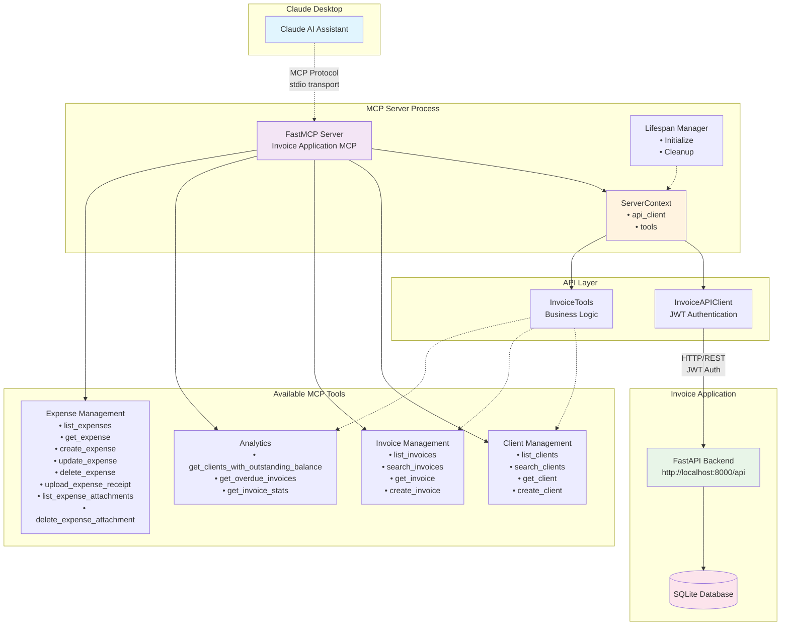
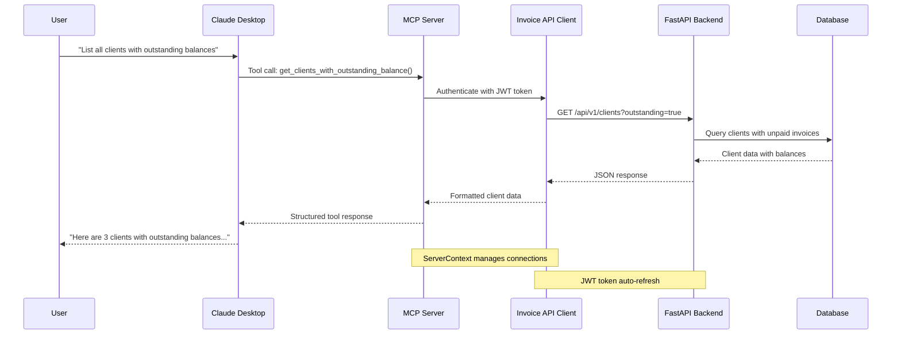
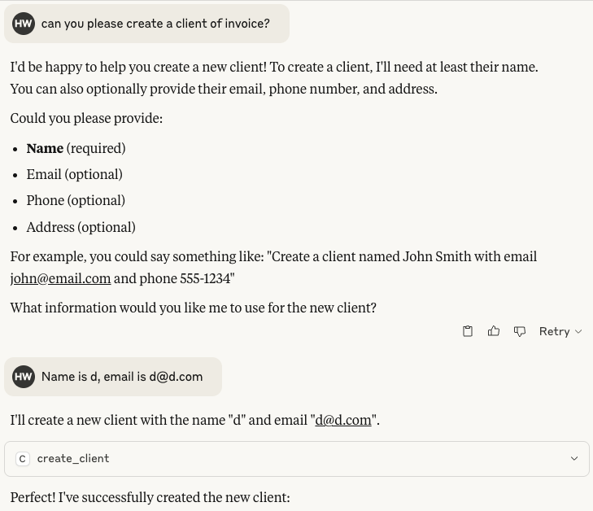
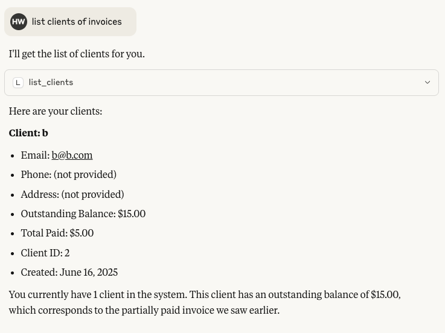
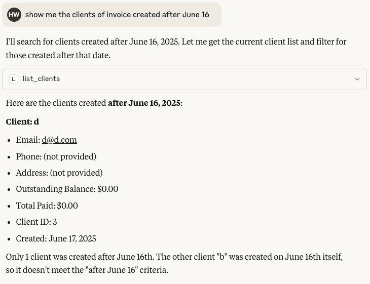
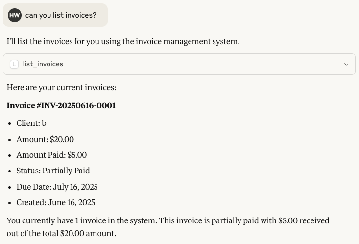

# Invoice Application FastMCP Server

This is a FastMCP (Model Context Protocol) server that provides AI models with tools to interact with the Invoice Application API. It enables AI assistants to list, search, create, and manage clients and invoices through a standardized interface using the modern FastMCP framework.

## 📊 Architecture Overview

### System Architecture



### MCP Tool Execution Flow



## 📸 Screenshots

### MCP Server Running
When properly configured and started, you should see output similar to this:

```
INFO:MCP.server:Starting Invoice FastMCP Server...
INFO:MCP.server:API Base URL: http://localhost:8000/api
INFO:MCP.server:Initialized API client for http://localhost:8000/api
[06/17/25 11:05:44] INFO     Starting MCP server 'Invoice Application MCP Server'  server.py:1168
                             with transport 'stdio'                                              
INFO:FastMCP.fastmcp.server.server:Starting MCP server 'Invoice Application MCP Server' with transport 'stdio'
```

### MCP Tools in Action

The following screenshots demonstrate the MCP tools working through Claude Desktop integration:

| MCP Tool | Screenshot | Description |
|----------|------------|-------------|
| `create_client` | [Create Invoice Client](images/create_invoice_client.png) | Create new clients with natural language requests |
| `list_clients` | [List Invoice Clients](images/list_invoice_clients.png) | Get complete list of clients with contact info and balances |
| `search_clients` | [Search Invoice Clients](images/search_invoice_clients.png) | Intelligent search across client data |
| `list_invoices` | [List Invoices](images/list_invoices.png) | View all invoices with client info and payment status |

#### 1. Creating Invoice Clients
**Tool Used:** `create_client`



*Claude can create new clients with natural language requests like "Create a new client named John Doe with email john@company.com"*

#### 2. Listing Invoice Clients  
**Tool Used:** `list_clients`



*Get a complete list of all clients with their contact information and balance details*

#### 3. Searching Invoice Clients
**Tool Used:** `search_clients` 



*Intelligent search across client names, emails, phone numbers, and addresses*

#### 4. Listing Invoices
**Tool Used:** `list_invoices`



*View all invoices with client information, amounts, due dates, and payment status*

### Claude Desktop Integration
Once integrated with Claude Desktop, you can ask natural language questions like:

**Example Conversation:**
```
User: "Show me all clients with outstanding balances"

Claude: I'll check for clients with outstanding balances using the invoice system.

[Uses get_clients_with_outstanding_balance tool]

Based on the invoice data, here are the clients with outstanding balances:

1. **John Doe Company** - Outstanding: $2,500.00
   - Email: john@company.com
   - Last invoice: #INV-001 (Overdue by 15 days)

2. **Jane Smith LLC** - Outstanding: $1,200.00
   - Email: jane@smithllc.com
   - Last invoice: #INV-003 (Due in 5 days)

Would you like me to get more details about any of these clients or their invoices?
```

**More Example Queries:**
- *"Create a new client for ABC Company with email contact@abc.com"*
- *"Search for clients containing 'Smith' in their name"*
- *"Show me all invoices from the last 30 days"*
- *"Find overdue invoices that need follow-up"*
- *"What are my total outstanding receivables?"*
- *"List all supported currencies"*
- *"Create a custom currency for Bitcoin"*
- *"Convert 100 USD to EUR"*
- *"Record a payment of $500 for invoice #123"*
- *"Get my company settings"*
- *"Create a 10% discount rule for orders over $1000"*
- *"Add a note to client John Doe about our meeting"*
- *"Send invoice #123 via email"*
- *"Test my email configuration"*

## ✨ Key Benefits

🚀 **Natural Language Interface** - Talk to your invoice system in plain English  
🔄 **Real-time Data** - Always up-to-date information from your live database  
🔒 **Secure Authentication** - JWT-based API authentication with token management  
⚡ **Fast Performance** - Optimized queries and efficient data processing  
📊 **Rich Analytics** - Get insights on business metrics and client data  
🛠️ **Developer Friendly** - Built with modern FastMCP framework

## Features

### Client Management
- **List Clients**: Get paginated list of all clients with balance information
- **Search Clients**: Search clients by name, email, phone, or address
- **Get Client Details**: Retrieve detailed information for a specific client
- **Create Client**: Add new clients to the system

### Invoice Management
- **List Invoices**: Get paginated list of all invoices with client information
- **Search Invoices**: Search invoices by number, client name, status, notes, or amount
- **Get Invoice Details**: Retrieve detailed information for a specific invoice
- **Create Invoice**: Generate new invoices for clients

### Analytics & Reporting
- **Outstanding Balances**: Find clients with unpaid invoices (`get_clients_with_outstanding_balance`)
- **Overdue Invoices**: Identify invoices past their due date (`get_overdue_invoices`)
- **Invoice Statistics**: Get overall financial metrics (`get_invoice_stats`)

### Currency Management
- **List Currencies**: Get supported currencies with filtering options (`list_currencies`)
- **Create Custom Currencies**: Add new currencies for your business (`create_currency`)
- **Currency Conversion**: Convert amounts between currencies (`convert_currency`)

### Payment Management
- **List Payments**: Get all payments with pagination (`list_payments`)
- **Create Payments**: Record payments for invoices (`create_payment`)

### Settings & Configuration
- **Get Settings**: Retrieve tenant settings and company information (`get_settings`)
- **Tenant Information**: Get current tenant details (`get_tenant_info`)

### Discount Rules
- **List Discount Rules**: Get all discount rules for the tenant (`list_discount_rules`)
- **Create Discount Rules**: Set up new discount rules (`create_discount_rule`)

### CRM Features
- **Client Notes**: Create notes for client interactions (`create_client_note`)

### Email Integration
- **Send Invoice Emails**: Send invoices via email (`send_invoice_email`)
- **Test Email Configuration**: Verify email setup (`test_email_configuration`)

## Installation

1. Install the required dependencies:
```bash
cd api/MCP
pip install -r requirements.txt
```

Note: This implementation uses FastMCP, a modern and simplified framework for building MCP servers with a decorator-based approach.

2. Set up environment variables:

### Option A: Using Environment Variables
```bash
export INVOICE_API_BASE_URL="http://localhost:8000/api"
export INVOICE_API_EMAIL="your_email@example.com"
export INVOICE_API_PASSWORD="your_password"
```

### Option B: Using Environment File (Recommended)
Copy the example environment file and customize it:
```bash
cp example.env .env
# Edit .env with your actual values
```

The server will automatically load configuration from a `.env` file in the MCP directory if it exists.

## Configuration

### Environment File (`.env`)

The MCP server supports configuration through environment variables. You can use the provided `example.env` as a template:

```bash
# Copy the example file
cp api/MCP/example.env api/MCP/.env
```

#### Configuration Options

| Environment Variable | Description | Default | Required |
|---------------------|-------------|---------|----------|
| `INVOICE_API_BASE_URL` | Base URL for the Invoice API | `http://localhost:8000/api` | No |
| `INVOICE_API_EMAIL` | Email for API authentication | None | **Yes** |
| `INVOICE_API_PASSWORD` | Password for API authentication | None | **Yes** |
| `REQUEST_TIMEOUT` | HTTP request timeout in seconds | `30` | No |
| `DEFAULT_PAGE_SIZE` | Default pagination size for lists | `100` | No |
| `MAX_PAGE_SIZE` | Maximum allowed pagination size | `1000` | No |
| `TOKEN_STORAGE_FILE` | File path for storing auth tokens | `.mcp_token` | No |

#### Example `.env` file:
```env
# Invoice Application MCP Server Configuration

# API Configuration - REQUIRED
INVOICE_API_BASE_URL=http://localhost:8000/api
INVOICE_API_EMAIL=your_email@example.com
INVOICE_API_PASSWORD=your_secure_password

# Request Configuration - OPTIONAL
REQUEST_TIMEOUT=30

# Pagination Configuration - OPTIONAL
DEFAULT_PAGE_SIZE=100
MAX_PAGE_SIZE=1000

# Token Storage - OPTIONAL
# TOKEN_STORAGE_FILE=.mcp_token
```

### Configuration Priority

The server uses the following configuration priority (highest to lowest):

1. **Command-line arguments** (highest priority)
2. **Environment variables**
3. **`.env` file values**
4. **Default values** (lowest priority)

Examples:
```bash
# Using .env file only
python -m MCP

# Override .env with command-line arguments
python -m MCP --email different@email.com --api-url http://different-server:8000/api

# Mix of .env and command-line (email from CLI, password from .env)
python -m MCP --email override@email.com
```

### Security Best Practices

⚠️ **Important Security Notes:**

- **Never commit `.env` files** to version control
- Use strong, unique passwords
- Consider using environment variables in production instead of files
- The `TOKEN_STORAGE_FILE` contains sensitive authentication tokens - keep it secure
- Regularly rotate API credentials

```bash
# Add .env to your .gitignore
echo ".env" >> .gitignore
echo ".mcp_token" >> .gitignore
```

## Usage

### Running the FastMCP Server

```bash
# From the api directory - recommended approach
python -m MCP --email user@example.com --password mypassword

# With custom API URL
python -m MCP --email user@example.com --password mypassword --api-url http://localhost:8000/api/v1

# With verbose logging
python -m MCP --email user@example.com --password mypassword --verbose
```

### Command-Line Usage

The server can be configured through command-line arguments, which override environment variables:

| CLI Argument | Environment Variable | Default | Description |
|--------------|---------------------|---------|-------------|
| `--api-url` | `INVOICE_API_BASE_URL` | `http://localhost:8000/api/v1` | Base URL for the Invoice API |
| `--email` | `INVOICE_API_EMAIL` | None | Email for API authentication |
| `--password` | `INVOICE_API_PASSWORD` | None | Password for API authentication |
| `--verbose` | N/A | False | Enable verbose logging |

### Using with Claude Desktop

Add this to your Claude Desktop configuration (`claude_desktop_config.json`):

```json
{
  "mcpServers": {
    "invoice-app": {
      "command": "/path/to/your/venv/bin/python",
      "args": ["/path/to/your/project/api/launch_mcp.py", "--email", "your_email@example.com", "--password", "your_password"],
      "env": {
        "INVOICE_API_BASE_URL": "http://localhost:8000/api/v1"
      }
    }
  }
}
```

**Important**: Use the full path to your virtual environment's Python interpreter to ensure all dependencies are available.

## Available Tools

### Client Tools

#### `list_clients`
List all clients with pagination support.

**Parameters:**
- `skip` (int, optional): Number of clients to skip for pagination (default: 0)
- `limit` (int, optional): Maximum number of clients to return (default: 100)

**Example:**
```json
{
  "name": "list_clients",
  "arguments": {
    "skip": 0,
    "limit": 50
  }
}
```

#### `search_clients`
Search for clients by name, email, phone, or address.

**Parameters:**
- `query` (string): Search query to find clients
- `skip` (int, optional): Number of results to skip for pagination (default: 0)
- `limit` (int, optional): Maximum number of results to return (default: 100)

**Example:**
```json
{
  "name": "search_clients",
  "arguments": {
    "query": "john doe",
    "limit": 20
  }
}
```

#### `get_client`
Get detailed information about a specific client.

**Parameters:**
- `client_id` (int): ID of the client to retrieve

**Example:**
```json
{
  "name": "get_client",
  "arguments": {
    "client_id": 123
  }
}
```

#### `create_client`
Create a new client.

**Parameters:**
- `name` (string): Client's full name
- `email` (string, optional): Client's email address
- `phone` (string, optional): Client's phone number
- `address` (string, optional): Client's address

**Example:**
```json
{
  "name": "create_client",
  "arguments": {
    "name": "John Doe",
    "email": "john@example.com",
    "phone": "+1-234-567-8900",
    "address": "123 Main St, City, State 12345"
  }
}
```

### Invoice Tools

#### `list_invoices`
List all invoices with pagination support.

**Parameters:**
- `skip` (int, optional): Number of invoices to skip for pagination (default: 0)
- `limit` (int, optional): Maximum number of invoices to return (default: 100)

#### `search_invoices`
Search for invoices by number, client name, status, notes, or amount.

**Parameters:**
- `query` (string): Search query to find invoices
- `skip` (int, optional): Number of results to skip for pagination (default: 0)
- `limit` (int, optional): Maximum number of results to return (default: 100)

#### `get_invoice`
Get detailed information about a specific invoice.

**Parameters:**
- `invoice_id` (int): ID of the invoice to retrieve

#### `create_invoice`
Create a new invoice for a client.

**Parameters:**
- `client_id` (int): ID of the client this invoice belongs to
- `amount` (float): Total amount of the invoice
- `due_date` (string): Due date in ISO format (YYYY-MM-DD)
- `status` (string, optional): Status of the invoice (default: "draft")
- `notes` (string, optional): Additional notes for the invoice

**Example:**
```json
{
  "name": "create_invoice",
  "arguments": {
    "client_id": 123,
    "amount": 1500.00,
    "due_date": "2024-02-15",
    "status": "sent",
    "notes": "Payment for consulting services"
  }
}
```

### Analytics Tools

#### `get_clients_with_outstanding_balance`
Get all clients that have outstanding balances (unpaid invoices).

#### `get_overdue_invoices`
Get all invoices that are past their due date and still unpaid.

#### `get_invoice_stats`
Get overall invoice statistics including total income and other metrics.

### Currency Management Tools

#### `list_currencies`
List supported currencies with optional filtering for active currencies only.

**Parameters:**
- `active_only` (boolean, optional): Return only active currencies (default: true)

**Example:**
```json
{
  "name": "list_currencies",
  "arguments": {
    "active_only": true
  }
}
```

#### `create_currency`
Create a custom currency for the tenant.

**Parameters:**
- `code` (string): Currency code (e.g., USD, EUR)
- `name` (string): Currency name
- `symbol` (string): Currency symbol
- `decimal_places` (int, optional): Number of decimal places (default: 2)
- `is_active` (boolean, optional): Whether the currency is active (default: true)

**Example:**
```json
{
  "name": "create_currency",
  "arguments": {
    "code": "BTC",
    "name": "Bitcoin",
    "symbol": "₿",
    "decimal_places": 8,
    "is_active": true
  }
}
```

#### `convert_currency`
Convert amount from one currency to another using current or historical exchange rates.

**Parameters:**
- `amount` (float): Amount to convert
- `from_currency` (string): Source currency code
- `to_currency` (string): Target currency code
- `conversion_date` (string, optional): Date for conversion rate in YYYY-MM-DD format

**Example:**
```json
{
  "name": "convert_currency",
  "arguments": {
    "amount": 100.00,
    "from_currency": "USD",
    "to_currency": "EUR",
    "conversion_date": "2024-01-15"
  }
}
```

### Payment Management Tools
### Expense Tools

#### `list_expenses`
List expenses with optional filters and pagination.

Parameters:
- `skip` (int, optional): Number of records to skip (default: 0)
- `limit` (int, optional): Max records to return (default: 100)
- `category` (string, optional): Filter by category
- `invoice_id` (int, optional): Filter by linked invoice id
- `unlinked_only` (bool, optional): Only expenses not linked to any invoice

#### `get_expense`
Get a single expense by ID.

Parameters:
- `expense_id` (int): Expense ID

#### `create_expense`
Create a new expense.

Parameters:
- `amount` (float): Expense amount before tax
- `currency` (string): Currency code (e.g., USD)
- `expense_date` (string): ISO date (YYYY-MM-DD)
- `category` (string): Expense category
- `vendor` (string, optional)
- `tax_rate` (float, optional)
- `tax_amount` (float, optional)
- `total_amount` (float, optional)
- `payment_method` (string, optional)
- `reference_number` (string, optional)
- `status` (string, optional)
- `notes` (string, optional)
- `invoice_id` (int, optional)

#### `update_expense`
Update fields of an existing expense.

Parameters:
- `expense_id` (int): ID of the expense to update
- Other fields same as `create_expense`, all optional

#### `delete_expense`
Delete an expense by ID.

Parameters:
- `expense_id` (int): ID to delete

#### `upload_expense_receipt`
Upload an attachment file for an expense.

Parameters:
- `expense_id` (int)
- `file_path` (string): Absolute path to local file to upload
- `filename` (string, optional): Override filename
- `content_type` (string, optional): Explicit MIME type

Notes: Up to 5 attachments per expense. Allowed types: PDF, JPG, PNG. Max 10 MB as enforced by backend.

#### `list_expense_attachments`
List attachments for an expense.

Parameters:
- `expense_id` (int)

#### `delete_expense_attachment`
Delete an attachment of an expense.

Parameters:
- `expense_id` (int)
- `attachment_id` (int)


#### `list_payments`
List all payments with pagination support.

**Parameters:**
- `skip` (int, optional): Number of payments to skip for pagination (default: 0)
- `limit` (int, optional): Maximum number of payments to return (default: 100)

#### `create_payment`
Create a new payment for an invoice.

**Parameters:**
- `invoice_id` (int): ID of the invoice this payment is for
- `amount` (float): Payment amount
- `payment_date` (string): Payment date in ISO format (YYYY-MM-DD)
- `payment_method` (string): Payment method (cash, check, credit_card, etc.)
- `reference` (string, optional): Payment reference number
- `notes` (string, optional): Additional notes

**Example:**
```json
{
  "name": "create_payment",
  "arguments": {
    "invoice_id": 123,
    "amount": 500.00,
    "payment_date": "2024-01-15",
    "payment_method": "credit_card",
    "reference": "TXN-12345",
    "notes": "Partial payment"
  }
}
```

### Settings Tools

#### `get_settings`
Get tenant settings including company information and invoice settings.

**Example:**
```json
{
  "name": "get_settings",
  "arguments": {}
}
```

### Discount Rules Tools

#### `list_discount_rules`
List all discount rules for the current tenant.

**Example:**
```json
{
  "name": "list_discount_rules",
  "arguments": {}
}
```

#### `create_discount_rule`
Create a new discount rule for the tenant.

**Parameters:**
- `name` (string): Name of the discount rule
- `discount_type` (string): Type of discount (percentage, fixed)
- `discount_value` (float): Discount value
- `min_amount` (float, optional): Minimum amount for discount to apply
- `max_discount` (float, optional): Maximum discount amount
- `priority` (int, optional): Priority of the rule, higher number = higher priority (default: 1)
- `is_active` (boolean, optional): Whether the rule is active (default: true)
- `currency` (string, optional): Currency code for the rule

**Example:**
```json
{
  "name": "create_discount_rule",
  "arguments": {
    "name": "Bulk Discount",
    "discount_type": "percentage",
    "discount_value": 10.0,
    "min_amount": 1000.0,
    "max_discount": 500.0,
    "priority": 1,
    "is_active": true,
    "currency": "USD"
  }
}
```

### CRM Tools

#### `create_client_note`
Create a note for a client.

**Parameters:**
- `client_id` (int): ID of the client
- `title` (string): Note title
- `content` (string): Note content
- `note_type` (string, optional): Type of note (general, call, meeting, etc.) (default: "general")

**Example:**
```json
{
  "name": "create_client_note",
  "arguments": {
    "client_id": 123,
    "title": "Follow-up Call",
    "content": "Called client to discuss payment terms. They agreed to pay within 30 days.",
    "note_type": "call"
  }
}
```

### Email Tools

#### `send_invoice_email`
Send an invoice via email.

**Parameters:**
- `invoice_id` (int): ID of the invoice to send
- `to_email` (string, optional): Recipient email address (uses client email if not provided)
- `to_name` (string, optional): Recipient name (uses client name if not provided)
- `subject` (string, optional): Email subject
- `message` (string, optional): Custom message

**Example:**
```json
{
  "name": "send_invoice_email",
  "arguments": {
    "invoice_id": 123,
    "to_email": "client@example.com",
    "to_name": "John Doe",
    "subject": "Invoice #INV-001",
    "message": "Please find attached invoice for our services."
  }
}
```

#### `test_email_configuration`
Test email configuration by sending a test email.

**Parameters:**
- `test_email` (string): Email address to send test email to

**Example:**
```json
{
  "name": "test_email_configuration",
  "arguments": {
    "test_email": "test@example.com"
  }
}
```

### Tenant Tools

#### `get_tenant_info`
Get current tenant information including company details and settings.

**Example:**
```json
{
  "name": "get_tenant_info",
  "arguments": {}
}
```

## Response Format

All tools return a JSON response with the following structure:

```json
{
  "success": true,
  "data": [...],
  "count": 10,
  "message": "Optional message",
  "pagination": {
    "skip": 0,
    "limit": 100
  }
}
```

For errors:
```json
{
  "success": false,
  "error": "Error description"
}
```

## Authentication

The MCP server handles authentication automatically by:

1. Using provided credentials to authenticate with the Invoice API
2. Storing and managing JWT tokens securely
3. Automatically refreshing tokens when they expire
4. Retrying requests with fresh tokens on authentication failures

## Security Considerations

- Store credentials securely (use environment variables, not hardcoded values)
- The token storage file (`.mcp_token`) contains sensitive information
- Use HTTPS in production environments
- Regularly rotate API credentials

## Troubleshooting

### Common Issues

1. **Authentication Failed**
   - Verify your email and password are correct
   - Ensure the Invoice API is running and accessible
   - Check that your user account is active

2. **Connection Refused**
   - Verify the API base URL is correct
   - Ensure the Invoice API server is running
   - Check firewall and network settings

3. **Permission Denied**
   - Verify your user has appropriate permissions
   - Check that you're authenticating with the correct tenant

### Debug Mode

Run with verbose logging to see detailed request/response information:

```bash
python -m MCP --verbose
```

## Development

### Project Structure

```
MCP/
├── __init__.py          # Package initialization
├── __main__.py          # Module entry point
├── server.py            # Main FastMCP server implementation
├── api_client.py        # HTTP client for Invoice API
├── auth_client.py       # Authentication handling
├── tools.py             # FastMCP tool implementations
├── config.py            # Configuration management
├── requirements.txt     # Python dependencies (includes FastMCP)
└── README.md           # This file
```

### FastMCP Benefits

This implementation uses FastMCP, which provides several advantages over traditional MCP:

- **Simplified Development**: Decorator-based tool definitions (`@mcp.tool()`)
- **Automatic Type Inference**: Uses Python type hints for schema generation
- **Better Error Handling**: Built-in error management and logging
- **Modern Python**: Leverages async/await and modern Python features
- **Reduced Boilerplate**: Less code needed compared to traditional MCP

### Adding New Tools

With FastMCP, adding new tools is simpler:

1. Add a new function in `server.py` with the `@mcp.tool()` decorator
2. Define the function parameters with proper type hints
3. Implement the business logic by calling the appropriate `InvoiceTools` method
4. Return a dictionary with the response data

Example:
```python
@mcp.tool()
async def get_client_invoices(client_id: int, status: Optional[str] = None) -> dict:
    """Get all invoices for a specific client, optionally filtered by status."""
    if tools is None:
        return {"success": False, "error": "Server not properly initialized"}
    
    # Implementation would go here
    return await tools.get_client_invoices(client_id=client_id, status=status)
```

### Testing

Test the FastMCP server with the included test script:

```bash
cd api
python MCP/test_mcp.py
```

Or test the API client directly:

```python
import asyncio
from MCP.api_client import InvoiceAPIClient

async def test_client():
    async with InvoiceAPIClient(email="test@example.com", password="password") as client:
        clients = await client.list_clients()
        print(f"Found {len(clients)} clients")

asyncio.run(test_client())
```

## Why FastMCP?

FastMCP was chosen for this implementation because it:

- **Reduces Complexity**: Traditional MCP requires extensive boilerplate code for tool definitions, schemas, and request handling. FastMCP eliminates this with decorators and automatic type inference.

- **Improves Developer Experience**: Function signatures become the API - no need to manually define JSON schemas or handle argument parsing.

- **Better Error Handling**: Built-in error management and consistent response formatting.

- **Modern Python Features**: Full support for type hints, async/await, and modern Python patterns.

- **Maintainability**: Less code means fewer bugs and easier maintenance.

## License

This FastMCP server is part of the Invoice Application project. Please refer to the main project license.