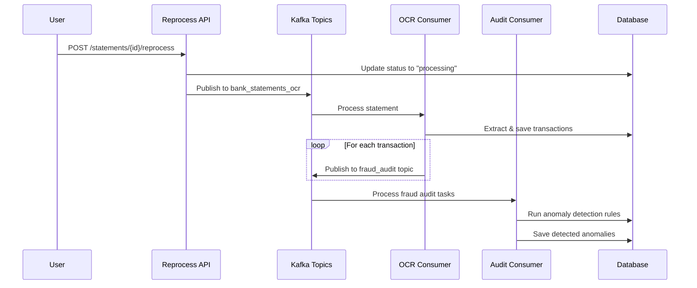

# Bank Statement Reprocess and Fraud Detection Flow

## Overview

This document explains how fraud detection is triggered when a bank statement is reprocessed.

## Answer: Yes, Reprocessing Triggers Fraud Detection

Every time you reprocess a bank statement, fraud detection is **automatically triggered** for all extracted transactions.

## Flow Diagram



## Code Flow

### 1. Reprocess Endpoint

**File**: [api/commercial/ai_bank_statement/router.py:L1189-1327](file:///Users/hao/dev/github/machine_learning/hao_projects/invoice_app/api/commercial/ai_bank_statement/router.py#L1189-1327)

When you call the reprocess endpoint:

```python
@router.post("/{statement_id}/reprocess")
async def reprocess_statement(statement_id: int, ...):
    # 1. Reset statement status
    s.status = "processing"
    s.analysis_error = None

    # 2. Enqueue processing task
    publish_bank_statement_task({
        "statement_id": s.id,
        "file_path": s.file_path,
        "tenant_id": tenant_id,
        "attempt": 0,
    })
```

### 2. OCR Consumer Processing

**File**: [api/workers/ocr_consumer.py:L823-896](file:///Users/hao/dev/github/machine_learning/hao_projects/invoice_app/api/workers/ocr_consumer.py#L823-896)

The OCR consumer processes the statement and **triggers fraud detection**:

```python
async def _process_single_statement(self, consumer, message, payload):
    # Extract transactions using LLM
    txns = process_bank_pdf_with_llm(file_path, ai_conf, db)

    # Save transactions
    await self._save_transactions(db, stmt, txns, method)

    # 🔥 TRIGGER FRAUD DETECTION FOR EACH TRANSACTION
    try:
        new_txns = db.query(BankStatementTransaction).filter(
            BankStatementTransaction.statement_id == statement_id
        ).all()

        for txn in new_txns:
            publish_fraud_audit_task(tenant_id, "bank_statement_transaction", txn.id)
    except Exception as e:
        self.logger.warning(f"Failed to run anomaly detection: {e}")
```

### 3. Fraud Audit Task Publishing

**File**: [api/core/services/ocr_service.py:L1109-1130](file:///Users/hao/dev/github/machine_learning/hao_projects/invoice_app/api/core/services/ocr_service.py#L1109-1130)

```python
def publish_fraud_audit_task(tenant_id: int, entity_type: str, entity_id: int, reprocess_mode: bool = False):
    """Publish a fraud audit task to Kafka."""
    message = {
        "tenant_id": tenant_id,
        "entity_type": entity_type,  # "bank_statement_transaction"
        "entity_id": entity_id,
        "reprocess_mode": reprocess_mode,
        "timestamp": datetime.now(timezone.utc).isoformat()
    }
    producer.produce(topic, value=payload, key=key)
```

### 4. Audit Consumer Processing

**File**: [api/workers/audit_consumer.py:L128-183](file:///Users/hao/dev/github/machine_learning/hao_projects/invoice_app/api/workers/audit_consumer.py#L128-183)

The audit consumer picks up fraud audit tasks:

```python
async def _process_message(self, message):
    payload = json.loads(message.value().decode("utf-8"))
    tenant_id = payload.get("tenant_id")
    entity_type = payload.get("entity_type")
    entity_id = payload.get("entity_id")
    reprocess_mode = payload.get("reprocess_mode", False)

    # Resolve entity from DB
    entity = tenant_session.query(BankStatementTransaction).get(entity_id)

    # Run Anomaly Detection
    service = AnomalyDetectionService(tenant_session)
    await service.analyze_entity(entity, entity_type, reprocess_mode=reprocess_mode)
```

### 5. Anomaly Detection Service

**File**: [api/commercial/anomaly_detection/service.py:L72-140](file:///Users/hao/dev/github/machine_learning/hao_projects/invoice_app/api/commercial/anomaly_detection/service.py#L72-140)

Runs all fraud detection rules:

```python
async def analyze_entity(self, entity, entity_type: str, reprocess_mode: bool = False):
    # Check if already audited (skip unless reprocess_mode)
    if not reprocess_mode and entity.is_audited:
        return []

    # Run all detection rules
    for rule in self._rules:
        result = await rule.analyze(self.db, entity, entity_type, context)
        if result:
            anomaly = self._save_anomaly(entity, entity_type, result)
            created_anomalies.append(anomaly)

    # Mark as audited
    entity.is_audited = True
    entity.last_audited_at = datetime.now(timezone.utc)
```

## Fraud Detection Rules Applied

The following rules are executed for each transaction:

1. **DuplicateBillingRule** - Detects duplicate transactions
2. **RoundingAnomalyRule** - Identifies suspicious round numbers
3. **PhantomVendorRule** - Flags fake or suspicious vendors
4. **ThresholdSplittingRule** - Detects split transactions to avoid approval thresholds
5. **TemporalAnomalyRule** - Identifies unusual timing patterns
6. **DescriptionMismatchRule** - Flags mismatches between vendor and description
7. **AttachmentAuditRule** - Analyzes attachments for tampering

## Key Points

### Automatic Triggering

- Fraud detection is **automatically triggered** during reprocessing
- No manual intervention required
- Runs asynchronously via Kafka

### Applies to All Processing Methods

- Single statement uploads
- Batch statement processing
- Manual reprocessing via API

### Reprocess Mode Parameter

The `reprocess_mode` parameter in fraud detection:

- When `False` (default): Skips already-audited entities
- When `True`: Re-audits even if previously audited
- Currently, reprocessing sets `reprocess_mode=False`, so it only audits new/changed transactions

### Performance Considerations

- Fraud detection runs asynchronously
- Does not block the reprocessing flow
- Results are saved to the `Anomaly` table

## Environment Configuration

Relevant Kafka topics:

- `KAFKA_BANK_TOPIC` - Bank statement processing (default: `bank_statements_ocr`)
- `KAFKA_FRAUD_AUDIT_TOPIC` - Fraud detection tasks (default: `fraud_audit`)

## Database Tables

- `bank_statements` - Statement records
- `bank_statement_transactions` - Individual transactions
- `anomalies` - Detected fraud/anomaly records

## Summary

**Yes, reprocessing a bank statement will trigger fraud detection.** The flow is:

1. User triggers reprocess
2. Statement is re-analyzed and transactions extracted
3. For each transaction, a fraud audit task is published to Kafka
4. Audit consumer runs all fraud detection rules
5. Any anomalies are saved to the database

This ensures that every reprocessed statement benefits from the latest fraud detection capabilities.
