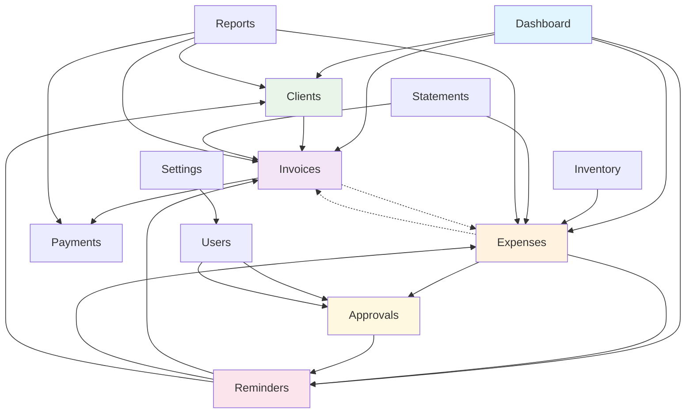

# Sidebar Menu Relationships Graph

This document visualizes the relationships between different modules in the sidebar navigation system.

## Menu Structure

### Core Modules (Primary Navigation)

- **Dashboard** - Central hub showing overview of all activities
- **Expenses** - Expense management and tracking
- **Invoices** - Invoice creation and management  
- **Clients** - Client/customer management
- **Payments** - Payment tracking and processing

### Tools (Secondary Navigation)

- **Approvals** - Expense approval workflow
- **Inventory** - Inventory item management
- **Reminders** - Task and reminder system
- **Reports** - Business reporting and analytics
- **Statements** - Bank statement management

### Administration

- **Settings** - System configuration
- **Users** - User management
- **Audit Log** - System audit trail
- **Analytics** - Advanced business analytics
- **Super Admin** - Super user functions

## Relationship Flow Diagram



## Detailed Relationships

### 1. User Creation Workflows

**Starting Points:**

- Users can create **Clients** from Dashboard or directly
- Users can create **Invoices** from Dashboard, Clients page, or directly
- Users can create **Expenses** from Dashboard or directly
- Users can create **Inventory** items from Inventory page
- Users can create **Statements** from Statements page
- Users can create **Reminders** from any module or directly

### 2. Transaction Flows

#### Invoice → Expense Flow

- A transaction in a **Statement** can be added as an **Invoice**
- A transaction in a **Statement** can be added as an **Expense**
- **Invoices** can be linked to **Expenses** (expense.invoice_id relationship)

#### Inventory → Expense Flow

- **Inventory** items can be consumed and added as **Expenses**
- Expenses can be marked as "inventory consumption" with specific items and quantities
- The expense amount is calculated from consumed inventory items

#### Expense → Approval Flow

- **Expenses** can be sent to other users for **Approval**
- Approval workflow supports multi-level approvals
- Approvers receive notifications and can approve/reject with notes

### 3. Reminder System Integration

**Reminders can be created for:**

- **Invoices** - Payment reminders, follow-ups
- **Expenses** - Approval reminders, reimbursement reminders  
- **Clients** - General client follow-ups, contract renewals
- **General tasks** - Any business-related reminders

**Reminder Recipients:**

- Self-reminders
- Reminders to other users in the system
- Reminders to approvers for pending expenses

### 4. Cross-Module Data Relationships

#### Expense Module Connections

```
Expense {
  invoice_id → Invoice (optional link)
  user_id → User (creator)
  approval_status → ExpenseApproval
  consumption_items → InventoryItem[]
}
```

#### Approval Module Connections

```
ExpenseApproval {
  expense_id → Expense
  approver_id → User
  submitter_id → User
}
```

#### Reminder Module Connections

```
Reminder {
  assigned_to_id → User
  created_by_id → User
  // Can reference any entity via metadata
  extra_metadata → {invoice_id?, expense_id?, client_id?}
}
```

### 5. Notification Flow

**Approval Notifications:**

- Expense submitted → Notification to approver
- Expense approved → Notification to submitter
- Expense rejected → Notification to submitter

**Reminder Notifications:**

- Due reminders → Notification to assigned user
- Overdue reminders → Escalation notifications

### 6. Reporting Integration

**Reports can aggregate data from:**

- **Expenses** - Expense reports by category, time period, user
- **Invoices** - Revenue reports, payment status
- **Payments** - Payment tracking and reconciliation
- **Clients** - Client activity and revenue analysis
- **Approvals** - Approval workflow metrics and bottlenecks

## Permission-Based Access

### User Roles

- **Viewer** - Read-only access to assigned data
- **User** - Can create/edit own data, submit for approval
- **Admin** - Full access, can approve expenses, manage users
- **Super Admin** - Cross-tenant access, system administration

### Module Access Patterns

- **Core modules** - Available to all users based on permissions
- **Approval tools** - Available to users with approval permissions
- **Admin modules** - Restricted to admin users
- **Reminders** - Users can create reminders for themselves and others they have permission to assign tasks to

This relationship graph shows how the sidebar navigation reflects a comprehensive business workflow system where users can start with basic entities (clients, expenses, invoices) and leverage advanced tools (approvals, reminders, reporting) to manage complex business processes.
