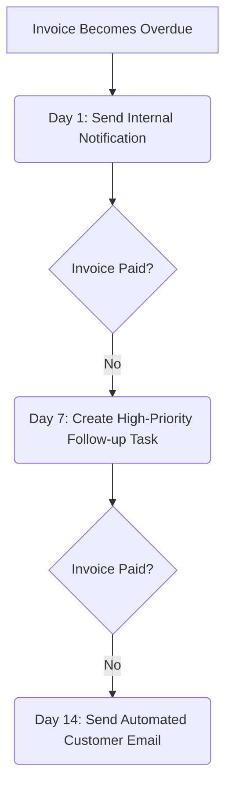

# Product Roadmap: Workflow Automation Expansion Ideas

This document outlines proposals for expanding the native Workflows engine in **YourFinanceWORKS**. These features are designed to increase operational efficiency, integrate with third-party software, and provide granular rules for complex enterprise operations.

---

## 📬 1. External Actions & Integrations
Connecting workflow outcomes to third-party tools increases system utility and automates cross-platform tracking.

### Slack & Microsoft Teams Webhooks
- **Concept**: Post automated updates directly to specific channels when critical events occur.
- **Example**: Post to `#finance-alerts` when an invoice exceeding $5,000 becomes 15 days overdue.
- **Payload**: Custom blocks showing invoice amount, client name, and the responsible teammate link.

### Customer Payment Reminders (Direct Email)
- **Concept**: Automate direct collection emails to clients instead of just prompting internal teammates.
- **Integration**: SendGrid, Amazon SES, or Mailgun templates.
- **Controls**: Allow global templates, custom sender profiles, and toggle-on/toggle-off options per client.

### Outgoing Webhooks (Generic JSON Payload)
- **Concept**: Trigger custom HTTP POST requests to external systems when a workflow executes.
- **Example**: Sync an overdue invoice state to a Salesforce CRM opportunity or trigger a Zapier multi-app integration.

---

## ⚡ 2. Expanded Trigger Events
Supporting events across the entire lifecycle of financial instruments and client relationships.

| Trigger Event | Target Entity | Use Case |
| :--- | :--- | :--- |
| `invoice_created` | Invoice | Set up onboarding tasks; send a welcome notification. |
| `payment_received` | Payment / Invoice | Trigger delivery webhooks; send payment receipts automatically. |
| `payment_failed` | Payment | Create high-priority collection tasks; send recovery emails. |
| `client_created` | Client | Assign account managers; verify tax details. |

---

## 🔍 3. Granular Condition & Rule Engine
Allowing users to specify exactly when a trigger should execute an action based on database entity attributes.

### Attribute Matching
- **Invoice Size**: Trigger only if amount is greater/less than a specified dollar value.
- **Client Tags**: Execute distinct workflows for "VIP", "Enterprise", or "Late Payer" clients.
- **Location Constraints**: Filter actions by country or state for tax-related follow-ups.

### UI Concept
A visual "Rule Builder" interface allowing logical nesting:
`[IF] Invoice Amount is greater than $5,000 [AND] Client Tag is 'Enterprise' [THEN] Execute Actions`

---

## ⏳ 4. Multi-step Escalation & Delay Timers
Replacing single-stage execution with multi-day escalation schedules.

- **Features**:
  - Drag-and-drop workflow timeline builder.
  - "Pause/Cancel" options if the invoice is paid or disputes are registered.

---

## 📝 5. Custom Dynamic Template Editors
Empower administrators to customize the text of notifications and tasks dynamically in the web portal.

- **Variable Autocomplete**: Dynamic fields populated at execution time:
  - `{{invoice_number}}`
  - `{{client_name}}`
  - `{{amount}}`
  - `{{currency}}`
  - `{{due_date}}`
  - `{{days_overdue}}`
- **Use Case**: Tailor reminders based on severity (e.g., gentle reminder for day 1 vs. firm legal template for day 30).

---

## 📊 6. Observability & ROI Dashboard
Provide an analytical overlay to prove the ROI of automated follow-ups and monitor engine health.

- **DSO Improvement**: Measure reduction in Days Sales Outstanding (DSO) for invoices managed by workflows vs. manual follow-ups.
- **Action Completion Rates**: Monitor how fast teammates resolve the follow-up tasks created by the workflow engine.
- **Health Logs**: Fast-diagnostic graphs showing error distributions, failed webhooks, or unassigned action owners.
